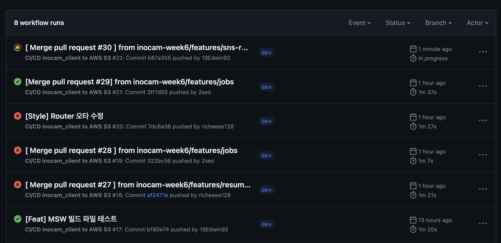

## `5번째` 협업에서 드디어 

Github Action을 활용하여 dev 브랜치 변경시 자동으로 S3에 빌드하는 단계를 시작했다. 아래는 먼저 연결한 사진이다. 



속도적인 측면에서는 다음 포스트에 작성한 터미널을 통한 IAM을 통한 S3 Build가 더 빠르긴 하다. 그러나 이는 별도의 과정이 필요하다면, github Action에서의 CD는 dev 브랜치를 기준으로 변경되면 github Action이 S3로 재배포를 시도한다. 

1. 먼저 `yml`파일 생성하기 
- 여기서 중요한 사실은 `테스트코드`가 없다면, CI는 동작하지 않는다는 것이다. 

  ```bah
  Treating warnings as erros because process.env.CI = true.
  Most CI server set it automatically

  Failed to compile
  ```

  찾아본 자료에 따르면, 배포 환경에서 CI 환경변수가 설정되었기에, 경고를 오류로 처리하여 발생된 현상이라고 한다. 

  이를 해결하기 위해서는 설정된 CI 환경변수를 해제해야 한다. 

  ```tsx
  // package.json
   "build": "CI=false react-scripts build",
  ```

  이를 몰랐기에, yarn 으로 했다가, npm 으로 했다가, 노드 버전을 확인하고, 설치하고 ... 320번 가량은 실패했다. 


  ```bash
  root
  ├─ .github
  |   └─ workflows 
  |       └─ main.yml
  ...
  
  ```

  먼저 root 폴더 안에 해당 디렉토리에 따라 파일을 생성한다. 

  ```yml
  name: CI/CD inocam_client to AWS S3

  on:
    push:
      branches:
        - dev

  jobs:
    deploy:
      runs-on: ubuntu-latest
      steps:
        - name: Checkout repository
          uses: actions/checkout@v3

        - name: AWS IAM 사용자 설정
          uses: aws-actions/configure-aws-credentials@v2
          with:
            aws-access-key-id: ${{ secrets.AWS_ACCESS_KEY_ID }}
            aws-secret-access-key: ${{ secrets.AWS_SECRET_ACCESS_KEY }}
            aws-region: ${{ secrets.AWS_REGION }}  
            
        - name: Build
          run: |
            npm install -g yarn
            yarn install --immutable
            yarn build
          
        - name: Deploy to S3 bucket
          run: |
            aws s3 sync build/ s3://inocam-week6
  ```

  전체 코드는 이와 같다.
  - `yml` 파일의 이름(name)을 생성하고
  - `on.push` 조건을 설정해 준다. 나는 `dev` 를 기준으로 동작하게 할 것임으로 브랜치를 dev로 설정하였다. 
  - `jobs.deploy` 실행조건을 설정해 준다. 
    - 컴퓨터는 github에서 제공된 컴퓨터를 사용할 것이다. 
    - 또한 빌드 환경이 S3이기에, IAM을 통하여 생성된 CLI 정보를 github 환경변수에 등록해준다. 
    - `run` : CLI를 통해 파일을 build 시킨다. 
      - 빌드가 실행될 S3 bucket을 연결해 주면 일단은 끝이다. 


## 다음으로 CDN 설정을 위한 CloudFront, 그리고 Route53까지 나아가보자. 