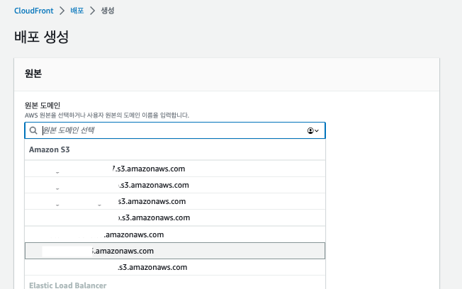
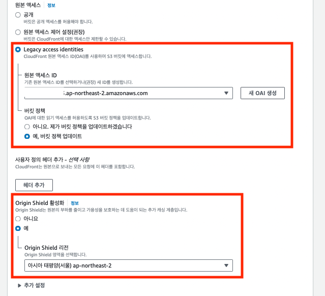
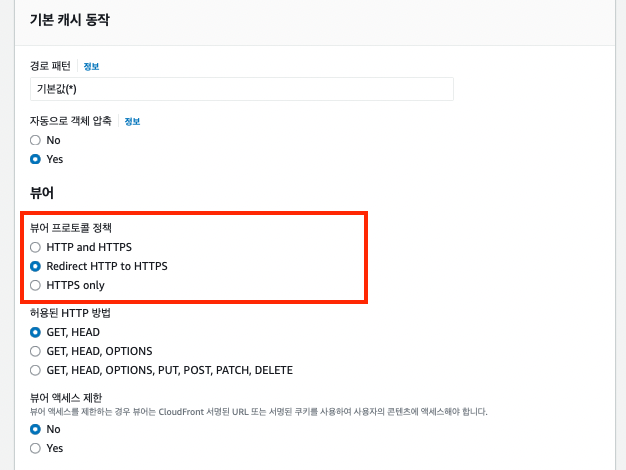
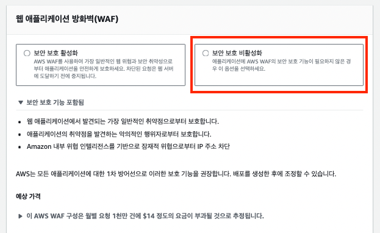
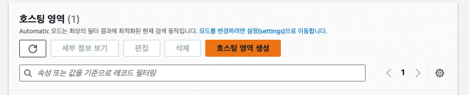
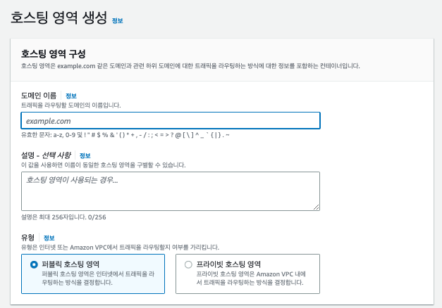
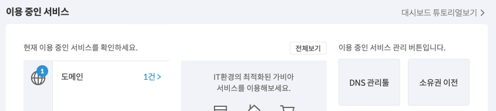
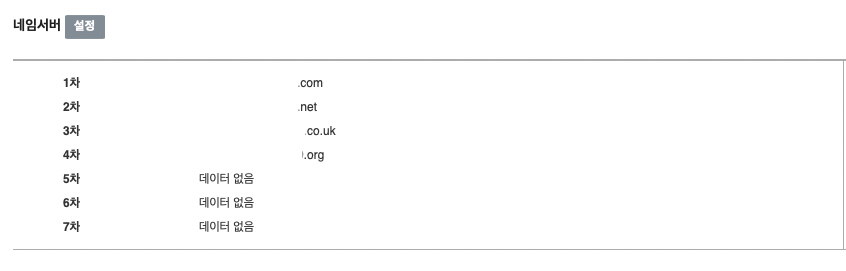
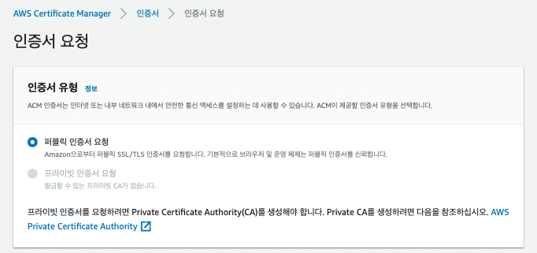
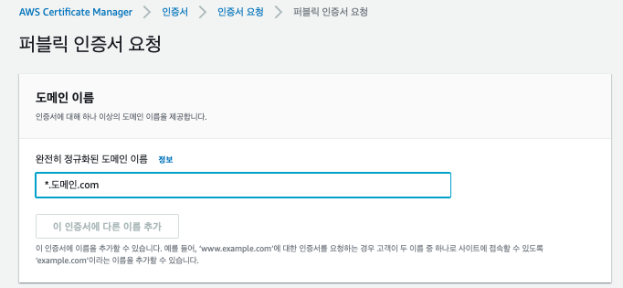

## CloudFront
### 참고글 (1)
[문서1](https://kukim.tistory.com/144)  
[문서2, 벨로퍼트](https://react-etc.vlpt.us/08.deploy-s3.html) 
[문서3](https://victorydntmd.tistory.com/335)

장점을 정리하면 
1. S3에 커스텀 도메인과 HTTPS를 지원
2. CDN을 통해 더 빠른 페이지 응답속도가 제공된다. 

[벨로퍼트](https://react-etc.vlpt.us/08.deploy-s3.html)의 깃북에 따르면, CloudFront를 사용하여 S3 사용하여 CDN에 태워줌으로서, 위의 두 가지 장점들을 챙길 수 있게 된다. 

[생활코딩](https://youtu.be/aeCatL0Fch8)에 따르면, Cache, CDN을 알아야 핟나. 

먼저 캐시(Cache)이다. 웹서버, PHP, 노드는 동적으로 웹페이지(html) 문서를 요청-응답으로 전달합니다. 준비된 HTML을 보내주는 것보다 동적으로 리소스를 제공한다는 점에서 요금이 발생홥니다. 

그런데 이러한 과정이 반복된다면 개발자는 비용을, 사용자는 경험이 떨어집니다. 그렇다면 동일한 내용은 저장하고 보내줄 수 있다면? 바로 이를 캐시 라고 하고, 이를 전담하는 캐싱 서버가 있는데, 이러한 캐싱 서버 가운데 하나가 cloudfront 입니다. 

다음으로는 세계화입니다. Content Delivery Network :: CDN이라 부르는데 전 세계 이용자들에게 빠른 서비스를 가능하게 됩니다. AWS의 인프라를 이용하기 때문입니다. 

CF를 통해서 웹서버의 부담을 경감, 전세계 사용자를 대상으로 고속으로 서비스를 제공하는 것이다. 아래의 사진은 위의 사례를 따라서 적용했을 때이다. 

향상률을 계산해보자. 
- `향상률 = ((이전 처리속도-현재 처리속도)/이전 처리속도) * 100` 했을 때의 결과이다. 

위의 이미지에서 보았을 때, `((24.5 - 7.65) / 24.5) * 100`는 처리속도가 24.5 ms에서 7.65 ms로 개선되었음에 대한 지표로, 기존대비 약 68.98% 향상되었음을 볼 수 있다. 그런데 새로고침해도 화면에는 변화가 없는 것을 볼 수 있고, 오히려 에러처리가 되는 것을 볼 수 있다. 이는 캐시가 살아있기 때문에 그렇다. 이를 위해서 캐시를 무력화 해줘야 한다. 

- CloudFront는 캐시를 설정없이는 24시간 보관합니다. 이를 위해서는 무효화 해줄 필요가 있습니다. 그래야 origin의 내용을 불러오게 됩니다. [공식문서](https://docs.aws.amazon.com/ko_kr/AmazonCloudFront/latest/DeveloperGuide/Invalidation.html)

- 그러나 무효화는 유료라는 점을 기억하자. 

### 순서대로, S3버킷까지는 이전의 정리를 참고, CloudFront
1. 배포 생성 > 원본 도메인을 클릭하면, S3 버킷에 있는 모든 내용이 나열된다. 그 가운데 원하는 버킷을 클릭하면 된다.  

    

2. 원본 엑세스를 Legacy access identities 를 선택하고, 새 OAI를 생성한다. 이때 OAI는 토글을 열어보면 나와 있기에, 그걸 선택하면 되고, 버킷 정택을 자동으로 업데이트하도록 설정하면 된다. 

3. Origin Shield 활성화를 하고, 버킷의 리전을 선택한다. 

    

4. 기본 캐시 동자 > 뷰어 프로토콜 정책을 Redirect HTTP to HTTPS로 전환해준다. 이를 통해서 기본적으로 웹서비스는 HTTPS를 프로토콜로 가지게 되지만, 이제는 SSL 인증서까지 더해줘야 서버와 소통할 때 문제 없이 소통할 수 있다. 

    

5. 웹 애플리케이션 방화벽인데, 유료라니, 일단은 무료로 가자. 여기까지 하고 나머지는 쭉 내려서 하단의 `배포 생성`을 클릭하자. 

    

### Route 53과 가비아 도메인 연결하기     

1. Route 53에서 호스팅 생성하기 
2. AWS - Route53으로 이동하고, `호스팅 영역 생성`을 클릭하자. 실제로 존재하는 예를 들어 가비아에서 구매한 도메인을 입력하소 생성하면 된다. 

    
    

3. 가비아로 이동해서 `Route53`에서 생성된 `값/트래픽 라우팅 대상`의 내용을 네임서버로 등록해 주면 된다. 

### SSL 인증서 발급을 위한 AWS-ACM 발급

[ACM](https://us-east-1.console.aws.amazon.com/acm/home)으로 이동하고, 인증서 요청을 한 후에, 도메인이름 앞에 와일드카드를 붙여서 `*.도메인.com`을 입력함으로 인증서를 요청하자. 그리고 무한 기다림의 시간 속에 들어가면 된다. 보통은 15분이 걸린다는데, 나는 더 걸리는 것 같다. 

[이 친구가 답이네...](https://velog.io/@whljm1003/AWS-S3배포부터-https적용까지-1)