## S3 배포하기 & IAM 생성하기 
### [AWS - S3](https://s3.console.aws.amazon.com/s3/home?region=ap-northeast-2#)

1. 버킷 생성하기 
    - 대문자, 언더스코어가 되지 않고, IP주소 형식으로 사용하면 안되며, 3~63자 사이로 입력이 가능하다. 
    - 소문자, 도트( 이때 `.. 연속된 도트는 인식되지 않음` ), 하이픈으로 구성할 수 있다. 
    - 개인 소유가 아니라 다른 사람도 접근할 수 있도록 퍼블릭 액세스 차단 설정을 해제해준다. 

      <details>
      <summary>관련 이미지 보기</summary>
      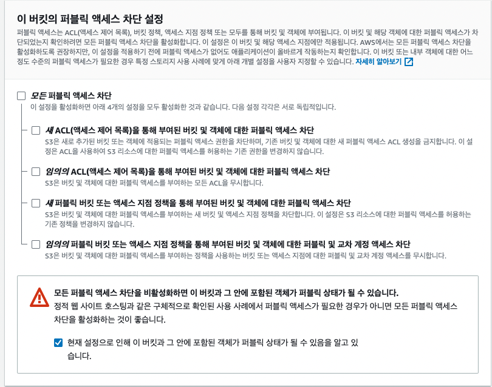
      </details><br/>

      

2. 버킷 설정하기 > 속성 
    - 맨 하단에, 정적 웹 사이트 호스팅 `편집`

      <details>
      <summary>관련 이미지 보기</summary>
      
      <div>
        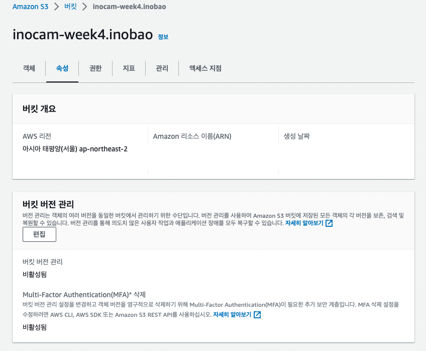
        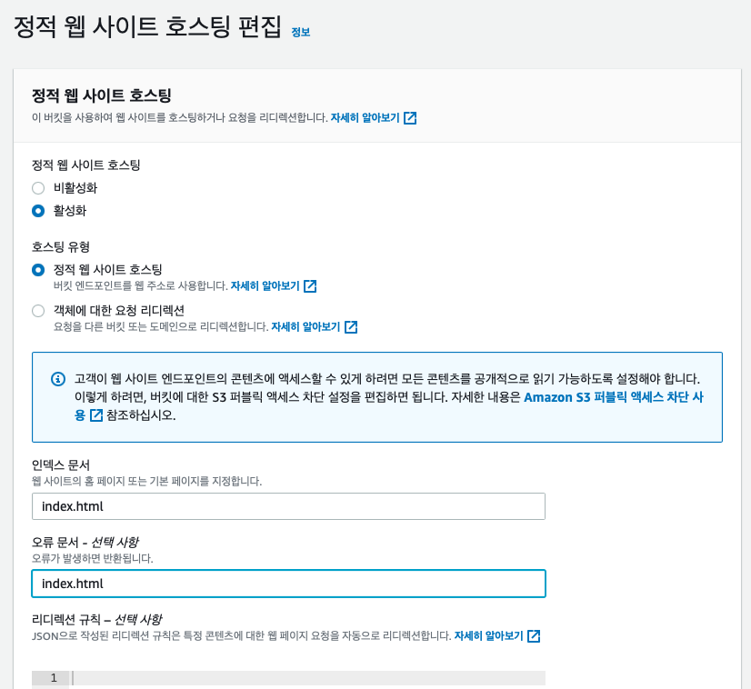
      </div>

      </details><br/>

3. 버킷 설정하기 > 권한 > 버킷 정책       
    - 버킷 정책 생성하기 
    - arn:aws:s3:::.....`/*` : ARN 뒤에 꼭! `/*` 를 붙여줘야 한다. 
    - Add statement 클릭
    - Generate Policy 클릭
    - Policy JSON Document 내용 복사하기 
    - 버킷 정책 편집으로 돌아와서 복사한 내용을 입력하고, `하단에 변경사항 저장하기 클릭` 


      <details>
      <summary>관련 이미지 보기</summary>
      <div>
      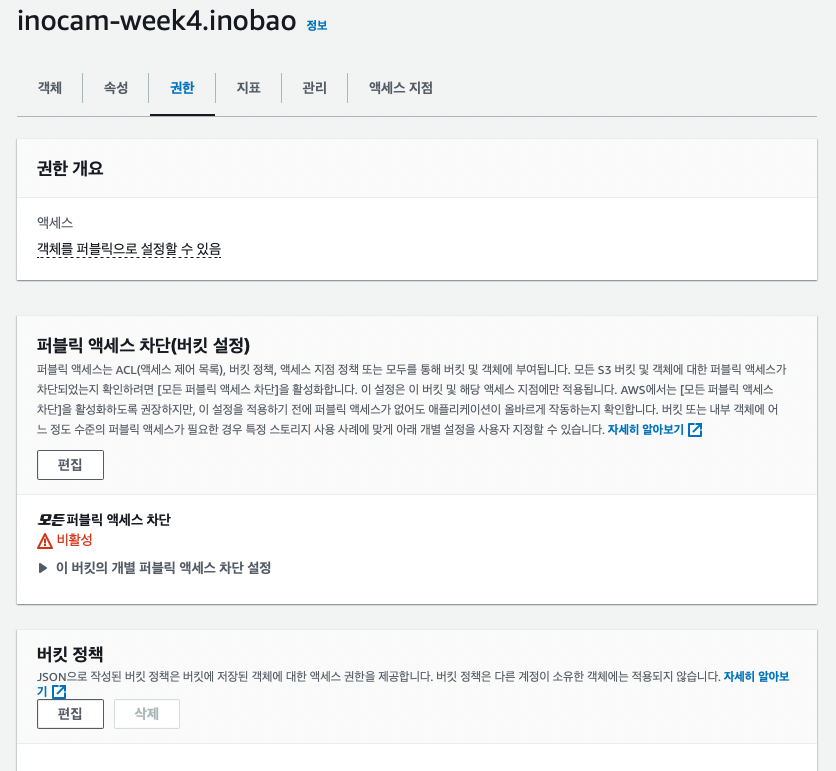
      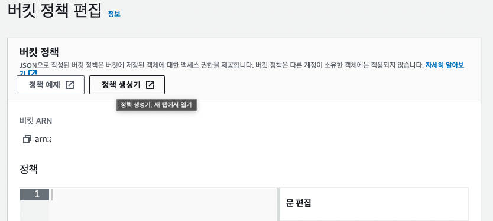
      <div>
      <div>
      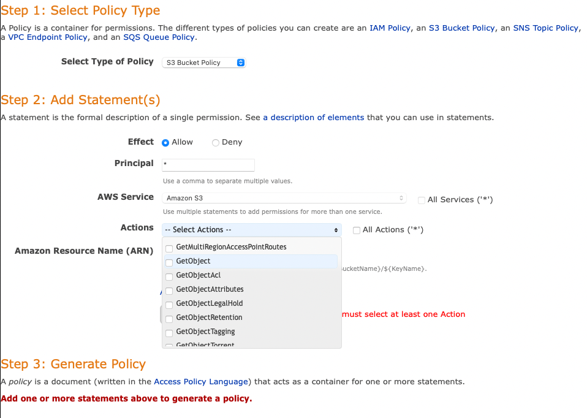
      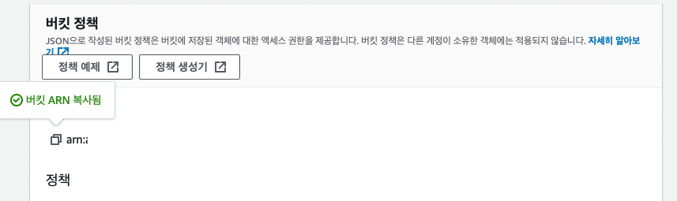
      <div>
      </details><br/>

4. IAM 사용자 생성하기 
    - 사용자 > `사용자 추가`
    - `사용자 세부 설정` 이름입력 
    - `AWS Mangerment Console` > IAM 사용자를 생성하고 싶음, `콘솔암호 설정` 하기 
    - `권한 옵션` : "직접 정책 연결"
    - `권한 정책` : AmazonS3FullAccess 
    - `다음` 생성하기 

      <details>
      <summary>관련 이미지 보기</summary>
      <div>
      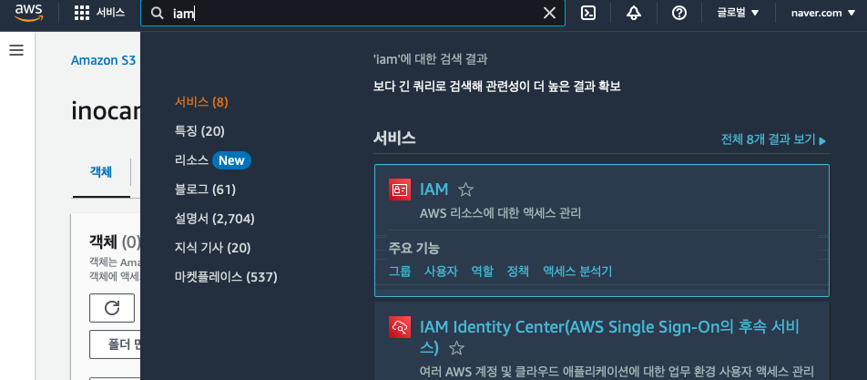
      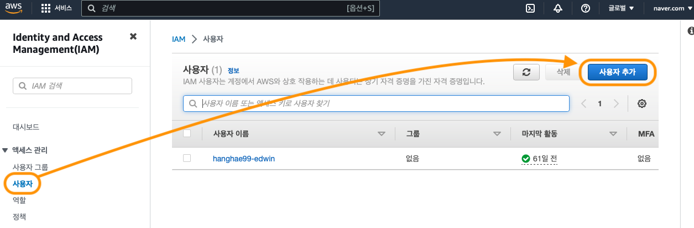
      <div>
      <div>
      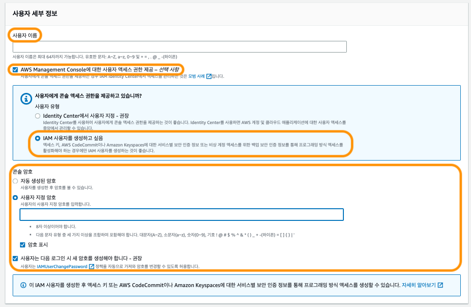
      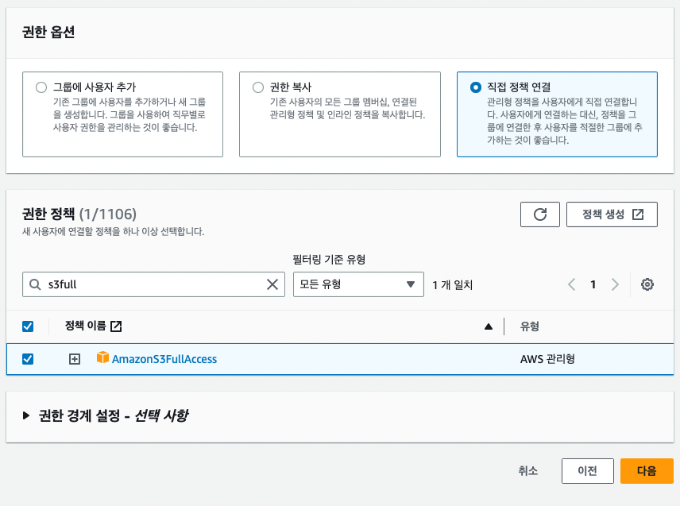
      <div>
      </details><br/>

    - 액세스 key 설정하기 

      <details>
      <summary>관련 이미지 보기</summary>
      <div>
      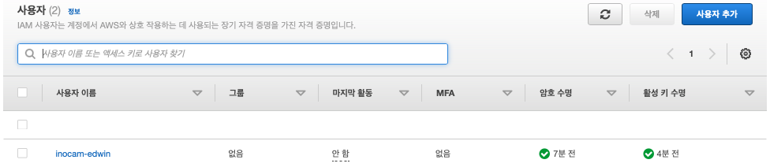
      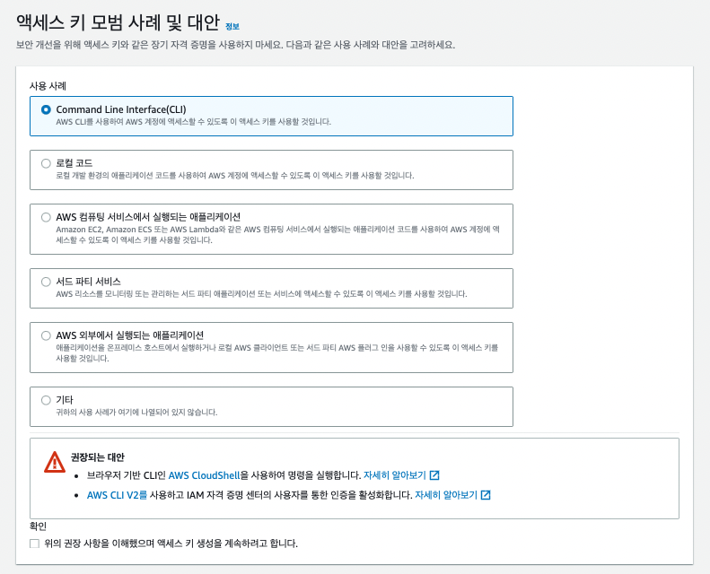
      <div>
      </details><br/>

5. [IAM CLI 설치 또는 없데이트](https://docs.aws.amazon.com/ko_kr/cli/latest/userguide/getting-started-install.html)
    - 해당 운영 체제에 따라서 설치를 진행한다. 
    - `aws --v`를 입력하고 설치된 버전을 확인한다. 
    - 버전이 확인되면 정상적으로 다운로드가 된 것이다.  
    - 명령어 : `aws configure`   
    - 각각의 내용들을 다운로드 받은 `CSV`를 기반으로 작성한다. 
    - 지역은 `ap-northeast-2output`, 형식은 `json`으로 설정한다. 

      <details>
      <summary>관련 이미지 보기</summary>
      <div>
      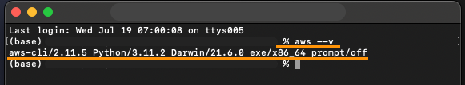
      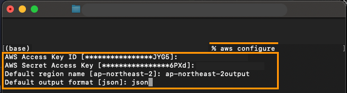
      <div>
      </details><br/>


6. CLI로 S3 빌드하기 

    - 터미널 : `aws s3 ls` 에서 목록을 확인하고
    - react-app - `package.json`의 scripts에 아래와 같이 입력한다. 

      ```javascript
        "scripts": {
          "start": "react-scripts start",
          "build": "react-scripts build",
          "test": "react-scripts test",
          "eject": "react-scripts eject",

          // 아래부분
          "deploy": "yarn run build && aws s3 sync build/ s3://inocam-week4.inobao"
        },
        

7. 프로젝트 경로 터미널에서 배포 스크립트 명령어로 실행하기 

    ```javascript 
    yarn run deploy
    ```