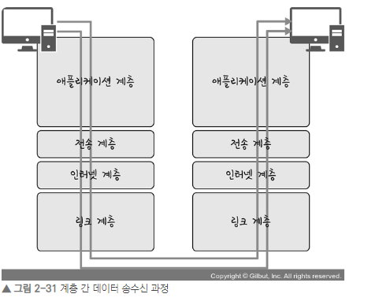

## 네트워트와 클라이언트와 서버 

1. 네트워트의 기본구조

    네트워크는 `글로벌 네트워크를 통해서` 컴퓨터와 컴퓨터끼리 연결을 합니다. 

    |종류|내용|
    |:--|:--|
    |LAN (Local Area Network)| 사무실이나 빌딩처럼 비교적 좁은 범위의 네트워크, Wifi, 프린터연결 등 |
    |WAN (Wide Area Network)| LAN 사이를 전용선 등으로 연결한 광역 네트워크, (중계기, ISP,SDN 등) |

2. 클라이언트와 서버 

    |종류|내용|
    |:--|:--|
    |클라이언트| 컴퓨터, 노트북, 핸드폰, 아이패드 등... |
    |서버|공유기, 도메인 관리기(DNS), IP할당기, 시간관리기(NTP), 게이트웨이|

    

## OSI 7계층과 TCP/IP 4계층 

    1960년 알파넷(미국방성)이 최초의 네트워크를 구축하며 배포가 시작되었지만, 통일돤 규칙이 없었기에 한 마디로 난장판이었다. 
    1970년 국제 표준기구(ISO)에서 OSI 7계층 모델을 만들어서 기본 구조를 이끌었고, 1990년 최종적으로 검증이 완료된 TCP/IP 규칙이 표준이 되었다. 

TCP/IP 4게층 OSI 7계층과 만이 비교된다. 
> `계층화`란  
> 통신 기술의 도입과 통신기능의 확장을 쉽게 하기 위해 규칙을 단계(계층)으로 나눈 것이다. 

|계층|내용|
|:--|:--|
|자용자 지원계층 ---|
|(7) 애플리케이션(응용) 계층| 애플리케이션 서비스 제공|
|(6) 프레젠테이션(표현) 계층|문자코드, 압축, 암호화|
|(5) 세션 계층|통신방식 결정|
|전송계층 ---|
|(4) 전송 계층|신뢰성 있는 통신 구현|
|네트워크 지원계층 ---|
|(3) 네트워크 계층| 다른 네트워크와 통신하기 위한 IP주소 결정|
|(2) 데이터링크 계층|물리주소 결정|
|(1) 물리계층|물리적인 연결과 전기 신호 변환 |

### TCP/IP의 4계층과 비교
- 애플리케이션 계층 : 애플리케이션, 프레젠테이션, 세션
- 전송 계층 : 전송 계층
- 인터넷 계층 : 네트워크 계층
- 네트워크 인터페이스 계층 : 데이터 링크 계층, 물리 계층

CS를 위한 전공지식 노트에 따르면, 이 계층들은 특정 계층이 변경되었을 때 다른 계층이 영향을 받지 않도록 설게되었다. 

### 각 계층과 내용
- 애플리케이션 : FTP, HTTP, SSH, SMTP, DNS
  - 애플리케이션 계층은 응용 프로그램이 사용되는 프로토콜 계층이며 웹 서비스 이메일 등 서비스를 실질적으로 사람들에게 제공하는 층   
- 전송 : TCP, UDP, QUIC
  - 전송 계층은 송신자와 수신자를 연결하는 통신 서비스를 제공하며 연결 지향 데이터 스트림 지원, 신뢰성, 흐름 제어를 제공하며, 애플리케이션과 인터넷 계층 사이의 데이터가 전달될 때의 중계 역할   
- 인터넷 : IP, ARP, ICMP
  - 네트워크 패킷을 IP 주소로 지정된 목적지로 전송하기 위해 사용되는 계층   
- 링크 : 이더넷, WIFI
  - 실질적으로 데이터를 전달하며 장치 간에 신호를 주고받는 규칙을 정하는 계층   

    

- 클라이언트와 서버의 소통은 위의 이미지와 같이 동작된다. HTTP를 통해 웹 서비스를 요청하면, 애플리케이션 계층에서 전송 계층으로 필자가 보내는 요청값들이 캡슐화 과정을 거쳐 전달되고, 
- 다시 링크 계층을 통해 해당 서버와 통신을 하고, 해당 서버의 링크 계층으로부터 애플리이션까지 비캡슐화 과정을 거쳐 데이터가 전송된다. 

## 계층별 상세정리
> 물리계층 (데이터 전송)

- 물리계층은 네트워크의 가장 하위에 위치하며, 실제 데이터 전송을 담당합니다.
- 이 계층에서는 데이터를 전기 신호로 변환하여 네트워크 매체를 통해 전송합니다.
- 물리적인 연결과 전기 신호 변환을 통해 기본적인 비트 단위의 데이터 전송이 이루어집니다.

>데이터링크 계층 (물리주소 결정)

- 데이터링크 계층은 노드 간의 신뢰성 있는 데이터 전송을 담당합니다.
- 이 계층에서는 물리적인 네트워크 주소인 MAC(Media Access Control) 주소를 사용하여 통신합니다.
- 오류 검출과 재전송 기능을 제공하여 데이터의 신뢰성과 효율성을 유지합니다.

>네트워크 계층 (IP 주소 결정)

- 네트워크 계층은 여러 개의 네트워크를 거쳐 목적지까지 데이터를 전달합니다.
- 이 계층에서는 IP 주소를 사용하여 데이터를 목적지까지 전달할 경로를 결정합니다.
- 라우팅, 패킷 분할 및 조립, 서브넷팅 등의 기능을 수행하여 데이터의 경로 선택과 네트워크 간 통신을 관리합니다.

> 전송 계층 (신뢰성 있는 통신 구현)

- 전송 계층은 송신자와 수신자 간의 신뢰성 있는 데이터 전송을 담당합니다.
- 이 계층에서는 데이터를 분할하여 패킷으로 전송하고, 전송 중에 발생하는 오류를 검출 및 복구합니다.
- 신뢰성 있는 연결을 제공하며, 흐름 제어와 오류 제어를 통해 데이터의 정확성과 순서를 보장합니다.

> 세션 계층 (통신방식 결정)

- 세션 계층은 통신을 위한 세션을 설정, 유지 및 종료하는 기능을 제공합니다.
- 이 계층에서는 데이터의 동기화, 대화 제어, 체크 포인팅 등을 수행하여 양 끝단의 응용 프로세스 간 효율적인 통신을 조정합니다.
- 세션 계층은 데이터의 전송 시간과 흐름을 관리하여 성능을 향상시킵니다.

> 프레젠테이션 계층 (문자코드, 압축, 암호화)

- 프레젠테이션 계층은 데이터의 형식을 변환하고 암호화하는 역할을 수행합니다.
- 이 계층에서는 데이터의 인코딩, 압축, 암호화 등의 작업을 처리하여 상위 계층으로 전달합니다.
- 데이터의 표현 방식을 일관되게 유지하고, 데이터의 안전성을 보장하기 위해 암호화 기술을 사용합니다.

> 애플리케이션 계층 (애플리케이션 서비스 제공)

- 애플리케이션 계층은 최종 사용자에게 서비스를 제공하는 계층입니다.
- 이 계층에서는 사용자가 네트워크를 통해 응용 프로그램을 실행하고 데이터를 주고받을 수 있도록 합니다.
- 이메일, 웹 브라우저, 파일 전송 등 다양한 응용 프로그램이 이 계층에서 동작하며, 사용자와 직접 상호작용합니다.

## 계층별 비교, MAC와 IP 
>  `MAC` 주소는 데이터링크 계층에서 `로컬 네트워크 내`에서 통신을 위한 물리적인 주소로 사용되며(노드 간의 물리적인 연결), `고유하고 변하지 않습니다`. 

> `IP` 주소는 네트워크 계층에서 `인터넷 상`에서 목적지를 식별하는 데 사용되며(여러 네트워크를 거쳐 데이터를 전달), `유동적으로 할당`되고 전역적으로 유효한 주소입니다.

## 계층이동간의 캡슐화의 역캡슐화 
>캡슐화 과정:

- 상위 계층에서 하위 계층으로 데이터를 전달할 때, 데이터에 헤더와 트레일러를 추가하여 패킷을 형성합니다.
- 각 계층은 자신에게 필요한 정보를 헤더에 추가하고, 필요한 경우 데이터에 대한 오류 검출과 복구를 위한 체크섬(Checksum) 등의 정보를 트레일러에 추가합니다.
- 패킷은 상위 계층에서 하위 계층으로 전달될 때, 하위 계층의 헤더와 트레일러를 더해진 상태로 전달됩니다.
- 이렇게 캡슐화된 패킷은 하위 계층을 통해 전송되며, 각 계층은 자신에게 필요한 정보를 추출하고 패킷을 처리합니다.

> 역캡슐화 과정:

- 하위 계층에서 상위 계층으로 패킷을 전달하면서 헤더와 트레일러를 제거하는 과정입니다.
- 패킷이 하위 계층에서 상위 계층으로 전달되면, 각 계층은 자신에게 필요한 정보를 추출하여 패킷을 처리합니다.
- 패킷을 처리한 후, 각 계층은 헤더와 트레일러를 제거하고, 필요한 정보를 상위 계층에 전달합니다.
- 이렇게 역캡슐화된 데이터는 최종적으로 상위 계층에서 처리되어 사용자에게 제공됩니다.
- 캡슐화와 역캡슐화는 OSI 모델에서 각 계층이 독립적으로 동작하며 데이터를 전달하고 처리하는 과정에서 중요한 역할을 합니다.- 각 계층은 자신에게 필요한 정보를 헤더와 트레일러에 추가하여 데이터를 패킷 형태로 캡슐화하고, 역캡슐화는 패킷을 전달받은 계층이 헤더와 트레일러를 제거하여 필요한 정보를 추출하고 처리합니다. 이러한 과정을 통해 계층 간의 데이터 전달과 처리가 이루어집니다.