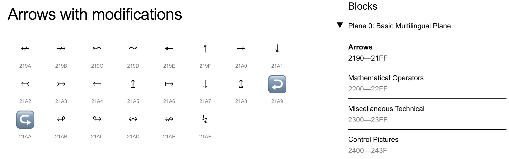
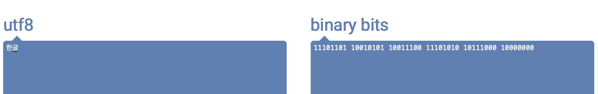

## [컴퓨터구조, 강민철 - 혼자 공부하는 컴퓨터 구조](https://www.youtube.com/watch?v=kFWP6sFKyp0&list=PLYH7OjNUOWLUz15j4Q9M6INxK5J3-59GC)

- 7시간강의 
- 실습보다는 이론이 주가 됩니다. 
- 세상에 존재하는 모든 컴퓨터의 동작와 예외를 담지 않고 전공서에서 제공하는 일반사례를 기준으로 저술했으며, 회로에 대한 언급이 없습니다. 개발자를 대상으로 작성되었기에 지역적인 내용은 배제되었습니다. 
- [github](https://github.com/kangtegong/self-learning-cs)

 

## 01 컴퓨터의 구조의 기초
### 01-01 컴퓨터구조를 알아야 하는 이유

처음 프로그래밍을 배운다면, `언어`부터 배우게 됩니다. 그러나 구조까지 살펴보지 못합니다. 그러나 좋은 개발자가 된다는 것은 `컴퓨터의 근간`을 알아야 합니다. 그래서 이 과정이 존재합니다. 

- 문제해결 능력
  - 분명 같은 코드인데, 왜 동작하지 않을까? `제 컴퓨터에서는 안되는데요?` 이는 문법를 넘어선 부분의 문제가 있기 때문일 것입니다. 이 과정에서 컴퓨터 내부를 들여다 보아야 하는데, 이것이 문제해결 능력의 부분입니다. 
  - 채용 담당자 입장에서는 이러한 문제개혈까지 겸허한 개발자를 선호할 것입니다. 특별히 `삼성전자`가 그렇습니다. 
  - 컴퓨터를 내려다보면서 문제를 해결할 수 있즌 자가 됩니다. 
    
- `성능, 용량, 비용`을 고려한 개발
  - 성능, 용량, 비용은 개발에서 간과할 수 없습니다. 
  - 서버컴퓨터를 검색하면, 성능/용량에 따라서 상이한 것을 볼 수 있습니다. 저렴?최신?
    - 개인과 다르게, 회사 잎장에서는 다른 접근이 필요합니다. 
    - 먼저 개발코드에 적합한 성능, 용량, 비용의 판단에 따른 컴퓨터를 지불하면 됩니다. 
    - 클라우드 서버컴퓨터를 선택한다해도, CPU/메모리/저장용량을 직접선택한다는 부분에서 여기에도 문제입니다. 

### 01-02 컴퓨터구조의 큰 그림
컴퓨터란? 명령어를 실행하는 하나의 기계라고 설명할 수 있습니다. 해당 기계가 이해하는 정보와 부품을 다뤄보면서 컴퓨터에 대해서 이해해보겠습니다. 

1. 컴퓨터가 이해하는 정보 : 데이터, 명령어 

    - 데이터 : 정적정보(숫자, 문자, 이미지)가 있고, 0과 1의 이진수로 변환됩니다.
    - 명령어 : 컴퓨터를 실질적으로 움직이는 정보, 데이터를 명령어를 위한 일종의 재료입니다. 
      

2. 컴퓨터의 네가지 핵심부품
    - (1) CPU
    - (2) 주기억장치(메모리) : 캐시(SRAM), 메인메모리(DRAM) + ROM 
    - (3) 보조기억장치 : 하드디스크(JDD,SSD) 등
    - (4) 입출력장치
      

4가지 부품이 서로 유기적으로 움직이기 위해서는 판이 필요한데, 이를 `마더보드:메인보드`라는 판에 부착하게 됩니다. 이를 연결해주는 통로가 또한 존재하느데 이를 `버스`라고 부르며, 그 가운데 가장 중요한 버스를 `시스템버스`라고 부릅니다. 연결의 척추에 해당됩니다. 

#### 메모리
현재 실행되는 프로그램의 명령어와 데이터를 저장하는 부품입니다. 여기서 현재 실행되는 프로그램을 추후 `프로세서`라고 부르게 될 것입니다. 여기서 볼 수 있듯이 실행되는 프로그램은 모두 데이터와 명령어를 가지고 있고 이를 메모리에 저장합니다. 그렇다면 설치는 했지만 실행되지 않은 프로그램들은 어떻게 돌까요? 이는 보조기억장치에 기록되어 있습니다. 

`메모리와 주소` : 메모리는 자신을 여러 개로 소분하고 주소와 주소에 값으로 각각에 접근하도록 합니다. 메모리에는 위에서 언급한 것처럼 명령어와 데이터가 저장됩니다. 

- 첫째, 프로그램이 실행되기 위해서는 메모리에 저장된다.
- 둘째, 메모리에는 명령어와 데이터가 저장된다.
- 셋째, 해당 메모리는 주소값을 가지고 접근한다. 

#### CPU : 컴퓨터의 두뇌
메모리에 저장된 명령어를 읽어 들이고, 해석하고, 실행하는 부품이다. 
- ALU : 산술연산장치(계산기)
- 저장장치 : 제어 신호를 내보내고, 명령어를 해석하는 장치 -> 제어신호란 컴퓨터 부품들을 관리하고 작동시키기 위한 전기 신호 
  - 메모리 읽기 신호 : CPU가 메모리에 저장된 값을 읽고 싶을 때, 메모리를 향해 보내는 제어신호를 뜻하고
  - 메모리 쓰기 신호 : 메모리가 어떤 값을 저장하고 싶을 때, 메모리를 향해 보내는 제어신호를 말한다. 
- 레지스터 : CPU 내부의 작은 저장장치(L1, 캐새)

CPU의 동작에 대해서 살펴봅시다. 먼저는 제어장치에서 (1) 메모리 읽기:제어신호를 내보냅니다. (2) 메모리에서 찾은 데이터는 CPU 내의 레지스터로 가져오게 됩니다. (3) 제어장치 : 레지스터로 들어온 명령어를 해석하고, 실행을 위해서 메모리 읽기 신호를 통해서 한 번더 필요한 데이터를 가져오게 됩니다. (4) ALU는 이렇게 데이터들이 가져와지면, 실제 명령을 수행합니다. 그리고 그 결과를 레지스터에 담게 됩니다. 

#### 보조기억장치
RAM은 보조기억장치에 대해서 비싸고, 휘발성입니다. 즉 전원이 꺼지면 저장된 내용이 날아갑니다. 메모리가 실핼할 정보를 저장한다면, 보조기억장치는 보관할 정보를 저장합니다. 보관이 필요하면 보조기억 장치에 저장되게 됩니다. 

#### 입출력장치
입출력장치와 보조기억장치는 산반되는 것이 아니기에, 딱 잘라 구분되는 개념이 될 수는 없지만, 메모리에 대해서 조금 더 특별하게 다루면서 보조하는 특별한 입출력장치(프로그램)라 여기면 좋을 것 같다. 그러기에 나누어서 다룹니다. 

#### 매안보드 : 마더보드와 버스 
컴퓨터의 4가지의 핵심부품이 부착되는 판을 마더보드라고 하고, 이를 연결하는 것을 버스라는 단위로 부릅니다. 그리고 그 중에 메인척추와 같은 부분을 시스템 버스라고 부릅니다. 메인보드는 이렇게 버스를 통해서 정보를 주고 받으며, 그러기에 다양한 종류의 버스가 존재합니다. 

- 시스템 버스
  - 주소버스 : 주소를 주고받는 통로
  - 데이터버스 : 명령어와 데이터를 주고받는 통로
  - 제어버스 : 제어 신호를 주고받는 통로 

 

## 02 컴퓨터의 데이터 구조
컴퓨터는 0과 1을 이해하게 되는데, 1bit는 꺼짐켜짐 단 2개의 정보를 답을 수 있습니다. 2bit는 4개의 경우의 수가 가능하겠죠. 3bit는 8개의 경우의 수의 데이터를 담을 수 있습니다. 

즉 n비트로는 2^n의 정보로 표현이 가능합니다. 프로그램은 이러한 수많은 비트로 구성되어 있습니다. 그러기에 단위가 큰 단위를 가지고 이야기를 하는데, 바이트 < 킬로바이트 < 메가바이트 < 기가바이트 < 테라바이트로 표현됩니다. 

- 1 바이트 : 8bit
- 1 킬로바이트 : 1,000바이트(1,000byte)
- 1 메가바이트 : 1,000킬로바이트(1,000kB)
- 1 킬로바이트 : 1,000메가바이트(1,000MB)
- 1 테라바이트 : 1,000기가바이트(1,000GB)
- 과거에는 1024개씩 묶는 단위를 사용했는데, 이는 kiB, MiB, GiB 라고 별도로 불렀습니다. 

`워드(word)`란 단위도 존재하는데, CPU가 한 번에 처리할 수 있는 정보의 크기 단위가 있습니다. 
- 하프워트 : 워드의 절반 크기
- 풀워드 : 워드 크기
- 더블워드 : 워드의 두 배 크기 
- 한번에 32bit씩 처리할 수 있다면, 1word라고 합니다. 
- 반면에 64bit는 CPU가 한 번에 처리할 수 있는 위드의 단위입니다. 

### 02-01 0과 1로 숫자를 표현하는 방법
1. `이진법(binary)` : 0과 1로 수를 표현하는 방법입니다. 일상에서 사용하는 진법은 9를 넘어가면 자리올림을 하는 십진법(decimal)입니다. 
- 1 -> 10 -> 11 -> 100 -> 101 -> 110 -> 111 -> 1000 으로 수를 표현합니다. 이진수는 컴퓨터가 이해하는 언어이기에 중요합니다. 
- 이진수 표기는 보통 `0b`를 숫자 앞에 더하여 이진수임을 알립니다. 
- `이진수와 음수` : 컴퓨터는 기본적으로 마이너스(-) 부호를 알지 못합니다. 0과 1만으로 어떻게 음수를 표현할까요? 대표적인 방법이 `2의 보수법`입니다. 어떤 수를 그보다 2^n에서 뺀 값입니다. 
  - 쉽게 구하는 방법은 모든 0과 1을 뒤집고, 1을 더하면 됩니다. 
  - `이진수 11`에 대한 음수 표현은 `00 + 1`인 `01`이라는 말입니다. 
  - `1011` -> `0100 +1` = `0101` 음수로 변경하기
  - `0101` -> `1010 +1` = `1011` 원본으로 돌리기 
  - 여기에 질문이 있습니다. 십진수 5를 이진수로 변경하면 `0101`입니다. 이를 음수와 어떻게 구분할까요? 이는 CPU 안에 있는 플래그(flag) 레지스터를 통해서 판별됩니다. 모든 수는 자신이 음수인지 양수인지 표시를 가지고 다닙니다. 그래서 컴퓨터는 혼선될 일이 없습니다. 

2. `십육진법`
- 이진법으로 숫자의 길이가 너무 길어진다는 단점이 있다. 그래서 컴퓨터의 데이터를 표현하기 위해 고안된 방법이 십육진법이다. 
  - 수가 15를 넘어가는 시점에 자리올림을 하는 기법이다. 
  - `1~9, A~F`
  - 16이되면, `10`이 됩니다. 
- 십진수 16은 십육진법에서 `11`입니다. 코드상 `0x`를 숫자 앞에 붙여줍니다.  
- 질문입니다. 왜 이진수와 십육진법을 사용하게 된 걸까? 가장 큰 이유는 "강민철"의 생각에서 이진수 <--> 십육진수를 변환하는 방법이 간편하기 때문이다. 
- `1A2B`의 변환은 각 숫자마다 4자리로 변환하는 것입니다. 반대는 이진수 4자리는 십육진수의 한 자리입니다. 
- 여기서도 볼 수 있듯이 이러한 숫자체계는 컴퓨터 기준입니다. 

### 02-02 0과 1로 문자를 표현하는 방법
1. 배경지식
질문 : 컴퓨터는 0과 1밖에 모르는데 어떻게 문자를 이해하고 표현할 수 있을까? 
- 문자집합 : 컴퓨터가 이해할 수 있는 문자의 모음(character set)
- `인코딩` : 코트화하는 과정(0과 1로 변환)
- `디코딩` : 코드를 해석하는 과정 (0과 1의 문자를 문자코드로 변환)

2. 대표적인 문자집합과 인코딩
- 아스키코드 
  - 알파벳, 아라비아 숫자, 일부특수문자, 제어문자가 표현됩니다. 
  - 하나의 아스키코드를 표현하기 위해서는 7bit가 필요하지만, 오류검출을 위한 1bit(패리트 비트)를 더해서 8bit로 구성됩니다. 
  - 즉 2^7 인 `128개`의 표현(0~127)이 가능하다는 말입니다. 각각의 값을 코드 포인트(문자에 부여된 값, code point)입니다. 
  - 대분자 A는 65, 소문자 a는 97 입니다. 
  - 문자에 부여된 값을 인코딩 한다는 점에거 간결하지만, 다양한 문자에 대응되지 못한다는 단점이 있습니다. 128개 이상의 문제에 대한 코드 포인트를 기술하지 못했기 때문입니다. 

- 언어별 인코딩방식 : 한글 
  - 먼저 한글의 특징에 대해서 살펴봐야 합니다. 
    - 완성형(가,나,다 - 자체에 고유한 코드 포인트 부여) vs 조합형(초성, 중성, 종성 - ㄱ, ㅏ 마다 코드 포인트 부여)
  - 그러나 언어별 인코딩방식의 문제는 다국어 서비스를 지원할 때 문제가 됩니다.   
  - EUC-KR (완성형 인코딩)
    - 글자마다 2bit 크기의 코드를 부여한다. 2바이트 = 16비트 == 4자리 십육진수로 표현됩니다. 
    - [직접 실습](https://dencode.com) : 가(Hex String : b0a1), 가(Hex String : b0a2), 2350개의 한글 표현이 가능합니다. 
    - 그럼에도 쀏, 뙠, 휔 에 대해서는 코드 포인트가 부여되어 있지 않기에 표현할 수 없는 한계가 있습니다. 
  - 그래서 모든 언어, 특수문자까지 통일된 문자 방식의 집합이 있을까? 

- 유니코드 문자집합과 utf-8 
  - 유니코드
    - 통일된 문자집합, 한글/영어/화살표/이모티콘
    - 유니코드를 인코딩하는 방식이 `uft-8`, `uft-16`, `uft-32`  
    - [unicode 실습](https://symbl.cc/en/unicode/blocks/)
    
    - `uft-8` : 대표적인데, 가변길이 인코딩을 따릅니다.
      - 결과에 따라 `1바이트~4바이트`가 됩니다. 
      - [onlineutf8tools 실습](https://onlineutf8tools.com/convert-utf8-to-binary)
      
 

## 03 컴퓨터의 명령어
### 03-01 소스 코드와 명령어
소스코드는 어떻게 명령어로 변경될까요? 개발코드는 컴퓨터가 직독직해 하지 못합니다. `고급언어(개발자가 읽고 쓰기 편한 언어)`가 `저급언어(명령어)`로 변환되어야 합니다. 

- 고급언어 : C++, Java(개발자가 이해하기 쉬운 언어)
- 저급언어 : 컴퓨터가 이해하고 실행하는 언어(기계어, 어셈블리어)

1. 기계어(이진수로 기록된 언어)
2. 어셈블리어(기계어를 읽기편하게 만들어진 저급언어입니다)
  - push는 `rbp`로 표현됩니다. 
  - 어셈블리어는 소스코드에 직접 명시적으로 기록하기도 합니다. 

3. 고급언어 : C, C++, Java, Python
  - 고급언어의 변환과정
    - 컴파일언어 : 컴파일러라는 통로(프로그램)를 통해서 변환되는 언어군입니다. 이렇게 변환된 저급언어를 `목적코드`라고 부릅니다. 인터프리터와 다르게 코드 전체를 살펴본다는 점에서 전체에 문제가 없는지 기다려야 됩니다. 
    - 인터프리터언어 : 인터프리터에 의해 소스코드가 한 줄씩 변환됩니다. 소스 코드 전체가 한 줄씩 변환되기에 실행이 즉시적입니다. 
  - 실행 양상이 다릅니다. 
    - 인터프리터 언어는 오류코드를 발견하면, 그 전까지는 실행되지만 이후의 실행이 중단됩니다.
    - 반면 컴파일 언어는 오류코드를 발견하면, 소스 코드 전체가 실행되지 않습니다.   

### 03-02 명령어의 구조
명령어의 구조에 대해서 다뤄봅시다. `영수야, 방 좀 치워`, `멍멍아, 이거 물어와`와 같습니다. 무엇으 대상으로, 무엇을 수행하라와 같이 기록되어 있습니다. 
- `수행할 연산` : 수행할 연산(더해라, 빼라, 저장해라)
- `무엇을 대상으로` :  연산에 사용될 데이터, 연산에 사용될 데이터가 저장된 위치(100과, 120를)

1. `연산코드` : 연산의 동사
  - `연산 코드의 종류` & 생김새는 CPU 마다 다르다.
  - 데이터 전송
  - 산순/논리 연산
  - 제어 흐름 변경
  - 입출력 제어 

2. `오퍼랜드` : 연산의 대상 (오퍼랜드필드 == 주소필드, 이는 위치가 차지하는 비율이 많기에)
  - 연산에 사용될 데이터
  - 연산에 사용될 데이터가 저장된 `위치`

연산코드는 하나라 할지라도, 오퍼랜드는 없을 수도 있고, 하나 이상인 경우도 있다는 점이 중요하다. 

-- 02:04:28

### 03-03 C언어의 컴파일 과정 

