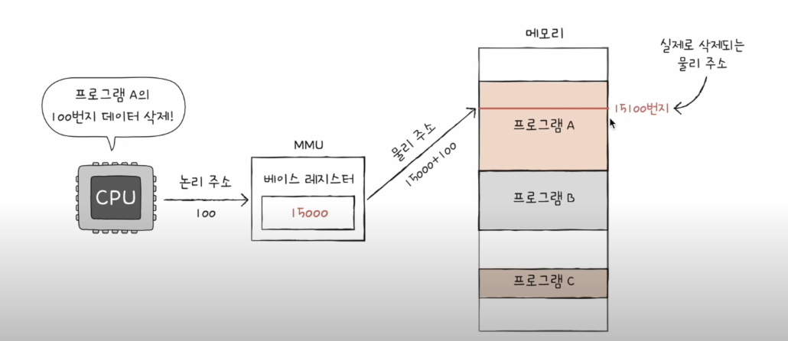

## [컴퓨터구조, 강민철 - 혼자 공부하는 컴퓨터 구조](https://www.youtube.com/watch?v=kFWP6sFKyp0&list=PLYH7OjNUOWLUz15j4Q9M6INxK5J3-59GC)

- 7시간강의 
- 실습보다는 이론이 주가 됩니다. 
- 세상에 존재하는 모든 컴퓨터의 동작와 예외를 담지 않고 전공서에서 제공하는 일반사례를 기준으로 저술했으며, 회로에 대한 언급이 없습니다. 개발자를 대상으로 작성되었기에 지역적인 내용은 배제되었습니다. 
- [github](https://github.com/kangtegong/self-learning-cs)

 

## 04 CPU와 명령어
### 04-01 CPU의 ALU와 제어장치
먼저 CPU는 ALU + 제어장치 + 레지스터들로 구성되어 있습니다. 

1. ALU : 산술연산장치
  - 피연산자(레지스터) : 수행할 데이트를 받아들입니다. 
  - 제어신호(제어장치) : 수행할 연산을 받아들입니다.
  - 플래그(플래그 레지스터) : 연산 결과에 대한 부가정보
    - 이진수만으로 양수와 음수를 판단하기 어려우니
    - 이를 라벨링하는 표현이 플래그라고 2강에서 다뤘습니다.
    - ALU 에서 피연산자와 제어신호를 바탕으로 연산을 수행합니다. 
    - 오버플래그 -> 레지스터에 담을 수 있는 양보다 많은 양도 기록됩니다. "너무 커"
    - 부호플래그(양수,음수), 제로플래그(0인지), 캐리플래그(올림수), 인터럽트플래그(인터럽트가 가능한지), 슈퍼바이저 플래그(커널모드, 사용자모드인지 나타내는 플래그)
  - 결과값(레지스터) : 숫자, 문자, 주소 등으로 반환될 것입니다. 그리고 그 결과값이 레지스터에 저장하는 것은 빠른 접근을 위해 임시적으로 레지스터에 담아두는 것입니다. 
2. 제어장치 : 제어 신호를 발생시키고, 명령어를 해석하는 장치 
  - CPU의 클럭 : 제어장치가 받아들이는 정보 가운데 하나로, 컴퓨터의 모든 부품을 일사불란하게 움직일 수 있게 하는 시간 단위입니다. 컴퓨터의 메트로늄이라고 생각하면 될 것 같고, 이 단위에 따라서 메모리에서 명령어를 가져오는 등의 동작을 수행한다. 이를 하나의 클럭주기라고 표현한다. 
  - 해석할 명령어(명령어 레지스터) : 레지스터로부터 명령어를 받아들입니다. 
  - 플래그(플래그 레지스터) : 명령어 레지스터와 함께 부가적인 값을 함께 받아들입니다. 결과가 0인지, 음수인지 양수인지입니다. 
  - 제어신호(제어버스)를 받아들입니다. 외부로부터 발생된 경우, 해당신호를 판별하여 받아들입니다. 

  - 이후, 내보내는 과정
    - To. 레지스터
    - To. ALU : 수행할 연산을 내보냅니다. 
    - To. 메모리 : 메모리를 읽고, 쓰고, 지워라 
    - To. 입출력장치 : 입출력장치를 읽어라, 써라 

### 04-02 CPU와 레지스터
레지스터는 CPU 내부의 작은 임시저장소로, 프로그램 속 명령어와 데이터가 실행 전후로 저장되는 공간이다. 

1. 반드시 알아야할 내용(8가지) : CPU마다 다르지만, 공동적으로 사용하는 레지스터들이 있습니다. 
- 먼저 4가지 레지스터 : 실행할 프로그램이 동작하는 것과 관련있습니다. 각각의 레지스터들은 주소버스 / 데이터버스 / 제어버스를 통해서 CPU와 메모리 사이에서 값을 중계합니다. 프로그램에서 -> 명령어 레지스터 순으로 동작합니다. 
  - 프로그램 카운터 : 메모리에서 가져올 명령어의 주소
  - 메모리 주소 레지스터 : 메모리의 주소(주소버스를 이용해야 할 때)
  - 메모리 버퍼 레지스터 : 메모리와 주고받을 값(데이터와 명령어), 데이터 버스로 정보를 CPU가 주고받을 때 거쳐가는 레지스터,
    - 값을 가져왔다면 이 단계에서 `프로그램 카운터`가 증가하며 다음 실행을 준비합니다. 
    - 그러나 특정 메모리 주소로 실행 흐름을 이동하는 명령어가 실행 될 때, `프로그램 카운터`의 순차적인 흐름이 끊어집니다. 또한 인터럽트 실행 시 끊어집니다. 
  - 명령어 레지스터 : 해석할 명령어(메모리에서 읽어드린 명령어, 제어장치가 해석)

- 다음으로 4가지 입니다. 
  - 플래그 레지스터 : 연산 결과 또는 CPU 상태에 대한 부가적인 정보
  - 범용 레지스터 : 다양하고 일반적인 상황에서 자유롭게 사용
  - 스택 포인터 & 베이스 레지스터 : 주소지정에서 사용된다. 
    - 스택 포인터 : 스택주소지정방식에 사용되는데, 스택의 꼭대기를 가리키는 레지스터이다. 스택이 어디까지 차 있는지에 대한 표시이다. 
      - 스택은 어디있을까? 메모리 안에 스택을 사용할 수 있는 특정한 영역이 있으며 운영체제에서 학습할 예정이다. 
    - 베이스 레지스터 : 변위주소지정 방식에서 사용되는 레지스터이다. 이는 오퍼랜드 필드의 값을 변위로 삼고, 특정 레지스터의 값을 더하여 유효 주소를 얻는 방식이다. 
      - 1번째(상대주소지정방식) : 오퍼랜드 필드의 값 + 프로그램 카운터
      - 2번째(베이스레지스터 주소지정방식) : 오퍼랜드 필드의 값 + 베이스 레지스터, 기준주소가 있고, 그 기준으로부터 떨어진 값이 메모리에 담겨지는 방식이다. 

### 04-03 명령어 사이클과 인터럽트 
CPU는 메모리로부터 값을 가져와서 실행합니다. 이때에는 `일정한 주기`(명렁어 사이클)가 있습니다. CPU는 메모리에 있는 정해진 흐름대로 일을 처리하는데, 이것이 방해되는 요소가 있다면 그 신호를 끊어내는 `인터럽트`를 발생시킵니다. 

1. #### 명령어 사이클(CPU가 메모리에서 값을 가져오는 일정한 주기)
- 인출사이클 : 값을 가져오는 것을 인출사이클
- 실행사이클 : 값을 실행하는 주기

  명령어 사이클은 이 과정을 을 반복합니다. 그런데 CPU가 인출을 하더라도 바로 실행이 불가능한 경우가 존재한다. 대표적으로 `간접주소지정방식`이 있다. 몇차례더 메모리 접근이 필요한 경우가 있다. 

2. #### 인터럽트 

    정해진 흐름대로 CPU가 실행되고 있는데, 그 과정을 끊어내는 것을 말합니다. `Interrupt` 방해, 중단의 뜻을 가지고 있는 해당 기능은 CPU가 긴급하게 다른 작업을 실행해야 할 때 발생하는 것을 의미합니다. 

    - 동기인터럽트(예외) : CPU가 예기지 못한 상황을 접했을 때 발생합니다. 
    - 비동기인터릅트(하드웨어) : 주로 입출력장치에 의해 발생, 주로 알림과 관련되어 있습니다.(세탁기완료 알림, 전자렌지 조리완료 알림)
      - 존재이유 : 입출력 작업 도중에도 효율적으로 명령어를 처리하기 위해 사용한다. 일반적으로 입출력 작업은 CPU 작업보다 느립니다. 그래서 입력받는 시간을 보장해주는거죠.
        - 처리 순서 
          - 첫째, 입출력장치는 CPU에 인터럽트 요청 신호를 보낸다. 
          - 둘째, CPU는 실행 사이클이 끝나고 명령어 인출하기 전, 항상 인터럽트 여부를 확인한다. 
          - 셋째, CPU는 인터럽트 요청을 확인하고, 인터럽트 플래그를 통해 현재 인터럽트를 받아들일 수 있는지 여부를 확인
          - 넷째, 인터럽트를 받아들일 수 있다면, CPU는 지금까지의 작업을 백업한다.
          - 다섯, 인터럽트 백터를 참조하여, 인터럽트 서비스 루틴을 실행
          - 여섯, 인터럽트 서비스 루틴 실행이 끝나면, 넷째에서 백업해 둔 작업을 복구하여 실행을 재개한다. 

        - 용어설명  
          - 인터럽트 요청신호 : 인터럽트는 CPU의 실행 과정에 끼어드는 것이기에, 끼어들 수 있는지 확인하는 작업을 수행합니다. 
            - 그러나, 정전과 같은 경우에 발생되는 인터럽트는 인터럽트 플래그로 막을 수 없다. 
          - 인터럽트 플래그 : 인터럽트 요청 신호를 받아들일지 무시할지를 결정하는 비트  
            - 인터럽트 플래그로 막을 수 없는 플래그도 있다(정전되었을 때 실행되는 플래그 등) 
          - 인터럽트 서비스 루틴 : 인터럽트가 발생했을 때 해당 인터럽트를 어떻게 처리하기 위한 프로그램(즉, 메모리에 저장)  
            - 키보드가 인터럽트 요청을 보내면 이렇게 실행하세요와 같다. 
            - 메모리에 저장되어 있고, 각 서비스 루틴에 따라 저장된 시작주소가 다릅니다. 
          - 인터럽트 백터 : 각각의 인터럽트를 구분하기 위한 정보(메모리에 저장된 프로그램의 시작위치)를 모아놓은 곳입니다. 
          - "CPU가 인터럽트를 처리한다" : 인터럽트 서비스 루틴을 실행하고, 본래 수행하던 작업으로 되돌아온다. 
            - 그런다면, 기존에 있었던 CPU의 레지스터들은 어딘가에 백업이 되어야 하지 않을까요? 
            - 지금까지의 작업내용이 `스택`에 백업됩니다. 인터럽트가 끝나면 스택으로부터 백업된 레지스터의 정보를 불러오게 되는 겁니다. 

## 05 빠른 CPU 설계
### 05-01 빠른 CPU를 위한 설계 기법
엔지니어는 조금이라도 더 CPU를 빠르게 동작시켜야 하는 괴제가 있습니다. 이를 위해서는 `클럭 신호`에 맞춰 일사분란하게 움직이도록 해야 할 것이니다. 즉 정해진 흐름에 따라 CPU가 동작하게 한다면, 될 것입니다. 

1. `를럭신호` : CPU의 속도단위
- 헤르츠 : 1초에 클럭이 반복되는 횟수, 1초에 한 번 똑딱 1 Hz 입니다. 1초에 100번반복되면 100HZ 입니다. 
- 그러나 클럭은 일정하지 않습니다. 기본속도가 있고, 최대속도가 있다는 것이 그것이죠. 
- 그런데 클럭 속다 CPU 속도에 비례할까요? 아닙니다. 발열이 발생되기 때문입니다. 

2. 코어와 멀티 코어
- 첫째, 코어 수를 늘리는 방법
  - `코어 Core`란
    - 현대적인 관점에서 CPU라는 용어를 재해석 해야 한다. 전통적으로 명령어를 인출하고 해석하는 도구가 CPU 였지만, 현대적으로는 CPU에 많은 부품들이 추가되면서 기능이 다분화되었습니다. 오늘날에는 이러한 전통적인 CPU를 하나의 CPU 안에 여러개를 가질 수 있게 되었습니다. 이렇게 코어를 복수로 가지고 있는 CPU를 `멀티코어`라고 했습니다. 전통적인 CPU를 `싱글코어`라고 부르게 되었습니다. 
    - `멀티코어`에 비례해서 연산속도는 비례하지는 않습니다. 학교에서 하는 조별과제를 생각해봅시다. 사람이 많다고 효율이 좋지 않는 것 처럼 말입니다. 중요한 것은 `명령어 분배의 적절성`입니다. 
- 둘째, 스레드 수를 늘리는 방법 
  - `스레드` : 실행 흐름의 단위 
    - `하드웨저적 스레드` : 하나의 코어가 동시에 처리하는 명렁어의 단위입니다. 1코어 1스레드 CPU 라고 합니다. 그런데 코어가 2개인 경우와 각 코어가 2개 씩의 명령어를 동시에 실행할 수 있다면, 2코어 4스레드 CPU라고 부르는 것입니다. 하나의 코어가 여러개의 스레드를 처리하는 것을 멀티 스레드 프로세서(CPU)라고 합니다. 8코어 16 스레드란, CPU가 8개이고, 각 CPU는 각 2개의 스레드를 동시에 처리한다는 말입니다. 인텔은 이를 하이퍼스레딩이라 지칭합니다. 그러나 내용은 멀티스레드 기술을 수행하는 CPU라는 것입니다. 
      - 멀티스레드 프로세서를 실계하는 일의 핵심은 `레지스터`이다. 명령어를 실행하는 `레지스터 세트(하나의 명령어를 실행하기 위한 레지스터들)`가 복수라면, 다음으로 실행할 수 있는 명령어를 2개 가질 수 있다는 소리인 것이다. 
      - 2코어4스레드(하드웨어프로세서 = 논리 프로세서)의 상태는 프로그램(소프트웨어)에서는 일일이 알지 못합니다. 그런 점에서 논리 프로세서라고 불리기도 합니다. 프로그램 입장에서는 오! 명령어를 잘받아 가는데 정도라는 것입니다. 
    - `소프트웨어적 스레드` : 하나의 프로그램에서 독립적으로 실행되는 단위입니다. 싱글스레드란 메모리에서 하나의 스레드만 실행하는 것이고, 멀티스레드란 메모리에서 복수의 스레드를 실행할 수 있다는 것입니다. 
      - 예를들어, 입력받은 내용을 화면에 보여주는 기능, 입력한 내용에 대한 맞춤법을 동시에 실행해야 하는 경우, 소프트웨어 스레드를 하나의 독립적 실행하는 프로그램에 동시에 실행되게 만드는 것이 멀티스레드 입니다. 
      - 1코어 1스레드(하드웨어)라도 소프트웨어 멀티스레드를 구성할 수 있습니다. 

### 05-02 명령어 병렬처리 
1. 명령어 파이프라인 : 비슷한 시간간격으로 나누었을 때 
  - 첫째, 명령어 인출
  - 둘째, 명령어 해석
  - 셋째, 명령어 실행
  - 넷째, 결과 저장 

같은 단계가 겹치지만 않는다면, CPU는 `각 단계를 동시에 실행할 수 있다.` 즉 (A-1)해석 단계에서는 (A-2)인출을 다시 실행할 수 있다는 것이다. 이를 명령어 파이프라인이라고 부릅니다. 즉 컴베이어벨트에서 업무가 분업화되어 실행되는 것으로 생각할 수 있죠. 그러나 명령어 파이프라인을 사용하지 않는다면, `인출-결과` 단위로 실행되기에 오랜 시간이 걸릴 것이기에, 현대 CPU 설계예서는 명령어 파이프라인을 실행합니다. 

그러나 항상 이렇게 설계되지 않습니다. `파이프라인 위험`이 존재하기 때문입니다. 

  - 첫째, 데이터 위험
    - 명령어 간의 의존성에 의해 야기되는 것입니다. 모든 명령어는 동시에 실행할 수 없는데, 명령어1의 실행이 끝나야만 실행할 수 있는 명령어2를 실행할 수 있는 경우입니다. 연속적인 측면의 명령어는 동시에 실행할 수 없기 때문입니다. 이러한 경우를 데이터 위험이라고 부릅니다. 
  - 둘쨰, 제어 위험
    - 프로그램 카운터의 갑작스러운 변화입니다. CPU의 메모리가 변경되는 경우가 있습니다. 예를 들어서 인터럽트가 발생되었을 때입니다. 기본적으로 명령어은 순차적으로 다음 명령어를 호출하지만, 프로그램 카운터가 갑자기 변경되면, 순차적인 명령어 인출에 혼선이 발생됩니다. 이러한 경우에서 파이프라이닝이 실패하게 되는데 이를 제어 위험이라고 부릅니다. 이를 방지하기 위해 프로그램 카운터는 미리 예측하는 기술을 더하게 되었는데 이를 `분기 예측`이라고 부릅니다. 
  - 셋째, 구조위험
    - 서로 다른 명령어가 같은 CPU 부품(ALU, 레지스터)를 쓰려고 할 때 발생되는 위험요소 입니다. 

2. 슈퍼스칼라 : 여러 개의 명령어 파이프라인을 구성하는 것입니다. 
- 소프트웨어 스레드의 멀티 스레드를 언급했는데, 바로 슈퍼스칼라에 해당됩니다. 
- 이론적으로, 파이프라인 개수에 비례해서 처리 속도가 증가합니다. 이에 따르 `파이프라인 위험도도 증가`되기 때문입니다.

3. 비순차적 명령어 처리 : 합법적인 새치기 
- 현대 CPU 발전에 있어서 중요한 개념입니다. 파이프라인의 중단을 방지하기 위해 명령어를 순차적으로 처리하지 않는 명령어입니다. 위의 사례는 명령어를 1번지로부터 10번지까지, 위에서 아래로 실행되는 것이었습니다. 
- 개념은 의존성이 없는 명령어의 순서를 바꾸는 것입니다. 이를 통해서 파이프라이닝이 원할할 때, 도입됩니다. 이를 통해서 파이프라인의 중단을 방지할 수 있게 되는 것인데, 순서를 변경하는 것에도 규칙은 있습니다. 다음 실행에서 필요한 연산을 다음보다 후순위로 미룰 수 없는 것입니다. 

### 05-03 명령어 집합 구조, CISC(시스크) & RISC(리스크)
들어가며 : 명령어 파이프라이닝은 현대 CPU 설계에 있어서 중요합니다. 그런데 명령어에 따라서 파이프라이닝에 유리한 명령어와 그렇지 않는 명령어가 존재합니다. 그런데 CPU가 동일하지 않기 때문에, 명령어의 생김새, 연산, 주소 지정 방식이 상이합니다. 

1. 명령어 집합(구조, ISA) : CPU가 이해할 수 있는 명령어들의 모음/집합
- 인텔 CPU에서 만든 실행파일을 M1으로 옮기면 실행되지 않는 것입니다. 
- 컴파일과정에서 고급언어를 어셈블리어로 변환할 때, CPU(ARM CPU와 X86-64 CPU)에 따라서 다르게 변환되는 것이 대표적인 사례입니다. 
- 결국, 이러한 집한은 CPU의 언어인 셈이다. 즉 가치관과 접근법이 나라마다 상의한 것과 마찬가지입니다. 
- 명령어 해석방식, 레지스터의 종류와 개수, 파이프라이닝의 용이성 등...
- 명령어 집합구조에 따라서, 하드웨어 설계가 달라집니다. ISA는 CPU의 언어이자, 하드웨어가 소프트웨어를 어떻게 이해할지에 대한 약속

2. 명령어 집합의 두 축 
- `CISC` : 복잡한 명령어 집합을 활용하는 CPU(컴퓨터)
  - x86, x86-64
  - 복잡하고 다양한 명령어를 활용하는데, 명령어의 형태와 크기가 다양하여 가변길이 명령어라고 부릅니다. 
  - 그 결과 작은 수의 명령어로도 프로그램을 실행할 수 있습니다. 
  - 메모리를 최대한 아끼면서 개발했던 시기에 인기가 있었지만, 복잡한 만큼 명령어 파이프라이닝에는 불리했습니다. 
    - 명령어 하나를 실행하기에 클럭 주기가 상의하다는 점에서, 파이프라이닝이 어려웠습니다. 
  - 대다수의 복잡한 명령어는 사용 빈도가 낮다는 점에서, 사용빈도가 상이하다는 점도 있습니다. 즉 자주 사용하는 명령어만 사용한다는 거죠.    

- `RISC` : 단순하고 적은 수의 고정 길이 명령어 집합을 활용하는 CPU(대표, ARM)
  - 명령어의 종류가 적고, 짧고 규격화된 명령어를 사용합니다. 
  - 짧고 규격화된 명령어라는 말은 파이프라이닝에 유익한 점이 있습니다. 
  - 리스크는 메모리 접근을 최소화하여, 레지스터를 십분 활용합니다. 
  - 시스크에 비하면, 명령어의 종류가 많다는 특징이 있습니다. 

- 정리하면,  
  |CISC|RISC|
  |:-:|:-:|
  |복잡하고 다양한 명령어|단순하고 정형화된 짧은 명령어|
  |가변 길이 명령어|고정 길이 명령어|
  |다양한 주소 지정 방식|적은 주소 지정 방식|
  |프로그램을 이루는 명령어의 수가 적음|프로그램을 이루는 명령어의 수가 많음|
  |여러 클럭에 걸쳐 명령어 수행|1클럭 내외로 명령어 수행|
  |파이프라이팅하기 어려움|파이프라이닝하기 쉬움|  

## 06 메모리
### 06-01 RAM의 특성과 종류
주기억장치에는 RAM과 ROM이 있지만, 보통 RAM을 지칭하는 경우가 많습니다. RAM에 대해서 알아보려고 합니다. RAM이 크면 어떤 부분이 유용한가이며, 종류에 따른 상이점에 대해서 다뤄봅시다. 

1. CPU와 RAM

    주기억장치는 전원이 꺼지면 소멸하기 때문에 보조기억장치에 보관할 자료들이 보관되었습니다. 그렇다면 주기억장치에는 무엇이 기록될까? 바로 `실행할 대상`이 컴퓨터가 실행되는 도중에 저장됩니다. 그래서 이를 휘발성 저장장치라고 부릅니다. 

2. 다다익RAM

    - RAM이 작을 경우 : 보조기억장치에 저장된 프로그램 A,B,C가 있지만, RAM에서는 하나의 프로그램밖에 가져오지 못한다면? 실행하고 싶은 프로그램을 변경하며 프로그램을 실행할 것입니다. 즉 새로운 프로그램을 실행할 때마다 실행대상을 변경해야 한다는 점에서 성능의 저하가 발생됩니다. 

    - RAM이 클 경우 : 보조기억장치에 저장된 프로그램을 모두 RAM에 불러와서 실행할 수 있습니다. 비유적으로 책장에 있는 책을 옮겨서 볼 테이블이 크고 작은 것으로 설명하기도 합니다. 

3. RAM의 종류

    - DRAM : 동적(dynamic)메모리(주기억장치) : 저장된 데이터가 동적으로 사라지는 메모리, 즉 데이터 소멸을 막기 위해 주기적으로 재활성화(refresh) 해야한다. 실제 메모리에서 많이 사용되는 RAM인데, 이는 소비전력이 낮고 저렴하고 집접도(빽빽한 대용량설계)가 높다는 측면이 있기 때문이다. 
    - SRAM : 정적(static)메모리(캐시메모리) : 전원이 연결되어 있다면, 저장된 데이터가 사라지지 않는 특성을 가진다. 그러나 DRAM 대비, 소비전력이 높고 가격이 높고 집적도가 낮기에, 대용량설계는 필요없지만 빨라야 하는 장치(캐시메모리)에 사용된다. 
    - SDRAM : DRAM의 발전, Synchronous DRAM로, 클럭 신호와 동기화된 메모리를 지칭한다. 클록이 한 번 동작할 때마다 한 번의 데이터를 주고받는 것이 기본적인 설게이며 이를 SDR(Single Data Rate, 일차선 도로)-SDRAM이라고 한다. 
      - DDR-SDRAM : 발전된 SDRAM(가장 대중적), 대역폭을 넓혀 속도를 빠르게 만든 것으로, Double Data Rate 이다. SDR-SDRAM이 클럭신호 한 번에 데이터를 한 번 주고받았다면, DDR은 대역폭을 두배로 확장시킨 것으로 이차선 도로로 확장된 메모리이다. 
        - DDR2 SDRAM : DDRx2 4차선 도로로 대역폭을 확장시킨 것이다. 
        - DDR3 SDRAM : 8차선 도로
        - DDR4 SDRAM : 16차선 도로
        - DDR5 : 32차선 도로로 대역폭이 확장된 메모리를 말한다. 

### 06-02 메모리의 주소 공간
메모리 내에는 논리주소와 물리주소로 세분된다. 

1. 논리주소와 물리주소란?

    `CPU와 실행 중인 프로그램`은 현재 메모리 몇 번지에 무엇이 저장되어 있는지 다 알고 있을까? 정답은 모른다는 측징이 있다. 이는 메모리의 값이 시시각가 변하기 때문이다. 새롭게 실행되는 프로그램은 새롭게 메모리에 적재되고, 같은 프로그램을 실행하더라도 실행할 때마다 주소가 달라지기 때문이다. 이런 상황에서 메모리를 물리적으로 1~100 을 기억한다는 것은 의미가 없는 일이다. 

    이런 특징 때문에, 주소는 물리/논리주소로 세분되게 되었다. 
    - 물리주소 : 메모리 입장에서, 실제로 저장된 하드웨어상의 주소(`물리주소는 0번지가 하나`)
    - 논리주소 : CPU와 실행 중인 프로그램 입장에서, 각 프로그램에 부여된 0번지부터 시작하는 주소(`논리주소는 0번지가 다수`)

2. 물리주소와 논리주소의 변환

    논리주소는 같은 번지가 중복될 수 있다는 점이 있다. (1) 인터넷 브라우저의 0번지에 A를 저장, (2) 게임의 0번지 데이터 삭제와 같은 경우이다. 그러나 물리주소에는 중복이 없는데 어떻게 아뤄질까? 

    `MMU(메모리관리장치)`에 의해서 변환됩니다. CPU에서 시작하는 주소버스가 논리주소 -> 물리주소 사이에서 변환과정을 거쳐서 물리주소에 접근하게 됩니다. `MMU`는 논리주소(베이스 레지스터로부터 이격된 주소)+베이스 레지스터(물리주소의 프로그램의 기준주소) 값을 더하여 논리주소를 물리주소로 변환한다.

    

3. 메모리 보호 : 한계 레지스터

    물리주소 프로그램 A(1000~1999)에 명령어로, 1500번지에 숫자 100을 저장하라 명령하면, 25100번지에 해당되는 프로그램 B(2000~2999)의 메모리에 접근한다면 어떻게 될까? 프로그램A의 물리주소를 벗어난 명령어가 입력된다면 어떻게 될까? 

    `한계 레지스터` : 프로그램의 영역을 침범할 수 있는 명령어의 실행을 막는 레지스터로, 논리주소의 최대 크기를 저장함으로 이러한 접근은 제한한다. 
    - 베이스레지스터값 <= `프로그램의 물리주소범위` < 베이스레지스터+한계레지스터의 값

### 06-03 캐시 메모리 
주기억장치 다른 캐시메모리에 대해서 다뤄봅시다. CPU가 메모리에 접근하는 시간은 CPU의 연산 속도보다 압도적으로 느립니다. 개념상으로 CPU와 가까운 저장장치는 빠르고, 멀리 있는 저장 장치는 느린고, 빠른 저장장치는 저장 용량이 작고, 가격이 비싸다는 특징이 있다.(저장장치 계층구조, memory hierarchy) 

1. 레지스터 - 메모리(RAM) - USB 메모리

    레지스터가 가장 빠르고 가장 비싸고, 용량이 작습니다. 메모리가 그 다음이고, USB 순입니다. 낮은 가격대의 대용량 저장장치를 원한다면 느린 속도를 감수해야 한다는 것이다. 

2. 캐시메모리란

    CPU와 메모리 사이에 위치하여, 레지스터 > 캐시메모리 > SRAM 저장장치, CPU의 연산 속도와 메모리 접근 속도의 차이를 개선하기 위해 탄생된 메모리이다. 메모리에서 CPU가 사용할 일부 데이터를 미리 캐시 메모리에 두고 사용하는 개념이다. 

    - L1 & L2 : CPU 내부에 위치
    - L3 : CPU 외부에 위치 
    - 접근속도 : L1 > L2 > L3
    - 가용용량 : L1 < L2 < L3

    - 멀티코어에서는 코어(L1,L2)와 코어(L1,L2)의 싱크를 맞줘야하는데, 이를 L3에 담당시키기도 합니다. 

    - L1 : L1은 가장 빠른 캐시메모리인데, L1D 명령어만을 담기 위한 캐시 메모리, L1L 데이터만을 담기 위한 캐시 메모리로 나누기도 합니다. 

3. 참조 지역성의 원리 

    캐시 메모리는 메모리보다 용량이 작기에, 메모리의 모든 내용을 저장할 수 없다. 그렇다면 `어떤 내용들이 저장될까?` CPU가 자주 사죵할 법한 내용을 예측하여 저장한다. CPU가 실제로 그 데이터들을 활용하면 `캐시히트`라는 개념으로 가져와 사용합니다. 그러나 예측이 틀렸을 경우, `캐시미스`라고 하는데 이는 성능이 하락하게 될 것입니다. 

    - 캐시적중률 : 캐시히트횟수 / (캐시히트횟수+캐시미스횟수) 

    최근 메모리의 적중률은 80~90%가 됩니다. 이러한 예측하는 원칙을 참조지역성의 원리라고 한다. (1) CPU가 최근에 접근했던 메모리 공간에 다시 접근하려는 경항(`변수를 사용하는 경우`가 이에 해당)과 (2) CPU는 접근한 메모리 공간 근처를 접근하려는 경향(`공간지역성`, 프로그램A[자동저장, 입력, 출력 기능 등], 프로그램B)을 가지고 설계하는 것이다. 

    5시간 16분 52초 - 7-1 다양한 보조기억장치