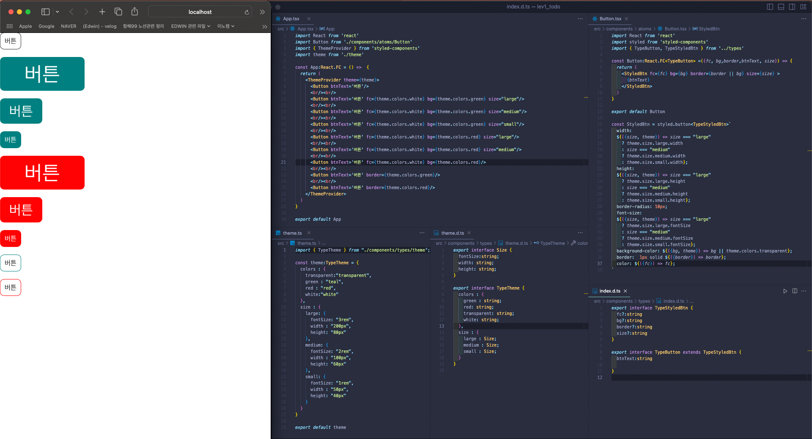

## Styled-componets
`CSS in JS`는 자바스크립트에서 CSS를 다루는 것을 말한다. 리액트에서는 대표적으로 `스타일드 컴포넌트` 라이브러리르 활용하여, 컴포넌트에 스타일을 적용하기 위해 사용한다. 

- 컴포넌트와 동일한 파일로 스타일을 구현하며, 별도의 CSS 파일을 작성할 필요가 없다. 
- `스타일드 컴포넌트`에서 정의한 스타일은 실행 시 고유한 클래스명으로 설정되며, 대상 컴포넌트에만 적용된다. 
- 이점으로는 하나의 컴포넌트에서 JS, TS, HTML, CSS 를 관리할 수 있다는 점이다. 

### ThemeProvider 와 theme 설정
먼저 환경설정을 위해 TS를 기반으로한 CRA을 선언하자. 그리고 `styled-components`와 `styled-components`에 대한 타입을 정의함으로 해당 프로젝트를 진행할 준비를 하자. 

```bash
yarn add styled-components @types/styled-components
```

이전의 사례에서 볼 때, 버튼컴포넌트를 범용적으로 만들어내지 못했던 기억이 있다. Css in JS를 사용하는 이점을 크게 활용하지 못헀던 것이다. 그렇다면, 이번 프로젝트에서는 버튼으로부터 시작해서 범용적인 컴포넌트(아토믹 디자인, 버튼)을 만들기 위해 나아가보자. <br/><br/>

<div width="80%" align="center" id="TypeButtonImg">
  
</div><br/>

<details>
<summary>공용 버튼 컴포넌트(전체 코드살펴보기)</summary>

  ```tsx
  import React from 'react'
import styled from 'styled-components'
import { TypeButton, TypeStyledBtn } from '../types'

const Button:React.FC<TypeButton> =({fc, bg,border,btnText, size}) => {
  return (
    <StyledBtn fc={fc} bg={bg} border={border || bg} size={size} >
      {btnText}
    </StyledBtn>
  )
}

export default Button

const StyledBtn = styled.button<TypeStyledBtn>`
  width: 
  ${({size, theme}) => size === "large" 
    ? theme.size.large.width 
    : size === "medium"
    ? theme.size.medium.width
    : theme.size.small.width};
  height: 
  ${({size, theme}) => size === "large" 
    ? theme.size.large.height 
    : size === "medium"
    ? theme.size.medium.height
    : theme.size.small.height};
  border-radius: 10px;
  font-size:
  ${({size, theme}) => size === "large" 
    ? theme.size.large.fontSize 
    : size === "medium"
    ? theme.size.medium.fontSize
    : theme.size.small.fontSize};
  background-color: ${({bg, theme}) => bg || theme.colors.transparent};
  border:  1px solid ${({border}) => border};
  color: ${({fc}) => fc};
`
  ```
</details>

간단한 코드는 아래와 같다. 

```tsx
const Button:React.FC<TypeButton> =({fc, bg,border,btnText, size}) => {
  return (
    <StyledBtn fc={fc} bg={bg} border={border || bg} size={size} >
      {btnText}
    </StyledBtn>
  )
}
```

1. 먼저 `부모 컨포넌트로부터 각각의 내용에 대한 props`를 전달받는다. 
2. 전달받은 props를 `<StyledBtn>` 컴포넌트, 스타일드컴포넌트로 만든 태그에 props로 전달한다. 

    - 이때 전달받을 props의 목록은 다음과 같다. 

      - `fc` : 글자의 색상을 전달받는다.
      - `bg` : 배경화면의 색상을 전달받는다.
      - `border` : 박스의 테두리 색상을 전달받는다. 이때 별도로 설정되지 않으면, bg의 값을 전달받는다. 
      - `size` : 박스의 크기와 글자의 크기등이 전달된다. 
      <br/><br/>

    ```tsx
    const StyledBtn = styled.button<TypeStyledBtn>`
      width: 
      ${({size, theme}) => size === "large" 
        ? theme.size.large.width 
        : size === "medium"
        ? theme.size.medium.width
        : theme.size.small.width};
      height: 
      ${({size, theme}) => size === "large" 
        ? theme.size.large.height 
        : size === "medium"
        ? theme.size.medium.height
        : theme.size.small.height};
      border-radius: 10px;
      font-size:
      ${({size, theme}) => size === "large" 
        ? theme.size.large.fontSize 
        : size === "medium"
        ? theme.size.medium.fontSize
        : theme.size.small.fontSize};
      background-color: ${({bg, theme}) => bg || theme.colors.transparent};
      border:  1px solid ${({border}) => border};
      color: ${({fc}) => fc};
    `  
    ```

    - `<StyledBtn>` 컴포넌트를 보면 다음과 같이 설정되어 있다.

      - `width, height, font-size` : 부모로부터 전달받은 props와 전역에서 선언된 theme를 props로 받는다. 
        - 전달받은 props에서 우선순위는 부모로부터 전달받은 size이다. 먼저 이를 참조하는데, 조건을 통해서 theme에 설정된 값에 다가가도록 지정하였다. 
        - `size === "large"` 일 때, `theme.size.large.width/height/fontSize` 를 적용시킨다. 
        - `size === "medium"` 일 때, `theme.size.medium.width/height/fontSize` 를 적용시킨다. 
        - `size === "small"` 일 때, `theme.size.small.width/height/fontSize` 를 적용시킨다. 
        
      - `background-color`는 구체적으로 지정한 `bg`가 있는 경우, `bg`가 적용되도록 하고, 초기값으로 `theme.colors.transparent` 적용되도록 하였다. 


3. App.tsx에서 Button 컴포넌트 다양하게 적용해보기 
    <div id="appTsx">

    ```tsx
    const App:React.FC = () =>  {
      return (
        <ThemeProvider theme={theme}>
          <Button btnText='버튼'/>
          <br/><br/>
          <Button btnText='버튼' fc={theme.colors.white} bg={theme.colors.green} size="large"/>
          <br/><br/>
          <Button btnText='버튼' fc={theme.colors.white} bg={theme.colors.green} size="medium"/>
          <br/><br/>
          <Button btnText='버튼' fc={theme.colors.white} bg={theme.colors.green} size="small"/>
          <br/><br/>
          <Button btnText='버튼' fc={theme.colors.white} bg={theme.colors.red} size="large"/>
          <br/><br/>
          <Button btnText='버튼' fc={theme.colors.white} bg={theme.colors.red} size="medium"/>
          <br/><br/>
          <Button btnText='버튼' fc={theme.colors.white} bg={theme.colors.red}/>
          <br/><br/>
          <Button btnText='버튼' border={theme.colors.green}/>
          <br/><br/>
          <Button btnText='버튼' border={theme.colors.red}/>
        </ThemeProvider>
      )
    }
    ```

    </div>


    코드 자체만 보면 하나의 `<Button>` 컴포넌트이지만, 화면에 나타난 결과는 다르다. [위의 이미지](#TypeButtonImg)에 나타난 다양한 버튼의 모습은 모두 하나의 `<Button>` 컴포넌트를 통해서 제어한 모습니다.<br/>

4. Theme와 프로젝트의 디자인 일관성

    ```tsx
    import { TypeTheme } from "./components/types/theme";

    const theme:TypeTheme = {
      colors : {
        transparent:"transparent",
        green : "teal",
        red : "red",
        white:"white"
      },
      size : {
        large: {
          fontSize: "3rem",
          width : "200px",
          height: "80px"
        }, 
        medium: {
          fontSize: "2rem",
          width : "100px",
          height: "60px"
        },
        small: {
          fontSize: "1rem",
          width : "50px",
          height: "40px"
        }
      }
    }

    export default theme
    ```

    위의 코드는 프로젝트의 디자인 일관성을 위해서 만든 theme.ts 파일이다. [App.tsx](#appTsx)에서 볼 수 있듯이 theme에서 기록한 코드를 props로 전달하고 있는 것을 볼 수 있다. 만약 green에 대한 전체적인 색상 변경이 필요한 경우에는 theme.ts에서 하나만 수정해도 프로젝트 전반에 걸친 색상을 일괄적으로 제어할 수 있다는 이야기다. 이것이 적용되기 위해서 한 가지를 빼먹은 내용이 있는데 바로 ContextAPI의 일종으로 사용된 `ThemeProvider`이다. 이를 통해서 하위 컴포넌트 전역에서 theme를 공유할 수 있게 된 것이다. 

    해당 프로젝트의 타입관련 부분은 [02. StyledComponents&Props](https://github.com/19Edwin92/JS-study/blob/main/typescript/02StyledComponents&Props.md) 여기를 참고하자. 

5. CSS 헬퍼 
아이디어는 이러하다. 반복되는 사전의 내용들을 css 함수에 정의해 놓고 이를 가져다가 사용하는 방식이다. 가장 좋은 부분이 버튼일 것이다. 아래에 경우와 같이 말이다. 

    ```jsx
    const primaryButtonStyles = css`
      background-color: blue;
      color: white;
    `;

    const redButtonStyles = css`
      background-color: red;
      color: white;
    `;

    const greenButtonStyles = css`
      background-color: green;
      color: white;
    `;

    const Button = styled.button`
      ${({ type }) =>
        type === "redButtonStyles"
          ? redButtonStyles
          : type === "greenButtonStyles"
          ? greenButtonStyles
          : primaryButtonStyles}
    `;

    // 사용 예시
    <Button type="redButtonStyles">Red Button</Button>
    <Button type="greenButtonStyles">Green Button</Button>
    ```

    css 함수의 사용은 이보다 더 방대하다. 조건을 통해서, 특정한 속성을 더하는 것도 가능한 일이다. 

    ```jsx
    const Button = styled.button`
      ${({ type }) =>
        type === "redButtonStyles"
          ? css`
              ${redButtonStyles}
              /* 추가적인 스타일 */
            `
          : type === "greenButtonStyles"
          ? css`
              ${greenButtonStyles}
              /* 추가적인 스타일 */
            `
          : css`
              ${primaryButtonStyles}
              /* 추가적인 스타일 */
            `}
    `;
    ```

    여기에서 `theme`와 `css함수`를 비교해보자. 
    - `theme`는 전역적인 스타일을 설정한다. 색상, 글꼴, 크기 같은 `스타일 변수`를 선언하고, 관리하고, 재사용한다. 
    - `css 함수` 컴포넌트 내에서 동적인 css 스타일을 작성할 때 사용한다. 주로 조건부 스타일, 템플릿 리터럴을 사용한 복잡한 스타일 작성 등에 활용된다. 
      - 즉, 특정 스타일 속성을 동적으로 결정하거나, 여러 스타일 정의를 조합할 때 유용하다.  
