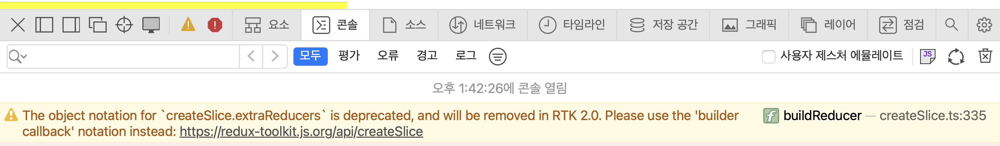

## 08상태관리라이브러리(2)ReduxThunk

[벨로퍼트](https://react.vlpt.us/redux-middleware/)에 따르면, `미들웨어`는 리덕스가 지니고 있는 핵심 기능으로, 미들웨어를 사용하면 액션이 디스패치 된 다음, `리듀서에서 해당 액셩을 받아와서 업데이트하기 전에 추가적인 작업을` 수행할 수 있도록 한 것이다. 

- 특정 조건에 따라 액션이 무시되게 만들 수 있다. 
- 액션을 콘솔에 출력하거나, 서버쪽으로 로깅 할 수 있다. 
- 액션을 수정해서 리듀서에게 전달할 수 있다. 
- 특정 액션이 발생했을 대, 이를 기반으로 다른 액션이 발생되도록 할 수 있다. 

### 리덕스에서 미들웨어의 사용처
보통 리덕스 미들웨어는 비동기 작업을 처리할 때 사용한다. 이와 관련된 미들웨어 라이브러리에는 다음과 같은 것들이 존재한다. 

- redux-thunk
- redux-saga
- redux-observable
- redux-promise-middleware

redux-saga와 redux-observable의 경우에는 특정 액션을 모니터링 할 수 있으며, 특정 액션이 디스패치되었을 때 원하는 함수를 호출, 또는 라우터를 통해 다른 주소로 이동하는 것도 가능하다. 

### 리덕스 미들웨어 redux-thunk
### [Redux Essentials, 5부: 비동기 로직 및 데이터 가져오기](https://redux.js.org/tutorials/essentials/part-5-async-logic#example-rest-api-and-client) Redux 스토어는 비동기 로직에 대해서 아무것도 알지 못한다. 이런 리덕스에게 비동기 로직을 부여하는 것이 바로 미들웨어라고 부른다. 가장 일반적인 비동기 미들웨어가 바로 `redux-thunk`이다. Redux Toolkit의 `configureStore`는 기본적으로 `thunk`를 자동으로 설정하며 리덕스로 비동기 로직을 작성하게 한다. 


1. Thunk 함수 기록히기 - Slice 파일

    ```bash
    src
    ├─ redux
    |   ├─ config 
    |   |   └─ configStore.js
    |   └─ modules
    |       ├─ itemSlice1.js # counter.js
    |       ├─ itemSlice1.js # todos.js
    |       └─ itemSlice1.js
    |
    ```

썽크는 일반적으로 슬라이스 파일에 기록된다. 그러나 `createSlice` 자체는 썽크 정의에 대한 특별한 지원이 없음으로 별도로 작성해야 한다. 함수의 생성은 `createAsyncThunk` API를 통해서 작성할 수 있다. 

```javascript 
// createAsyncThunk
const __getTodosThunk = createAsyncThunk(
  "getTodos", // action.type 
  async (payload, thunkAPI) => {
    try {
      const res = await axios.get('http://localhost:3001/todos')
      return thunkAPI.fulfillWithValue(res.data)
    } catch (error) {
      return thunkAPI.rejectWithValue(error)
    }
  } 
)  
```
1. 매개변수1 : 함수의 이름이 기록된다.
2. 매개변수2 : 비동기 처리 부분이 기록된다. 


### [Redux Essentials, Part 6: 성능 및 데이터 정규화](https://redux.js.org/tutorials/essentials/part-6-performance-normalization)
이 섹션에서는 애플리케이션에서 좋은 성능을 보장하기 위한 최적화된 패턴과 저장소에서 데이터의 일반적인 업데이트를 자동으로 처리하는 기술을 다룬다. 여기서 중심해서 볼 때, `메모라이징 셀렉터`가 될 것 같다. `createSelector`는 이전 입력 세트와 계산된 결과를 저장하고 입력이 동일하면 다시 계산하는 대신 이전 결과를 반환한다. 

```javascript 
// Slice 파일에서
export const selectAllPosts = state => state.posts.posts

export const selectPostById = (state, postId) =>
  state.posts.posts.find(post => post.id === postId)

export const selectPostsByUser = createSelector(
  [selectAllPosts, (state, userId) => userId],
  (posts, userId) => posts.filter(post => post.user === userId)
)

// 컴포넌트에서 
export const UserPage = ({ match }) => {
  const { userId } = match.params

  const user = useSelector(state => selectUserById(state, userId))

  const postsForUser = useSelector(state => selectPostsByUser(state, userId))

  // omit rendering logic
}
```
메모이제이션 선택기는 불필요한 재렌더링을 피하고 입력 데이터가 변경되지 않은 경우 잠재적으로 복잡하거나 비용이 많이 드는 계산을 피하는 데 도움이 되므로 React+Redux 애플리케이션의 성능을 개선하는 데 유용한 도구가 된다. createSelector로 선언된 값은 이전에 계산된 값과 동일한지 확인을 하고, 변경되지 않으면, 이전에 계산된 결과를 반한한다. 반면 입력 값이 변경된 경우, 새로운 계산을 수행하고 결과를 반환한다. 

그러나 리덕스 자체는 애플리케이션의 상태를 영속적으로 저장하거나 캐싱하는 기능을 제공하지 않는다. 반면에 React-Query는 내장된 캐싱 기능을 제공하여 서버로부터 데이터를 가져올 때 데이터를 캐시하고 관리한다. 그 결과 새로고침이나 다른 상황에서도 캐시된 데이터를 활용할 수 있다. 

리덕스의 createSelector는 단지 셀렉터의 메모이제이션을 제공하는데 그 목적이 있다. 

### 리덕스 미들웨어 redux-thunk 실제로 사용하기 
1. configStore나 index.js 에서 별도로 작업해 줄 내용이 없이
2. `Slice`에서 `createAsyncThunk`를 ActionCreate 처럼 추가해주면 된다. 

    <details>
    <summary> CRUD(1):READ : GET_TODOS 만들기 : __getTodosThunk</summary>

    - 변수명 : `__`를 넣어서 생성하는 것이 관행이라고 한다. 

      ```javascript 
      // redux // modules // todoSlice.js
      const __getTodosThunk = createAsyncThunk(
        "getTodosThunk",
        async (_, thunkAPI) => {
          try {
            const res = await instance.get("/todos");
            return thunkAPI.fulfillWithValue(res.data);
          } catch (error) {
            return thunkAPI.rejectWithValue(error);
          }
        }
      );

      
      // 컴포넌트에서 사용하기 // App.js 
      //  __getTodosThunk를 dispatch를 통해서 호출하며, 이때 컴포넌트가 마운트 또는 리렌더링 될 때마다 useEffect를 통해서 호출되게 하였다. 
      function App () {
        const dispatch = useDispatch()
        const {todos:todoSlice} = useSelector(selecttodoSlice)
        useEffect(() => {
          dispatch(__getTodosThunk());
        }, [dispatch]);
      }
      return  {todoSlice && todoSlice.map(({ id, title }) => (
              <Todos key={id} todoid={id} title={title} />))}
      ```
    </details>

    <details>
    <summary> CRUD(2):CREATE : POST_TODOS 만들기 : __poseTodosThunk</summary>


      ```javascript 
      // redux // modules // todoSlice.js
      const __poseTodosThunk = createAsyncThunk(
        "postTodosThunk",
        async (payload, thunkAPI) => {
          try {
            const res = await instance.post("/todos", payload);
            return thunkAPI.fulfillWithValue(res.data);
          } catch (error) {
            return thunkAPI.rejectWithValue(error);
          }
        }
      );

      // 컴포넌트에서 사용하기 // useThunk.js // AXIOS DELETE 기능구현 : CRUD (2) POST
      const onSubmitHandler = async (e) => {
        e.preventDefault()
        dispatch(__poseTodosThunk({id:Date.now(), title:newtodos})) 
        setNewTodos("")
      }
      ```
    </details>

    <details>
    <summary> CRUD(3):DELETE : DELETE_TODOS 만들기 : __deleteTodosThunk</summary>


      ```javascript 
      // redux // modules // todoSlice.js 
      const __deleteTodosThunk = createAsyncThunk(
        "deleteTodosThunk",
        async (payload, thunkAPI) => {
          try {
            await instance.delete(`/todos/${payload}`); 
            return payload;
          } catch (error) {
            return thunkAPI.rejectWithValue(error);
          }
        }
      );

      // 컴포넌트에서 사용하기 // useThunk.js // AXIOS DELETE 기능구현 : CRUD (3) DELETE
      const onDeleteHandler = async () => {
        dispatch(__deleteTodosThunk(todoid)); 
      };
      ```
    </details>

    <details>
    <summary> CRUD(4):UPDATE : UPDATE_TODOS 만들기 : __updateTodosThunk</summary>


      ```javascript 
      // redux // modules // todoSlice.js
      const __updateTodosThunk = createAsyncThunk(
        "updateTodosThunk",
        async (payload, thunkAPI) => {
          try {
            await instance.patch(`/todos/${payload.id}`, payload.content); // (1) 서버 업데이트
            return payload;
          } catch (error) {
            return thunkAPI.rejectWithValue(error);
          }
        }
      );

      // AXIOS UPDATE 기능구현 : CRUD (4) UPDATE
      const onUpdateSubmitHandler = () => async (e) => {
        e.preventDefault();
        dispatch(
          __updateTodosThunk({ id: todoid, content: { title: updatetodos } })
        );
        setUpdate((pre) => !pre);
      };
      ```
    </details><br/>

3. `createSlice`의 `extraReducers`부분에서 각각의 비동기 통신에 대한 pending, fulfilled, rejected 상황시를 설정하면 된다. 

    

    ```javascript
    const todoSlice = createSlice({
      name: "todoSlice",
      initialState: {
        todos: [],
        isLoading: false,
        isError: false,
      },
      extraReducers:{}
    })
    ```

    기존과 같이 `extraReducers`를 객체로 생성하면 콘솔에서 위와 같은 경고가 뜨는 것을 볼 수 있다. 내용은 RTK(Redux Toolkit) 버전 2.0에서는 `extraReducers의 객체 표기`를 지양하고, `builder callback`을 사용해달라는 내용이다. 

    ```javascript
    const todoSlice = createSlice({
      name: "todoSlice",
      initialState: {
        todos: [],
        isLoading: false,
        isError: false,
      },
      extraReducers: builder => {
        builder
          // __getTodosThunk
          .addCase(__getTodosThunk.pending, (state) => {
            state.isLoading = true;
            state.isError = false;
          })
          .addCase(__getTodosThunk.fulfilled, (state, action) => {
            state.isLoading = false;
            state.isError = false;
            state.todos = [...action.payload];
          })
          .addCase(__getTodosThunk.rejected, (state) => {
            state.isLoading = true;
            state.isError = false;
          })
      }
    })
    ```

    각 `Thunk API`에 대해서 위와 같이 `addCase`를 추가함으로 `extraReducers`를 구성해주면 된다. 

4. 리덕스의 전역상태관리소의 상태와 서버 데이터의 동기화 

    <details>
    <summary>이런 질문, 서버 데이터도 갱신(createAsyncThunk)하고 전역 상태도 업데이트하고 2중적인 부분이 발생되는 듯?</summary>

      첫째로, 기본적으로 `createAsyncThunk`는 Redux 체계 내에서 동작하기에, 메인메모리에 state를 저장하며, 이를 모든 컴포넌트에서 공유한다. 
      둘째로, 상태가 변경되면, state를 변경하고, 이를 리액트 가상 DOM에게 알려주어, 리렌더링을 발생시켜야 한다. 
      셋째로, 이 과정에서 useEffect를 통하여, 다시 get요청을 함으로 로컬의 state와 서버 데이터 간의 동기화 작업을 수행해주어야 한다. 
      넷째, 이 과정에서 다소 오버헤드가 발생된다고 생각하면 맞는 이야기다. 그러나 Redux가 가지는 중앙 집중화된 상태 관리는 여러 컴포넌트 간에 일관된 데이터 흐름과 예측 가능한 상태 변화를 제공한다는 측면에서, 애플리케이션의 복잡성을 줄이고 유지 관리를 용이하게 만든다. 
    </details><br/>

    서버의 발전으로 자연스럽게 로컬 메인메모리에 서버 데이터를 동기화하는 과정이 필요할까? 고민이 등장했고, 이러한 요구에 따라 리액트 쿼리가 등장했었다. 이에 대응하듯 Redux에서도 RTK query를 출범하여, 캐시를 통해서 서버의 데이터를 관리하도록 함으로, 기존 `createAsyncThunk`가 가졌던 오버헤드를 줄이는 데 획기적인 발전을 가능하게 하였다. 캐시를 활용한다는 것은 막강하다. 캐시된 데이터를 다른 부분에서 조회할 때 네트워크에 불필요한 요청을 보내지 않아도 된다는 점에서 성능 향상과 서버의 부화를 줄여줄 수 있게 되었기 때문이다. 또한 상태가 갱신되면 자동으로 서버에 요청하여 상태를 반영한다. 