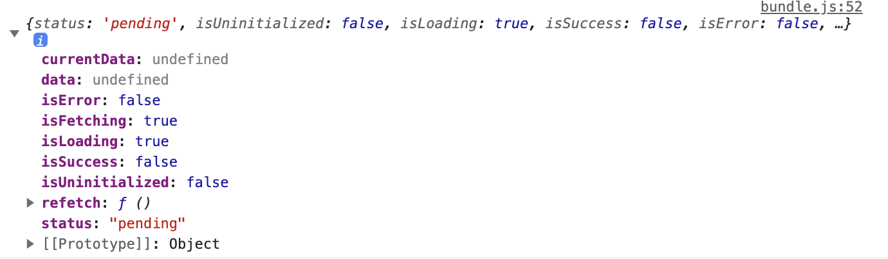
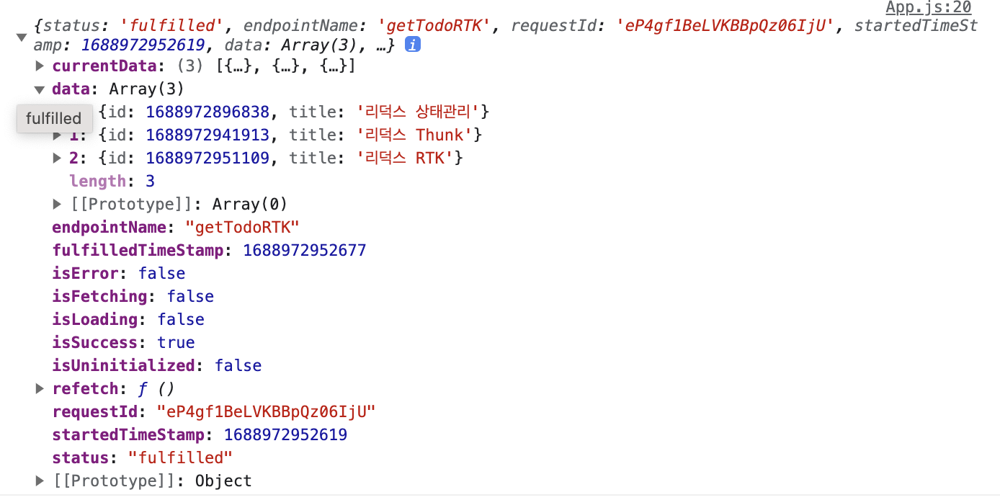

## [Redux 필수, 파트 7: RTK 쿼리 기본 사항](https://redux.js.org/tutorials/essentials/part-7-rtk-query-basics)

웹 애플리케이션은 일반적으로 데이터를 표시하기 위해서는 서버에서 데이터를 가져와야 한다.
- 또한 해당 데이터를 업데이트하고
- 해당 업데이트를 서버로 보내고
- 클라이언트의 캐시된 데이터를 서버의 데이터와 동기화 상태로 유지해야 한다. 

RTX 쿼리는 강력한 데이터 가져오기 및 캐싱 도구이다. 공식문서에 따르면 리덕스는 이러한 사용 사례를 완전히 해결하는 데 도움이 되는 내장 기능을 포함하지 않는다. `createAsyncThunk` 함께 사용하는 경우에도 `createSlice` 요청을 만들고 로드 상태를 관리하는 데 여전히 상당한 수작업이 필요하다. 

- `extraReducers` 우리는 비동기 썽크를 만들고,
- 실제 요청을 만들고, 응답에서 관련 필드를 가져오고, 로딩 상태 필드를 추가하고, 케이스를 위한 핸들러를 추가하고
- `pending/fulfilled/rejected` 적절한 상태 업데이트 작성해야 한다. 

공식문서는 [React](https://redux.js.org/tutorials/essentials/part-7-rtk-query-basics) 커뮤니티가 `데이터 가져오기 및 캐싱`이 실제로 `상태관리`와는 다른 관심사라는 것을 깨달았다고 한다. `RTK Query`는 `Apollo Client, React Query, Urql 및 SWR`와 같은 데이터 가져오기 솔루션을 개척한 다른 도구에서 영감을 얻었지만, API 디자인에 고유한 접근 방식을 추가한다. 

여기서 등장하는 것이 [createApi](https://redux-toolkit.js.org/rtk-query/api/createApi)이다. [isp1106](https://velog.io/@dlstjr1106/RTK-QUERY)의 설명에 따르면, RTK의 `createAsyncThunk`는 비동기처리를 할 때, `createSlice`를 활용해서 관리해야 했으며, 그 결과 코드가 늘어날 수밖에 었었다. 

반면에 `RTK Query`는 Redux Toolkit 의 createSlice 와 createAsyncThunk의 기능을 동시에 사용하면서, react-query 와 유사하게 서버에서 넘어온 데이터를 관리할 수 있는 기능을 추가시켰다. 캐싱을 지원하기 떄문에, 불필요한 요청을 줄일 수 있다. 나아가 post 하자마자 자동으로 get하는 기능까지도 구현할 수 있으며, 프론트 데이터와 서버 데이터를 분리하여 관리할 수도 있다. 

- 서버데이터 : RTK Query 
- 전역데이터 : createSlice
<br/><br/>

## RTK - query 세팅하기 

1. 기본 구성은 다음과 같다.

    ```javascript 
    import { createApi, fetchBaseQuery } from '@reduxjs/toolkit/query/react';
    
    export const api이름 = createApi({
      reducerPath: '리듀서이름',
      baseQuery: fetchBaseQuery({
        baseUrl: process.env.REACT_APP_API_URL,
      }),
      endpoints: (builder) => ({
        요청이름: builder.query({
          query: (주소에 넘길 값) => 'api 주소값/(주소에 넘길 값)',
        }),
      }),
    });
    
    export const { seT요청이름Query} = api이름;
    ```

    [공식문서](https://junsangyu.gitbook.io/rtk-query/tutorial)에 따르면, RTK Query는 전체 API를 보통 한 곳에 정의한다. 이 점이 다른(react-query) 같은 라이브러리와 다른 점이다. 리덕스 팀은 한 곳에 위치시켜 요청, 캐시 무효화, 공통 앱 설정을 둠으로 관리하기가 더욱 쉽다고 생각하였기 때문이다. 

    [공신문서의 팁](https://junsangyu.gitbook.io/rtk-query/tutorial)은 베이스 URL당 하나의 API 슬라이스를 가져야 한다고 말한다. 예를 들어 

    - api/posts
    - api/todos

    두 개의 경로가 있다면, 하나의 API 슬라이스를 만들고, post와 user로 엔드포인트를 나누어야 한다. 이렇게 설정함으로, endpoints와의 관계를 tag로 정의해서 자동 데이처 리패칭 기능을 효과적으로 활용할 수 있다. 

      - `createApi()` RTK query 기능의 코어이다. 데이터를 패치하고 변환하는 설정을 포함해서 엔드포인트들에서 어떻게 데이터를 패치하는지 정의할 수 있다. 케이스는 베이스 URL당 하나의 API 슬라이스를 사용해야 한다. 
      - `fetchBaseQuery()` 간단한 요청을 위한 `fetch`의 래퍼이다.
      <br/><br/>

2. `Axios 라이브러리`와 함께 RTK-query 사용하기

    ```javascript 
    import { instance } from "./axiosInstance";
    import { createApi } from '@reduxjs/toolkit/query/react'

    // 첫째, 여기에 정의된 instance 은 다른 파일에서 설정한 axios의 intance이다. 
        export const instance = axios.create({
          baseURL:process.env.REACT_APP_SERVERKEY1
        })

    /* 
    둘째, 
    - axios를 RTK-query와 함께 사용하기 위해서는 별도의 baseQuery을 만들어줘야 한다. 
    - 이 과정에 있어서 baseUrl 를 기입해야 되는 부분은 axios를 통해 instance를 생성할 것임으로 생략이 가능하다. 
    - 다만 axios를 사용하기에 try{}catch{} 구문을 통하여 프로미스 구문을 만들어줘야 한다. 
    - 매개변수로 {url, method, data}를 받아서 axios의 매개변수에 충족시킨다. 
    - 클로저 : () => async ({url, method, data}) => {}, 해당 구분은 클로저로 기록해야 하는데, 
      만약 클로저 없이 만들었다면, 외부 범위에서 해당 변수에 액세스 할 수 있는 기능을 상실하게 되기 때문이다. 
      그 결과 해체된 변수가 내부 비동기 함수의 범위 내에서 정의되지 않을 수 있다. 
    */

    const axiosBaseQuery = () => async ({url, method, data}) => {
      try {
        const res = await instance({method,url,data})
        return {data: res.data}
      } catch (error) {
        return console.log("에러", error);
      }
    }

    /*
    클로저로 생성한 axiosBaseQuery
     async ({url, method, data})는 렉시컬 스코프를 통해서 자신 내에 변수가 없을 때 상위로 올라가서 변수를 참조한다. 
     그 결과 변수가 안전하게 캡슐화되어 내부 로직 안에서 동작할 수 있게 되는 것이다. 
    */

    /*
    넷째,
    - createApi를 통해서 비동기 통신의 로직을 작성하면 된다. 
    - 다음은 createApi를 통해서 구성한 todos CRUD API에 대한 로직이다. 
    - 놀랍게도 이게 전부이다. 
      기존의 Slice에서 initialState를 통해서 isLoading, isError, data를 설정해주었던 부분이 여기에 생략되었다. 
    */

    export const todoRTKquery = createApi({
      baseQuery: axiosBaseQuery(),
      tagTypes: ['TODO'],
      endpoints : builder => ({
        getTodoRTK : builder.query({
          query: () => ({url:"/todos", method:"get"}),
          providesTags: ['TODO'],
        }),
        setTodoRTK : builder.mutation({
          query: (payload) => ({url:"/todos", method:"post", data:payload}),
          invalidatesTags: ['TODO'],
        }),
        deleteTodoRTK : builder.mutation({
          query: (payload) => ({url:`/todos/${payload}`, method:"delete"}),
          invalidatesTags: ['TODO'],
        }),
        updateTodoRTK : builder.mutation({
          query: ({todoid, data}) => ({url:`/todos/${todoid}`, method:"patch", data}),
          invalidatesTags: ['TODO'],
        }),
      })
    })

    export const {useGetTodoRTKQuery, useSetTodoRTKMutation, useDeleteTodoRTKMutation, useUpdateTodoRTKMutation} = todoRTKquery;
    ``` 

    <div >
    
    
    </div><br/>

    그러나 기록을 하지 안해도 될 뿐, 내부 안에서 해당 결과가 산출되어 콘솔에 기록되는 것을 볼 수 있다. 위의 이미지는 `pending`, `fulfilled` 시 콘솔에 기록되는 각각 표시한 것이다. `createAsyncThunk`에서 각각의 상황에 대해서 기록해 주어야 했던 것과 달리 `createApi`는 그 결과를 만들어서 클라이언트에 반영해 준다. `useGetTodoRTKQuery`를 보면  `pending`시에 isFetching와 isLoading이 true 가 되는 것과, `fulfilled` 시에 앞선 내용들은 false가 되고 data에 데이터가 담겨진 것과 isSuccess가 true가 되는 것을 볼 수 있다. 그 결과, 이 진위값에 따라서 화면을 구성할 수 있게 된다는 말이 되는 것이다. 

    - `tagTypes: ['TODO']` 는 캐시에 있는 데이터에 접근하기 위한 주소값에 해당된다. 마치 react-query가 캐시에 있는 데이터에 접근하기 위해하는 고유한 `queryKey`를 생성하는 것과 동일한다.  
    - `invalidatesTags: ['TODO']` 는 마치 react-query에 있는 `invalidateQueries`와 같다. 동일한 요청에 대해서 데이터를 캐싱하고, 내용에 변화가 있으면 기존의 값을 무효화 한 뒤에 업데이트한 데이터를 불러온다. 

    - `use...Query` : `useGetTodoRTKQuery`는 GET 메서드에 대한 데이터를 Fetching 하는 Hook으로 ...에는 `endpoint`에서 설정한 함수의 변수의 이름이 기록된다. 컴포넌트는 isFetching과 isLoading 시를 특정하여 화면을 최적화 할 수 있다. 
    - `use...Mutation` : POST에 대한 `useSetTodoRTKMutation`, DELETE에 대한 `useDeleteTodoRTKMutation`, PATCH(UPDATE)에 대한 `useUpdateTodoRTKMutation`는 그 결과 후에, `use...Query`와 공유하는 `tagTypes: ['TODO']`를 무효화하고 서버로 부터 업데이트된 데이터를 다시 패싱해 오는 Hook이다. 
      - 이를 위해서 `invalidatesTags: ['TODO']`를 설정하면, 동일한 `tagTypes`에 대한 데이터를 갱신할 수 있다. 
<br/><br/>      

3. ConfigStore에 `createApi` 등록하기 

    <details>
    <summary>ConfigStore 없이 createApi 사용하기, <strong>ApiProvider</strong></summary>

      `createApi`는 리덕스를 기반으로 동작하는 비동기 처리지만, Redux 없이 사용할 수도 있다. 이 부분이 흥미있는 부분이다. 

      ```javascript 
      import { ApiProvider } from '@reduxjs/toolkit/dist/query/react';

      const root = ReactDOM.createRoot(document.getElementById('root'));
      root.render(
          <ApiProvider api={}>
            <App />
          </ApiProvider>
      );
      ```

      `index.js`에 해당 `createApi`를 구독시켜서 Redux의 Store 없이 단독으로 사용이 가능하다. 이는 데이터가 메인 메모리에 저장될 필요가 없는 네트워크 상태관리에 따른 결과일 것이다. 이 부분은 react-query가 index.js에 `<QueryClientProvider>`를 설정하는 것과 유사하다. 

      ```javascript 
      // react-query
      import { QueryClientProvider, QueryClient } from 'react-query';
      const queryClient = new QueryClient();

      const App = () => {
        return (
          <QueryClientProvider client={queryClient}>
            <div className="App"></div>
          </QueryClientProvider>
        );
      };
      ```
    </details>


### 실전프로젝트에서 사용해보기     
```jsx
import { createApi } from "@reduxjs/toolkit/query/react";
import axios from "axios";

const instanse = axios.create({
  baseURL: process.env.REACT_APP_SERVER_KEY, // 재익님 서버 
  // baseURL:  process.env.REACT_APP_INOCAM_KEY2 // 진웅님 서버
});

instanse.interceptors.request.use((config) => {
  const accessToken =
    document.cookie &&
    document.cookie
      .split(";")
      .filter((cookies) => cookies.includes("accessToken"))[0]
      ?.split("=")[1];
  if (accessToken) config.headers.authorization = accessToken;
  return config;
});

instanse.interceptors.response.use((config) => {
  config.headers.authorization && (document.cookie = `accessToken=${config.headers.authorization}; path=/;`);
  return config
});


const axiosBaseQuery =
  () =>
  async ({ url, method, data, types }) => {
    try {
      switch (types) {
        case "addpost":
          const postres = await instanse({
            method,
            url,
            data,
            headers: {
              "Content-Type": "multipart/form-data",
            },
          });
          return {data : postres.data}  
        case "login":
          const auth = await instanse({ method, url, data });
          console.log(`authorization ${method}`, auth.headers.authorization);
          return {data : auth.data} 
        default:
          const res = await instanse({ method, url, data });
          console.log(`${method}`, res);
          return { data :res.data };
      }
    } catch (error) {
      // 오류를 직렬화 가능한 형태로 변환하여 반환
      const serializedError = {
        message: error.message,
        name: error.name,
        code: error.code,
        // 필요한 경우 오류 객체의 다른 속성도 추가로 포함시킬 수 있습니다.
      };
      return { error : serializedError }
    }
  };

export const inobaoQuery = createApi({
  baseQuery: axiosBaseQuery(),
  tagTypes: ["POSTS", "COMMENTS"],
  endpoints: (builder) => ({
    // Login
    postLoginRTK: builder.mutation({
      query: (payload) => ({
        url: "/api/auth/login",
        method: "post",
        data: payload,
        types:"login"
      })
    }),
    // About Post (1) READ
    getPostRTK: builder.query({
      query: () => ({ url: "/api/posts", method: "get" }),
      providesTags: ["POSTS"],
    }),
    // About Post (2) CREATE
    postPostsRTK: builder.mutation({
      query: (payload) => ({
        url: "/api/posts",
        method: "post",
        data: payload,
        types: "addpost",
      }),
      invalidatesTags: ["POSTS"],
    }),
    // About Post (3) DELETE
    deletePostsRTK: builder.mutation({
      query: (payload) => ({ url: `/api/posts/${payload}`, method: "delete" }),
      invalidatesTags: ["POSTS"],
    }),
    // About Post (4) PATCH
    patchPostsRTK: builder.mutation({
      query: ({ id, data }) => ({
        url: `/api/posts/${id}`,
        method: "patch",
        data,
      }),
      invalidatesTags: ["POSTS"],
    }),
    // About PostComment (1) READ
    getCommentsRTK: builder.query({
      query: (postid) => ({
        url: `/api/posts/${postid}/comments`,
        method: "get",
      }),
      providesTags: ["COMMENTS"],
    }),
    // About PostComment (2) CREATE
    postCommentsRTK: builder.mutation({
      query: ({ postid, data }) => ({
        url: `/api/posts/${postid}/comments`,
        method: "post",
        data,
      }),
      invalidatesTags: ["COMMENTS"],
    }),
    // About PostComment (3) DELETE
    deleteCommentsRTK: builder.mutation({
      query: ({ postid, commentid }) => ({
        url: `/api/posts/${postid}/comments/${commentid}`,
        method: "delete",
      }),
      invalidatesTags: ["COMMENTS"],
    }),
    // About PostComment (4) PATCH
    patchCommentsRTK: builder.mutation({
      query: ({ postid, commentid, data }) => ({
        url: `/api/posts/${postid}/comments/${commentid}`,
        method: "patch",
        data,
      }),
      invalidatesTags: ["COMMENTS"],
    }),
  }),
});

export const {
  usePostLoginRTKMutation,
  useGetPostRTKQuery,
  usePostPostsRTKMutation,
  useDeletePostsRTKMutation,
  usePatchPostsRTKMutation,
  useGetCommentsRTKQuery,
  usePostCommentsRTKMutation,
  useDeleteCommentsRTKMutation,
  usePatchCommentsRTKMutation
} = inobaoQuery;

```    