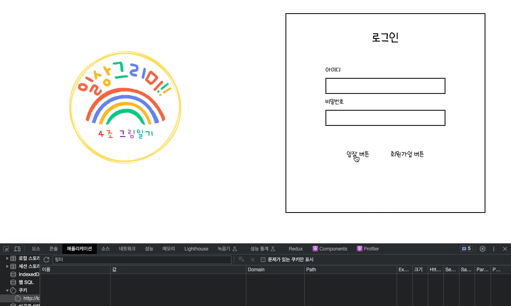

## 리프레시 토큰

1. instance = axios.create 를 통해서 interceptors 시에 토큰과 관련된 정보를 제어하며, `리프레시토큰`을 다뤄보자 한다.
2. 먼저 `interceptors.response.use`
    - const expirationDate = new Date(); : 만료시간을 설정
    - 각각의 토큰을 쿠기에 저장한다. 
      - document.cookie = `accessToken=${config.headers.accesstoken}; expires=${expires} path=/;`;
      - config.headers.authorization &&
      (document.cookie = `refreshToken=${config.headers.authorization}; path=/;`);
<br/><br/>

3. 다음으로 `instance.interceptors.request.use`
    - `accessToken`, `refreshToken`을 쿠키에서 추출한 후에 
    - 각각의 토큰의 상황에 따라서 config에 토큰을 넣어준다. 
      - if (accessToken) config.headers.accesstoken = accessToken;
      - if (refreshToken) config.headers.Authorization = refreshToken;

```jsx
export const instance = axios.create({
  baseURL: "http://000.000.000.000",
});

instance.interceptors.request.use((config) => {
  const accessToken =
    document.cookie &&
    document.cookie
      .split(";")
      .filter((cookies) => cookies.includes("accessToken"))[0]
      ?.split("=")[1];
  const refreshToken =
    document.cookie &&
    document.cookie
      .split(";")
      .filter((cookies) => cookies.includes("refreshToken"))[0]
      ?.split("=")[1];
  if (accessToken) config.headers.accesstoken = accessToken;
  if (!accessToken && refreshToken) config.headers.Authorization = refreshToken;
  return config;
});

instance.interceptors.response.use((config) => {
  const expirationDate = new Date();
  // expirationDate.setHours(expirationDate.getHours() + 1);
  expirationDate.setSeconds(expirationDate.getSeconds() + 5);
  const expires = expirationDate.toUTCString();
  document.cookie = `accessToken=${config.headers.accesstoken}; expires=${expires} path=/;`;
  config.headers.authorization &&
    (document.cookie = `refreshToken=${config.headers.authorization}; path=/;`);
});
```

### 다음은 콘솔에서 테스트용 서버로 실험을 진행하였다. 

```jsx
  const onRefreshToken = async () => {
    try {
      let testRefesh = await instance.post("/api/comment", {
        content: "테스트",
      });
      console.log(testRefesh);
    } catch (e) {
      console.log(e);
    }
  };
```

