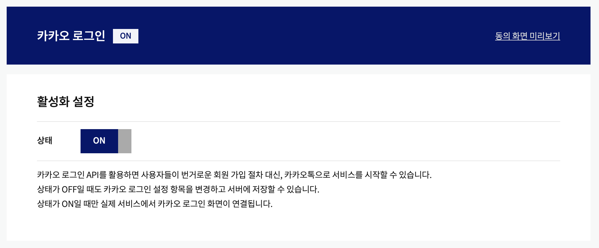

## 카카오톡 소셜로그인 

[카카오디벨로퍼스](https://developers.kakao.com/console/app/946347/product/login)에 접근하고 애플리케이션을 생성한 뒤에, url을 입력하고 설정해 줄 것은 카카오 로그인을 활성화 해주는 것이다. 이로써 준비는 끝이다. <br/><br/>


### 1. onClick 이벤트와 리다이렉트
```jsx
<button 
  onClick={()=>window.location.href=`https://kauth.kakao.com/oauth/authorize?client_id=${process.env.REACT_APP_REST_API}&redirect_uri=${process.env.REACT_APP_REDIRECT_URL}&response_type=code`}>
  카카오 로그인
</button>  
```

### 2. 리다이렉트와 Get요청
위의 로직이 실행되면, kakao의 redirect_uri 설정에 따라서, 해당 프로젝트에서 같은 경로로 설정한 라우트로 화면이 이동된다. 그리고 해당 라우터의 url에는 kakao로부터 전달받은 code에 대한 쿼리스트링이 담겨지게 된다. 이후의 과정은 해당 쿼리스트링을 추출하고, 서버로 전달하면 된다. 

```jsx
import React, { useEffect } from 'react'
import { useLocation } from 'react-router-dom'
import { useLoginSNSRTKQuery } from '../../redux'
import { useRouter } from '../../hooks/commen';

export default function KakaoRedirect() {
  const {search} = useLocation()
  const { onNavigate } = useRouter();
  // 컴포넌트가 마운트되면 즉시로 RTK-query가 동작되고, 그 결과로 isSuccess 값을 반환해줄 것이다. 
  const {isSuccess} = useLoginSNSRTKQuery(search)

  useEffect(()=>{
    // 이후 isSuccess 가 반환되면, 홈으로 경로를 이동하도록 하였다. 
    isSuccess && onNavigate('/')()
  }, [isSuccess, onNavigate])
  
  return (
    <div>KakaoRedirect</div>
  )
}
```

이 사이에서 전송된, get 요청은 서버로 자신의 라우트에 담겨 있는 code=에 대한 쿼리스트링을 그대로 전달해준다. 

```jsx
import { instance } from "./instance";
import { createApi } from "@reduxjs/toolkit/query/react";

const axiosBaseQuery =
  () =>
  async ({ url, method, data, types }) => {
    try {
      switch (types) {
        case "login":
          const auth = await instance({ method, url, data });
          alert("로그인 성공", auth);
          return { data: auth.headers.authorization };
        case "multipart":
          alert("Payload 확인", data);
          const multipart = await instance({
            method,
            url,
            data,
            headers: {
              "Content-Type": "multipart/form-data",
            },
          });
          return { data: multipart.data };  
        default:
          const res = await instance({ method, url, data });
          return { data: res.data.info };
      }
    } catch (error) {
      const serializedError = {
        message: error.message,
        name: error.name,
        code: error.code,
      };
      return { error: serializedError };
    }
  };

export const heavenRTKQuery = createApi({
  baseQuery: axiosBaseQuery(),
  tagTypes: ["KAKAO"],
  endpoints: (builder) => ({
    // SNSLogin
    loginSNSRTK: builder.query({
      query: (payload) => ({
        url: `/api/auth/kakao${payload}`,
        method: "get",
        data: payload,
      }),
      providesTags: ["KAKAO"],
    }), 
  }),
});

export const { useLoginSNSRTKQuery } = heavenRTKQuery;

```

해당 요청이 실행되면, 설정한 instance의 interceptors에 의해서 서버로부터 반환된 토큰이 쿠키에 저장되게 된다. 이러한 방식으로 OAuth 없이 구현이 가능하다. 


