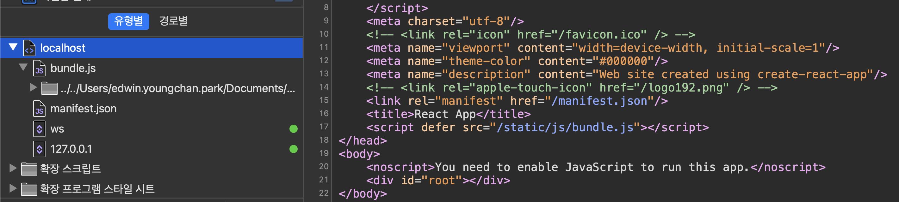

## 리액트 코드스플리팅

[참고글1, (김승호, 휴먼스케이프)](https://medium.com/humanscape-tech/react에서-해보는-코드-스플리팅-code-splitting-56c9c7a1baa4)은 해당 이야기를 하며 아래의 사진을 소개한다. 


리액트를 예로들 때, 리액트는 번들링이라는 과정을 통해서 기록된 JS를 하나의 `.js`로 만들어서 HTML에 담으며, 이미지에서 보이는 `bundle.js`가 바로 그것이다. 



### Code Splitting 
만들어진 앱이 간단한 편이라면 문제가 되지 않지만, 프로젝트가 커지면 전달해야 하는 파일도 커지고, 유저의 브라우저가 파싱해야 하는 정보도 많아진다. 이 말은 퍼포먼스에 문제가 발생될 수 있다는 소리이다. 개발자는 유저가 당장 필요한 정보에 우선순위를 두어 순서대로 로딩이 되도록 고려해야 한다. `로딩중`이더라도, 유저한테 유의미한 UX를 제공할 의무가 있다는 것이다. 

### React.lazy()
리액트 라이브러리에 컴포넌트 레벨 단위에서 이를 제어할 수 있는데, `lazy()`이며, 이러한 기법을 dynamic import 라고 한다. dynamic import는 원래 방식대로 import 하지 않고, 필요할 때에만 import를 실행한 뒤에, 돌아오는 promise에서 모듈을 실행할 수 있도록 만든다. 

React.lazy() 함수와 동적 import() 문을 함께 사용하여 컴포넌트를 필요할 때만 로드할 수 있으며, 이렇게 함으로 일부 컴포넌트가 무거울 때 애플리케이션의 초기 로딩 시간을 개선할 수 있게 한다. 

고민은 중첩라우트의 상황이다. 문제는 중첩된 라우트에 직접 React.lazy()를 사용할 수는 없다는 점이다. React.lazy()는 기본 내보내기(default export)에만 작동하기 때문이다. 

### Suspense 
dynamic import가 실행될 때마다, 로딩되는 과정을 유저에게 기다려 달라고 할 수 없다. 이때에 보여주는 내용이 Suspense이다. 

```jsx
import React, { lazy } from 'react';

const NewPopup = lazy(() => import('./views/NewPopup'));

const MainComponent = () => (
  const loading = () => <p>Loading</p>;

  return (
   <Suspense fallback={loading()}
    <NewPopup />
    <NewPopupTwo />
    <NewPopupThree />
  </Suspense>
  )
)
```