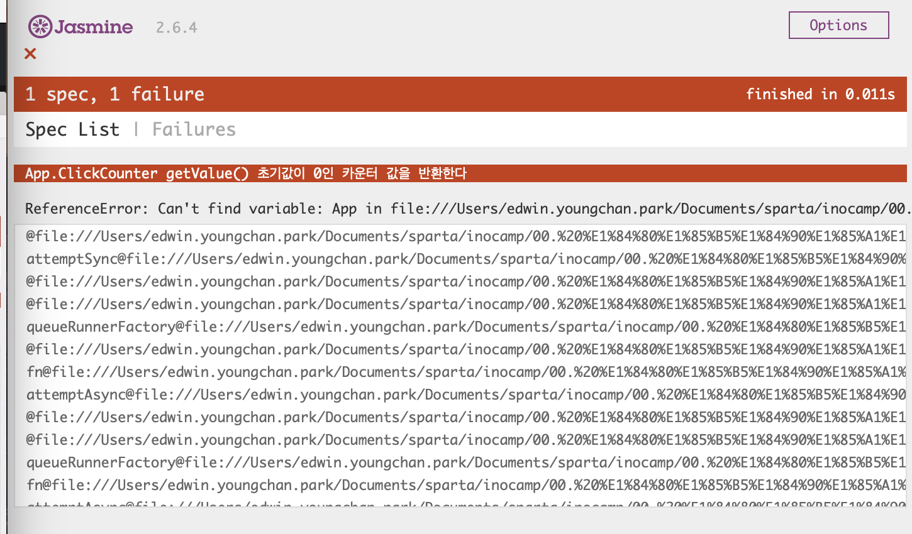
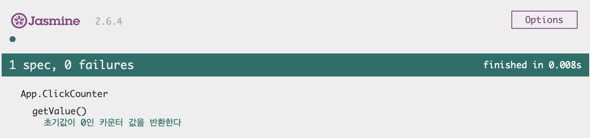
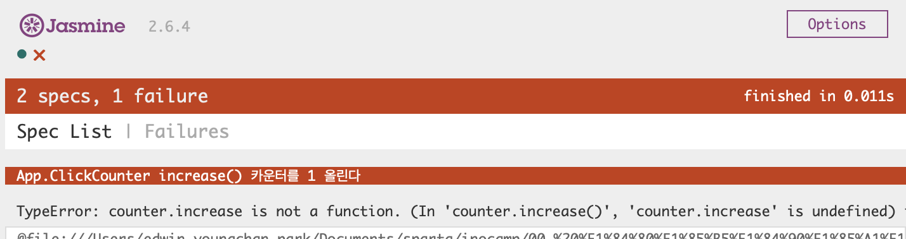

## 견고한 JS 소프트웨어 만들기 
`김정환`, 같은 기능을 만들더라도 자바스크립트 문법을 막 뗀 주니어 개발자와 시니어 개발자의 코드는 다르다. 시니어의 코드가 인정받는 이유는 짜임새 있는 설계와 변화에 대응할 수 있는 확장성 때문일 것이다. 이 강의는 그런 좋은 코드를 만들어 내는 방법에 대해서 접근한다. 

JS는 컴파일러가 없기에, 테스트가 최선이며 코드를 직접 실행하여, 이러한 문제를 극복하는 TDD(테스트주도개발)에 대해서 알아가보고자 한다. 

1. 목표 
  - 테스트주도 개발 방법으로 견고한 프론트엔드 코드를 설계하고 코딩하기
  - 소프트웨어 공학 원칙과 디자인 패턴을 학습하기 
  - 테스트 프레임웍 : Jasmine

### 섹션 0, 몇 가지 테스트 개념들
1. 단위(함수) 테스트 : `준비 - 실행 - 단언` 패턴을 따른다. 

2. TDD(테스트주도개발) : 어떤 함수의 기능을 만든다고 하자, TDD에서는 `적색(실패할 수 있는) - 녹색(함수의 기능코드 작성, 테스트 통과정도의 수준) - 블루, 리팩터(기존로직을 유지하면서 확장, 중복제거)` 순환 과정을 진행한다. TDD는 품질좋은 코드를 만들기 위해 작성하는 것입니다. 

3. JS - 프레임워크 : Jasmine 

    어떤 프레임워크든 하나를 익히면 다른 것은 쉽게 배웁니다. (1) 스탠드얼론 : 간단하게 실행결과를 볼 수 있지만 실무에서는 (2) 카르마를 많이 사용된다. 강의에서는 (1) 스탠드얼론을 배울예정이다. 

    [v.2.7.0(Jul 29, 2017)](https://github.com/jasmine/jasmine/releases?page=4)을 받아서 실행할 것이다. 

    <details>
    <summary>01. Jasmine 실행하기</summary>

    ```html
    <!-- 자스민 라이브러리 파일 -->
    <script src="lib/jasmine-2.7.0/jasmine.js"></script>
    <script src="lib/jasmine-2.7.0/jasmine-html.js"></script>
    <script src="lib/jasmine-2.7.0/boot.js"></script>

    <!-- 소스코드 -->
    <script src="src/Player.js"></script>
    <script src="src/Song.js"></script>

    <!-- 테스트코드 -->
    <script src="spec/SpecHelper.js"></script>
    <script src="spec/PlayerSpec.js"></script>
    ```
    </details>

    테스트를 실행하는 것을 테스트러너가 된다. [김정환-강의자료](https://github.com/jeonghwan-kim/lecture-develop-fe-with-tdd)

    <details>
    <summary>02. 테스트코드 살펴보기</summary>

    ```html
     <script>
      describe('hello world', ()=> { // 테스트 스윗: 테스트 유닛들의 모음 
        it('true is true', ()=> { // 테스트 유닛: 테스트 단위
          expect(true).toBe(true) // 매쳐: 검증자 
        })
      })
    </script>
    ```

    1. 테스트꾸러미 - Test Suite : `describe` 첫번째 인자로 테스트에 대한 설명, 두번째 인자로 테스트 구현 함수가 선언된다. 중첩으로 사용할 수 있다. 
      - 테스트 스펙(Test Spec) : `it` 메소드로 첫번째 인자로 테스트를 설명하고, 두번째 인자로 기대식을 가진 테스트 구현 함수를 선언한다. 
        - 기대식과 매쳐 : 결과값(expect)와 기대하는 값(toBe)가 함수 안에서 선언된다. 
        - 스파이(spyOn) : 감시할 객체와 감시할 메소드가 기록된다. 
    </details>

4. 테스트할 수 있는 코드와 할 수 없는 코드, 아래의 규칙이 충족되어야 합니다. 

    - OOP : 객체지향에서 하나의 코드는 하나의 기능을 가지고 있어야 합니다.
    - (소프웨어공학) 오픈크로스원칙 : 확장에는 열려있고, 변경에는 닫혀 있어야 한다

    1. 코드를 UI에서 완전히 분리하기 : HTML에서 JS 코드만 떼어내면 비즈니스 로직만 테스트 가능
    2. JS를 별도 파일로 분리 : 다른 곳에서도 재사용할 수 있고 테스트성 향상


5. 모듈패턴 이해하기 

    JS 경우에는 모듈패턴이 많이 사용된다. 이는 함수로 데이터를 감추고, 모듈 API를 담고 있는 객체를 반환하는 형태이다. 

    - 임의함수를 호출하여 생성하는 모듈 : 객체가 여러 개일 때
    - 즉시실행함수(IIFE) 기반의 모듈 : 싱글톤일 때 

    모듈은 단일책임원칙에 따라 한 가지 역할만 해야 한다. 그 결과는 테스트가 쉽다. 둘째, `모듈 자신이 사용할 객체가 있다면 의존성 주입 형태로 제공되어야 한다`. 


### 섹션 1, 모듈패턴으로 기존 코드 개선하기 

    ```bash
    git checkout -f 
    git checkout --force

    # 강의를 보면, 두가지 체크아웃이 등장한다. 이 둘은 평소에 다루지 않았던 명령어이기에 정리가 필요하다. 
    # -f : 강제로 덮어쓰기를 의미한다. 현재의 변경사항을 무시하고 해당 브랜치나 커밋으로 변경한다. 작업 디렉토리에 스테이징되지 않는 변경 사항이 있더라도 무시하고 이동한다. 이는 강제로 브랜치를 변경하고 이전 브랜치의 변경 내용을 모두 삭제하고 싶을 때 유용하다. 
    # --force : 변경사항을 덮어쓸 때 더 강력한 강제 옵션이다. 작업 디렉토리에 스테이징되지 않는 변경 사항이 있으면 이를 제거하고 변경한다. 작업 디렉토리에 있는 변경 사항이 스테이징 영역에 있더라도 무시하고 변경한다. 이 두 가지는 변경 사항을 손실할 수 있으므로 사용 전에 주의 깊게 검토해야 한다. 
    ```

1. 클릭카운터 모듈 `git checkout --force ClickCounter-spec-1`    

    
    - TDD의 첫단계는 실패하는 코드를 작성하는 것이다. 이것이 적색단계이다. 테스트코드는 입력되었지만, 테스트가 진행될 `ClickCounter.js`에 아무런 코드도 기록되지 않았기 때문이다. 즉 참조오류는 이런 이유 때문에 발생된 것이다. 

    ```javascript 
    describe('App.ClickCounter', ()=> {
      describe('getValue()', ()=> {
        it('초기값이 0인 카운터 값을 반환한다', ()=> {
          const counter = App.ClickCounter()
          expect(counter.getValue()).toBe(0)
        })
      })
    })
    ```

    
    - 참조 오류가 발생되지 않도록, 해당 부분에 코드를 작성해주면 녹색단계를 화면에서 확인할 수 있다. 

    ```javascript 
    var App = App || {}
    App.ClickCounter = () => {
      return {
        getValue() {
          return 0
        }
      }
    }
    ```

    - 세번째는 실행된 녹색단계를 기준으로 리펙터 하게 되는 것이 TDD의 진행순이다. 테스트코드가 있기 때문에 안심하고 리팩토링 할 수 있는 것으로, 하나의 기능에 대해 Red-Green-Refactor(Blue) 사이클로 개발한다. 

    ```javascript 
    var App = App || {}
    App.ClickCounter = () => {
      let value = 0
      return {
        getValue() {
          return value
        }
      }
    }
    ```

    

2. 클릭카운터 모듈 `git checkout --force ClickCounter-spec-2`    

    
    - 이번에 발생된 에러는 타입에러로, 테스트코드는 작성했지만 실제 코드를 작성하지 않아서 발생된 문제이다. 함수로 선언된 increase는 함수가 아니기 때문, 찾을 수 없는 undefined이기 때문이다. 이를 작성해주면 녹색으로 변경된다. 

    ```javascript 
    var App = App || {}
    App.ClickCounter = () => {
      let value = 0

      return {
        getValue() {
          return value
        },
        increase() {
          value++
        }
      }
    }
    ```

    - 그러나 increase() 테스트코드를 작성하며, 테스트코드에 중복이 발생되었다. 소스코드는 중복코드를 상당히 싫어한다. 이를 개선하기 위해서 jasmine에서는 beforEach 내장메소드가 도입되었다. describe 내에서 beforEach -> it -> afterEach 메소드가 순서대로 실행된다. 이를 DRY하다라고 한다. 중복코드가 제거된 코드를 말한다. 

    ```javascript 
    describe('App.ClickCounter', ()=> {
      describe('getValue()', ()=> {
        beforeEach(() => {
          // 준비단계
          const counter = App.ClickCounter()
        })
        it('초기값이 0인 카운터 값을 반환한다', ()=> {
          // 단언단계
          expect(counter.getValue()).toBe(0)
        })
      })

      describe('increase()', ()=> {
        it('카운터를 1 올린다', ()=> {
          // 그러나 초기값이 0이 아닌경우에는 문제가 될 수 있기에, 
          const initialValue = counter.getValue()
          // 실행단계
          counter.increase()
          // 단언단계
          expect(counter.getValue()).toBe(initialValue+1)
        })
      })
    })
    ```

    3. 클릭카운터 뷰 모듈 `git checkout --force ClickCountView-spec-1`

        질문이 있습니다. 데이터를 조회할 ClickCounter를 어떻게 얻으며, 데이터를 출력할 돔 엘리먼트는 어떻게 테스트하는가입니다. 

        `주의` : ClickCounter를 객체로 만들어서 파라미터로 전달받는 것이다. 데이터를 출력할 돔도 만들어서 전달받는 것이다. 이렇게 TDD 방식으로 사고하다 보면, 필요한 모듈을 주입받아 사용하는 경향이 생겨단다. 이는 하나의 기능 단위로 모듈을 분리할 수 있기 때문이며, 이를 단일 책임 원칙이라 OOP에서는 설명한다. 
