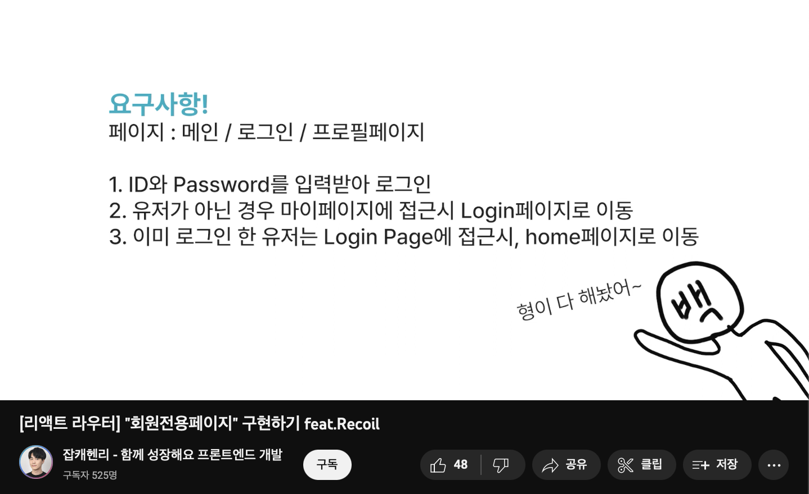

## 리액트 라우터 돔 - 프로텍티드 라우터 
출처 : [잡캐헨리 유튜브](https://www.youtube.com/watch?v=5rG48pDcTLQ) 

### 개념설명 : Protected Route
인증이나 적절한 권한이 없는 유저로부터 민간한 정보 또는 기능을 보호하기 위해, 특정 경로에 접근을 제한하는 기능이다. 

<div align="center">
  
</div>

### 중첩라우트와 프로텍티드라우터 
1. 사용자가 로그인을 하면 : JWT 토큰을 받아올 것이다. 토큰이 있다면 `마이페이지`로, 없다면 `로그인페이지`로 보내면 된다. 
2. 헨리켄지의 경우 쉽게 설명하기 위해 리코일을 통해서 전역상태에서 토큰을 관리했지만, 보통은 쿠키에 토큰 정보를 저장하게 될 것이다. 

    ```jsx
    // 로그인의 결과로 발급받은 토근 저장하기 
    const accessToken=response.headers.authorization;
    document.cookie = `accessToken=${accessToken}; path=/;`
    ```

3. 프로텍티드라우터 구현하기(1)

    ```jsx
    // 토큰 정보 쿠키에서 가져오기 
    const cookies = cookieString.split(';')
                            .filter(cookies => cookies.includes("AccessToken"))[0]
                            .split('=')[1] || null;
    /* 또는 정규식
       정규 표현식을 사용하는 방법이 배열 필터링 방법보다 시간 복잡도 측면에서 우수하고
       정규 표현식은 문자열 검색과 패턴 매칭에 특화되어 있으며
       복잡한 문자열 조작이 필요하지 않기 때문에 간단하고 빠른 결과를 얻을 수 있습니다. */
    const cookieString = document.cookie.match(/AccessToken=([^;]+)/);
    const accessToken = cookieString ? cookieString[1] : null;       
    
    // 리다이렉트 만들기 
    useEffect(()=>{
      if(accessToken) {
        return 
      } else {
        navigate('/login')
      }
    },[])                
    
     // 그런데 보호해야 될 페이지가 한두 페이지가 아니라면? 중첩라우팅으로 관리하기
     const ProtectedRoute = () => {
        const cookieString = document.cookie.match(/AccessToken=([^;]+)/);
        const accessToken = cookieString ? cookieString[1] : null; 

        return accessToken ? <Outlet /> : <Navigate to={'/login'}>
     } 
    ```
    ProtectedRoute 컴포넌트에 `Outlet`을 적용한 후, `Route`가 선언되어 있는 아래(App.js)에 중첩라우터를 생성해줍니다. 

    ```jsx
    // App.js
    return (
      <BrowserRouter>
        <Routes>
          <Route path="/" element={<Dashboard />} />
          <Route path="/login" element={<DetailPage />} />

          {/* 유저전용 */}
          <Route element={<ProtectedRoute />} />
            <Route path="/mypage" element={<Mypage />}>
          </Route>
        </Routes>
      </BrowserRouter>
    )
    ```

    - 그러나 위와 같은 기록은 문제를 내제하고 있다. 
    - `path="/"` => `path="/Mypage"` => `path="/login"`
      - 이 상황에서 로그인하지 않고 `뒤로가기`를 한다면, [ `path="/Mypage"` => `path="/login"` ] 무한루프에 빠지게 되며, 로그인에이지에 갇혀버리고 만다. 
      - 이는 브라우저가 가지고 있는 `Hitory 객체`의 영향 때문이다. 
        <div align="center">
          
        </div>

      ```jsx
      const ProtectedRoute = () => {
          const cookieString = document.cookie.match(/AccessToken=([^;]+)/);
          const accessToken = cookieString ? cookieString[1] : null; 

          return accessToken ? <Outlet /> : <Navigate to={'/login'} replace={true}>
          {/* 
              replace의 ={true}는 생략이 가능하다. 
              - `path="/"` => ( `path="/Mypage"` => `path="/login"` ) 
              - History의 Mypage 스택이 login로 대체되었기에, 뒤로가기를 하면 "/"이 되는 것이다. 
          */}
      } 
      ```  

4. 프로텍티드라우터 구현하기(2)
프로텍트드라우터는 제한된 페이지에 대해서 인증되지 않는 유저로 하여금 권한을 제한하여 권한을 요구하기 위해 리다이렉트 하는 것이다. 그렇다면, 로그인 한 후에는 어떻게 하면 좋을까? 유저가 접근하고자 하던 방향으로 길을 만들어주면 될 것이다. 

상황에 따라 다른 유저의 방향, 즉 직전에 유저가 어디에 있었는지에 대해서 알고 있으면 될 것이다. 어떻게 적용할 수 있을까? 바로 `History 객체`와 `Navigate 컴포넌트의 state` 속성을 활용하는 것이다. 

- 현재주소 알아내기 : `window.location`
- 라우터돔 뽕뽑기 : `useLocation()` : Location을 조작하기 위해 사용되는 Hooks 

  ```jsx
  const ProtectedRoute = () => {
      const cookieString = document.cookie.match(/AccessToken=([^;]+)/);
      const accessToken = cookieString ? cookieString[1] : null; 
      const currentLocation = useLocation()
      return accessToken ? <Outlet /> : <Navigate to={'/login'} replace={true} state={{redirectedFrom:currentLocation}}>
  } 
  ```

  ```jsx
  // 이후 이동한 /login 페이지
  const Login = () => {
    const navigate = useNavigate()
    const location = useLocation()
    const from = location?.state?.redirectedFrom?.pathname || '/'
    // 옵셔널로 선언한 이유는 리다이렉트를 통해서 들어오지 않는 경우가 있기 때문에

    const HandlerSubmit = (e) => {
      e.preventDefault();
      axios.post().then((res) => {
        document.cookie = `accessToken=${res.data.accessToken}; path=/;`
        navigate(from)
      })
    }
  }
  ```  

여기서 정리,
- Link 컴포넌트는 사용자에게 클릭 가능한 링크를 제공
- Navigate 컴포넌트는 페이지 전환을 수행하는 역할
- useNavigate는 함수형 컴포넌트 내에서 내비게이션을 처리하는 데 사용된다.
