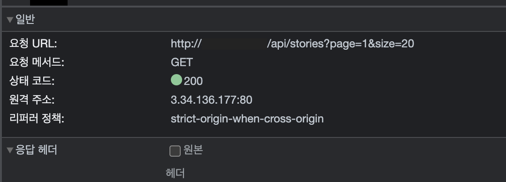
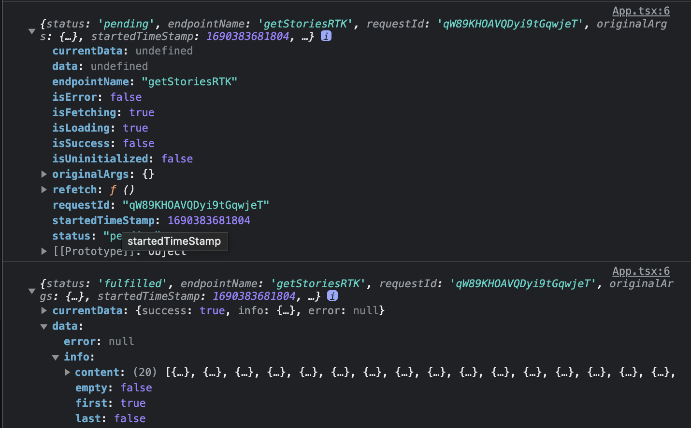
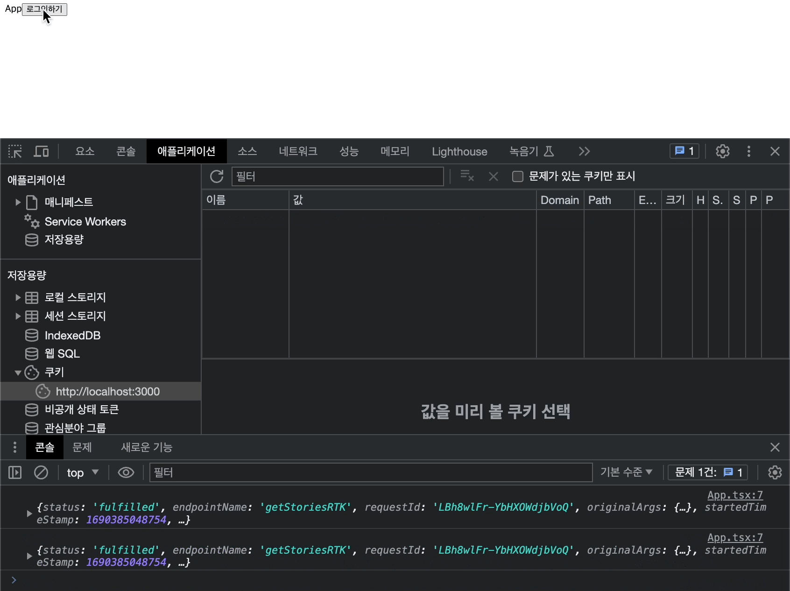
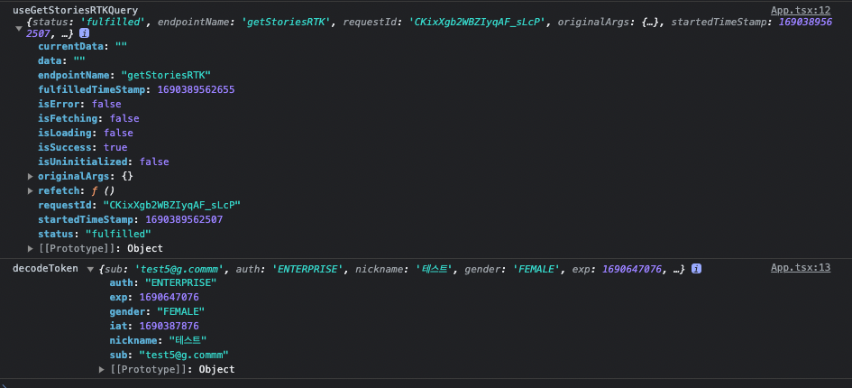
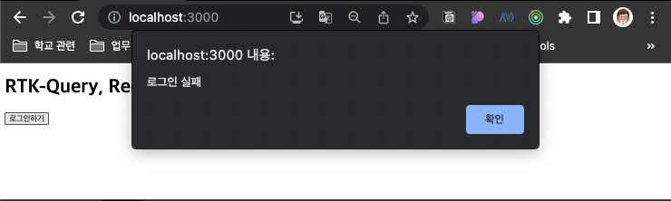
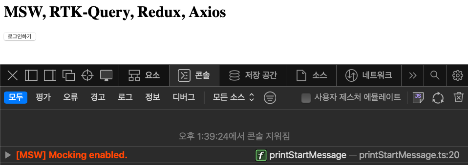

## 타입스크립트로 최종프로젝트하기 

### 1. 타입스크립트 TSX 리액트앱을 설치하자. 

```bash
# 타입스크립트로 파일 기본설정하기
yarn create react-app [프로젝트파일명] --template typescript 
```

### 2. JSX 대신 TSX를 사용하는 이유

- 타입스크립트 공식문서에서 볼 수 있듯이, 컴파일 단계에서부터 파일형식을 확인하여, 프로젝트의 에러를 사전에 제어하는 것이 핵심이다.

### 3. 리액트 컴포넌트 타입 `:React.FC`

```tsx
import React from 'react'

const App:React.FC = () =>  {
  return (
    <div>App</div>
  )
}

export default App
```

### 4. tsconfig 설정하기 

```tsx
"compilerOptions": {
  
  
  "strict": true,
  // IE 호환성을 위해서 es5, commonjs
  "target": "es5",
  "module": "commonjs",
  "noImplicitAny": true, //any타입 금지 여부
  "strictNullChecks": true, //null, undefined 타입조작시 에러내기 
  "removeComments": true, //컴파일시 주석제거 
  "strictFunctionTypes": true, //함수파라미터 타입체크 강하게 
  "noUnusedLocals": true, //쓰지않는 지역변수 있으면 에러내기
  "noUnusedParameters": true, //쓰지않는 파라미터 있으면 에러내기
  "noFallthroughCasesInSwitch": true, //switch문 이상하면 에러내기 
}
```

### 5. 라이브러리 (1) RTK, RTK-query
[공식문서](https://ko.redux.js.org/tutorials/typescript-quick-start)를 따라가면 아래와 같다. 
[참고자료, 퍼렁꽁치](https://velog.io/@ckm960411/Next-TypeScript-%EC%97%90-%EB%A6%AC%EB%8D%95%EC%8A%A4%ED%88%B4%ED%82%B7-%EC%A0%81%EC%9A%A9%ED%95%98%EA%B8%B0)

```bash
yarn add react-redux @types/react-redux @reduxjs/toolkit
```

1. configureStore 생성하고, index.tsx 설정해주기 

    ```tsx
    // Config/configureStore.ts
    import { configureStore } from "@reduxjs/toolkit";

    const store = configureStore({
      reducer : {}
    }) 

    export type RootState = ReturnType<typeof store.getState>
    export type AppDispatch = typeof store.dispatch


    // Config/hooks.ts
    import { TypedUseSelectorHook, useDispatch, useSelector } from "react-redux";
    import { AppDispatch, RootState } from "./configStore";

    export const useAppDispatch = () => useDispatch<AppDispatch>()
    export const useAppSelector: TypedUseSelectorHook<RootState> = useSelector
    ```

    - `RootState` : 이 행은 RootState 유형을 store.getState() 함수의 반환 유형으로 설정합니다. 
    - `AppDispatch` :  디스패치 함수의 유형을 얻습니다.
    - 기존에 사용하던 useDispatch는 `useAppDispatch`로 사용이 가능하고
    - 기존에 사용하던 useSelector는 `useAppSelector`로 사용이 가능해진다.<br/><br/>

2. 컴포넌트에서 react-redux Hooks 사용하기 

    ```tsx
    import { useAppDispatch, useAppSelector } from 'store/hooks'

    const App: React.FC = () => {
      const dispatch = useAppDispatch()
      const myInfo = useAppSelector(selectData)
  
      return ()
    }
    ```

3. RTK-query 타입설정하기 
<br/>[공식문서](https://junsangyu.gitbook.io/rtk-query/undefined)
<br/>[공식문서](https://redux-toolkit.js.org/rtk-query/usage/customizing-queries)
<br/>[joshua1988.github](https://joshua1988.github.io/ts/guide/type-assertion.html)

    <details>
    <summary>RTK-query 통신성공 이미지 먼저 확인하기</summary>

    
    
    </details>

  - 본격적으로 RTK-query 를 살펴보기 전에 `AXIOS` 먼저 살펴보고 이어나가보자. 

### 6. 라이브러리(2) Axios
<details>
<summary>첫째, 라이브러리 설치 및 타입</summary>

```bash
yarn add axios @types/axios
```
</details>

<details>
<summary>둘째, tsconfing.json 설정헤주기 </summary>

```bash
 "types": ["node", "axios"],
```
</details>

<details>
<summary>셋째, 이번에 작업했던 instance 마이그레이션 </summary>

```tsx
import axios, { AxiosInstance, AxiosRequestHeaders, AxiosRequestConfig, AxiosResponse } from "axios";

// axios 인스턴스 생성
const instance: AxiosInstance = axios.create({
  baseURL: process.env.REACT_APP_SERVER_KEY, 
});

// headers에 설정을하기 위해서는 아래와 같이 AxiosRequestConfig를 커스텀해야 한다. 
// 이때 headers에 대한 타입 정의는 AxiosRequestHeaders를 지정해 준다. 
interface CustomRequestConfig extends AxiosRequestConfig {
  headers: AxiosRequestHeaders;
}

// 요청 인터셉터 설정
instance.interceptors.request.use(
  (config:CustomRequestConfig) => {
    const accessToken =
      document.cookie &&
      document.cookie
        .split(";")
        .filter((cookies) => cookies.includes("accessToken"))[0]
        ?.split("=")[1];
    const refreshToken =
      document.cookie &&
      document.cookie
        .split(";")
        .filter((cookies) => cookies.includes("refreshToken"))[0]
        ?.split("=")[1];
    if (accessToken) config.headers.authorization = accessToken;
    if (!accessToken && refreshToken) config.headers.refreshtoken = refreshToken;
    return config 
  },
  (error) => {
    return Promise.reject(error);
  }
);

// 응답 인터셉터 설정
instance.interceptors.response.use(
  (response: AxiosResponse) => {
    if (response.headers.authorization) {
      console.log("config", response.headers.authorization);
      const expiresTime = new Date();
      expiresTime.setMinutes(expiresTime.getMinutes() + 30);
      document.cookie = `accessToken=${response.headers.authorization}; expires=${expiresTime.toUTCString()}; path=/;`;
    }
    if (response.headers.refreshtoken) {
      console.log("config", response.headers.authorization);
      const expiresTime = new Date();
      expiresTime.setDate(expiresTime.getDate() + 3);
      document.cookie = `refreshtoken=${response.headers.refreshtoken}; expires=${expiresTime.toUTCString()}; path=/;`;
    }
    return response;
  },
  (error) => {
    return Promise.reject(error);
  }
);

export default instance; 
```
</details>


### 7. 라이브러리(3) RTK-query

<br/><br/>

- [비교, RTK쿼리 공식문서](https://redux-toolkit.js.org/rtk-query/comparison)
- [비교, 리액트쿼리 공식문서](https://tanstack.com/query/latest/docs/react/comparison)

<details>
<summary>첫째, RTK-query-axiosBaseQuery</summary>

  - 기존에 있던 `fetchBaseQuery`를 활용해도 되지만, 나는 AXIOS가 지원하는 인스턴스 생성과 인터셉터를 RTK-query에 더해주고 싶었다. 이를 위해서  커스텀BaseQuery인 `axiosBaseQuery`를 생성하고 이를 활용하였다. 
  - 타입스크립트 기반이기에, `axiosBaseQuery`에 대한 타입이 정의되어야 한다. 먼저 커스텀BaseQuery이지만, RTK가 제공하는 `BaseQueryFn` 타입을 기반으로 사용자가 사용할 타입을 `<제네릭>` 타입으로 지정해주면된다. 
    - 여기서 [제네릭](https://joshua1988.github.io/ts/guide/generics.html#%EC%A0%9C%EB%84%A4%EB%A6%AD-generics-%EC%9D%98-%EC%82%AC%EC%A0%84%EC%A0%81-%EC%A0%95%EC%9D%98)이란 마치 함수의 파라미터처럼 타입을 인자로 넘겨주는 방식을 말한다. 
    - 커스텀하여 사용해줄 내용은 객체이기 때문에 아래와 같이 설정해줄 수 있다. 
      - `method`는 그 타입이 `AxiosRequestConfig`에 의해 지정되어 있음으로 이를 활용하면 된다. 
      - `data`도 마찬가지이다. 
      - `url`과 `types`은 내가 지정해 줄 내용임으로 들어올 타입을 먼저 지정해준다. 
      - 이때 `types`는 항상 들어오는 타입이 아니기에, 옵셔널체이닝으로 지정해 주었다. <br/><br/>
    - 타입을 정의했다면, 아래의 내용은 기존의 JSX와 동일하다. 
    - 나아가 `error`에 대한 타입도 정의해야 하는데, 이때는 타입정의를 사용하였다. 
    - 이는 에러로 들어올 타입이 무엇인지 개발자가 확실하게 알고 있다는 것을 토대로 한다.   
    - 아레의 사례에서는 `AxiosError`를 타입으로 지정해주었다. 

    ```tsx
    import type { BaseQueryFn } from '@reduxjs/toolkit/query'
    import { AxiosError, AxiosRequestConfig } from 'axios'

    const axiosBaseQuery = (): BaseQueryFn<
        {
          url: string
          method: AxiosRequestConfig['method']
          data?: AxiosRequestConfig['data']
          types?: string
        }
      > =>
      async ({ url, method, data, types }) => {
        try {
          switch (types) {
            case "login":
              const auth = await instance({ url, method, data })
              console.log("auth", auth);
              return { data: auth.data }
            default:
            const res = await instance({ url, method })
            return { data: res.data } 
          }
        } catch (axiosError) {
          let err = axiosError as AxiosError // 타입단언 
          return {
            error: {
              status: err.response?.status, 
              data: err.response?.data || err.message,
            },
          }
        }
      }
      ```

</details>

<details>
<summary>둘째, RTK-query-createApi</summary>

  - RTKquery의 생성은 `createApi`를 통해서 가능하다. 
  
    ```tsx
    export const testApi = createApi({
      baseQuery: axiosBaseQuery(),
      tagTypes: ["STORIES"],
      endpoints(build) {
        return {
          postLogin: build.mutation({
            query: (data) => ({ url: `/api/auth/login`, method: 'post', data, types:'login' }),
          }),
          getStoriesRTK: build.query({
            query: () => ({
              url: `api/stories?page=1&size=20`, 
              method: "get",
            }),
            providesTags: ["STORIES"],
          }),
        }
      },
    })

    export const {
      usePostLoginMutation,
      useGetStoriesRTKQuery,
    } = testApi
    ```

  - `baseQuery: axiosBaseQuery()` : 위에서 생성한 BaseQuery를 createApi의 비동기처리 로직으로 넣어준다. 
  - `tagTypes: [],` : 배열은 캐시무효화를 실행해줄 QueryKey를 담아놓을 배열이다. 
    <details>
    <summary>providesTags 와 invalidatesTags</summary>
    ```tsx
    // STORIES - GET
    getStoriesRTK: builder.query({
      query: (pageNum) => ({
        url: `api/stories?page=${pageNum}&size=20`, //
        method: "get",
      }),
      providesTags: ["STORIES"],
    }),
    // STORIES - POST
    postStoriesRTK: builder.mutation({
      query: (payload) => ({
        url: "/api/stories/newstory",
        data: payload,
        method: "post",
      }),
      invalidatesTags: ["STORIES"], // 캐시를 무효화시켜, 다시 패칭을 실행시키는 메서드는 `invalidatesTags`이다. 
    }),
    // STORIES - DELETE
    deleteStoriesRTK: builder.mutation({
      query: (id) => ({
        url: `/api/stories/${id}`,
        method: "delete",
      }),
      invalidatesTags: ["COMMENTS", "STORIES"],
    }),
    ```
    </details><br/>
</details>

<details>
<summary>셋째, RTK-query-ConfigureStore, Provider 그리고 ApiProvider</summary>

  - 먼저, `createApi`를 단독해서 사용하는 경우에는 ConfigureStore, Provider를 생성할 필요가 없다. ApiProvider만으로도 가능하다. 
  - 그러나 `전역상태관리를 위한 Redux-Module`과 함께 사용하는 경우에는 ConfigureStore, Provider를 구성해야 한다. 
  - (1) 등록은 `[testApi.reducerPath] : testApi.reducer`이렇게 해주고
  - (2) 미들웨어에서 제공하는 추가 기능을 위해서 `middleware: (getDefaultMiddleware) => {...}`을 생성해준다. 
    - 이를 통해 미들웨어 스택에 추가하여 RTK 쿼리가 파견된 작업을 가로채고 API 요청을 처리하고 그에 따라 캐시를 업데이트할 수 있게한다. 
  - (3) setupListeners 함수를 통해서 폴링을 생성하는데, 이는 RTK 쿼리가 액션을 수동으로 디스패치할 필요 없이 지정된 간격으로 자동으로 데이터를 다시 가져올 수 있도록 해누다. 폴딩을 통해서 데이터가 서버의 최신 상태로 유지되도록 하는 것을 돕는다. 

      ```tsx
      import { configureStore } from "@reduxjs/toolkit";
      import { testApi } from "../api/RTKquery";
      import { setupListeners } from "@reduxjs/toolkit/dist/query";

      export const store = configureStore({
        reducer : {
          [testApi.reducerPath] : testApi.reducer // (1)
        },
        middleware: (getDefaultMiddleware) => getDefaultMiddleware().concat(testApi.middleware) // // (2)
      })

      setupListeners(store.dispatch) // (3)

      export type RootState = ReturnType<typeof store.getState>
      export type AppDispatch = typeof store.dispatch
      ```

   - index.tsx 에서 Provider를 생성해주는 것은 동일하며, createApi 단독사용일 경우 ApiProvider를 통해서 간략하게 구현할 수 있다. <br/>

</details>

<details>
<summary>넷째, react-redux의 Hook을 사용하기 위한 타입정의</summary>

  - useSelector와 useEispatch는 tsㅌ에서 타입을 정의해야 사용이 가능하며,
  - 아래와 같이 각각 `useAppDispatch`와 `useAppSelector`의 이름으로 사용된다. 

      ```tsx
      import { TypedUseSelectorHook, useDispatch, useSelector } from "react-redux";
      import { AppDispatch, RootState } from "./configStore";

      export const useAppDispatch = () => useDispatch<AppDispatch>()
      export const useAppSelector: TypedUseSelectorHook<RootState> = useSelector
      ```
</details>

### 8. 라이브러리(4) RTK-query 와 Redux 병행하기, Token과 Decode



<details>
<summary>첫째, DecodeSlice 생성하고, ConfigureStore에 등록하기</summary>

  - Slice의 TS는 `action: PayloadAction<DecodeToken>`에 대한 타입정의와
  - `selectDecode = (state: any) => state.decodeToken` Store에서 가져올 타입에 대한 정의이다. 
  - `useSelector`의 타입스크리트 버전은 `useAppSelector`을 통해서 사용하게 되는데, 여기서 기억할 것은 `store`에 등록된 내용을 기준으로 등록된 리듀서를 불러와야 한다. 다른 이름으로 불러오면 undefined가 나온다. 

      ```tsx
      // redux/modules/decodeTokenSlice.ts
      import { PayloadAction, createSlice } from "@reduxjs/toolkit";
      import { DecodeToken } from "../reduxType";

      const decodeTokenSlice = createSlice({
        name:"decodeToken",
        initialState: {} as DecodeToken,
        reducers : {
          setDecodeToken : (_, action: PayloadAction<DecodeToken>) => {
            return {...action.payload}
          },
          deleteDecodeToken : () => {
            return {} as DecodeToken
          }
        }
      })

      export const decodeTokenReducer = decodeTokenSlice.reducer
      export const selectDecode = (state) => state.decodeTokenReducer
      export const {setDecodeToken, deleteDecodeToken} = decodeTokenSlice.actions

      // redux/config/configureStro.ts
      import { decodeTokenReducer }  from "../modules"
      import { configureStore } from "@reduxjs/toolkit";

      export const store = configureStore({
        reducer : {
          decodeTokenReducer,
        },
      })
      ```
</details>

<details>
<summary>둘째, useAppSelector를 통해 DecodeSlice 내용 불러오고, useAppDispatch를 통해 DecodeSlice의 값 변경하기</summary>

```tsx
import React, { useEffect } from 'react'
import jwtDecode from 'jwt-decode'
import * as Redux from './redux'

const App: React.FC = () => {
  /* 
      (1) 생성한 RTK 실행 : usePostLoginMutation
      (2) Mutation으로 생성한 RTK는 2개의 배열을 가지고 있다. 첫째는 함수고 둘째는 함수의 결과로 생성되는 data 객체 이다. 
      (3) 이를 구조분해 할당을 통해 아래와 같이 변수에 대입시킬 수 있다. 
  */
  const [postLoginRTK, { data:logindata, isSuccess,isError, error }] = Redux.usePostLoginMutation()

  /* 
      (5) useAppSelector를 통해서 store에 등록된 selectDecode를 이와 같이 가져올 수 있다. 
      (6) useAppDispatch를 통해서 dispatch 함수를 준비시킨다. 
  */
  const decodeToken = Redux.useAppSelector(Redux.selectDecode)
  const dispatch = Redux.useAppDispatch()

  /* 
      (7) DecodeSlice(redux/modules)에 생성한 2개의 Actions에 대한 각각의 상황을 아래와 같이 만들었다. 
      (8) 첫번째 상황은 decodeToken에 서버로부터 받아와서 쿠키에 저장된(Axios/interceptors) 토큰을 호출하여 전역상태에 set해보자.
      (9) 비동기통신을 실행하는 RTK에 뒤따르는 후속조치는 React-query와 방식에 있어서 다른다. 
          a. React-query는 프로미스 처리를 통해 onSuccess와 onError의 콜백함수를 연속적으로 실행히실 수 있다. 
             비동기통신 -> 컴포넌트 마운트 -> 사용자UX생성이라면,
          b. RTK-query는 통신의 결과에 따라 제공되는 isSuccess, logindata, isError, error 값에 따라서 
             useEffect를 통한 사이드이펙트 처리를 실행해야 한다. 
             그러기에 비동기통신 -> 컴포넌트 마운트 -> 사이드이펙트 -> 사용자UX생성를 생성한다. 
             중간에 사이드이펙트를 위한 처리가 추가적으로 발생된다는 점이다. 
          c. 그러나 RTK의 장점은 "공식문서"에서도 볼 수 있듯이, 
             사전에 여러 엔드포인트가 있는 "API 슬라이스"를 정의하여 
             하나의 중앙 위치에서 작업을 수행할 있다는 점에 있다. 
             반면에 React Query 및 SWR을 사용하면 일반적으로 후크를 직접 정의하고 
             모든 위치에서 즉시 수행할 수 있지만 흩어져 있다는 점이 유지관리 측면에서 제한된다. 
          d. 나아가 React-query는 비동기통신을 위한 상태관리라이브러리 이기에, 
             전역상태의 관리를 위해서는 ContextAPI, recoil 등의 추가적인 API들이 변행되어야 한다. 
             반면에, RTK는 리덕스를 기반으로 하기에 하나의 store를 통해 
             모든 컴포넌트에 비동기를 포함한 전역상태를 공유할 수있는 하나의 Provider를 가진다. 
             이것이 가장 큰 장점이다. 
  */
  const onLogin = () => {
    postLoginRTK({ email: "test5@g.commm", password: "qwer1234!" }) // 로그인 성공
    // postLoginRTK({ email: "test5@g.commm", password: "qwer1234!!!" }) // 로그인 실패
  }

  /* 
      (10) usePostLoginMutation에 뒤따르는 후소조치의 사이드이펙트를 통해 DecodeSlice의 Actions를 실행할 수 있다. 
      (11) 아래의 조건분기를 통해서 비동기통신이 성공하면, 쿠키에 저장된 토큰을 호울하고, 이를 Decode한 결과를 DecodeSlice로 보낸다. 
      (12) 그 결과에 따라서, return 아래에 보이는 실제 뷰파트 부분에 결과를 보여줄 수 있다. 
      (13) 만약 통신에 실패하면 어떻게 제어할까? alert(myError.message)을 통해서 보여주자. 이미지는 코드 하단에 있다. 
      (14) 이때 반환되는 값에 대한 ` 타입 `을 지정해 줘야 한다. 이를 위해서 코드 하단와 관련 부분에 있는 것과 같이 타입을 지정해 주었다. 
  */
  useEffect(() => {
    if (isSuccess) {
      const refreshToken = document.cookie?.split(';').filter(cookie => cookie.includes("refresh"))[0]?.split('=')[1];
      console.log("usePostLoginMutation", logindata.info);
      dispatch(Redux.setDecodeToken(jwtDecode(refreshToken)));
    }
    if(isError) {
      const axiosError: Redux.ErrorType = error as Redux.ErrorType;
      alert(axiosError.data.error.message);
      console.log("isError", isError);
    }  
  }, [dispatch, isSuccess, logindata, isError, error])

  /* 
      (15) 이번에는 로그아웃을 통한 DecodeSlice의 Actions의 deleteDecodeToken를 가정해보자. 
      (16) 먼저 토큰의 만료는 현재시간보다 과거를 설정해주면 된다는 점을 기억하자. expires=${pastDate}
           a. 이를 위해, new Date(0).toUTCString();를 설정해주었다. 
      (18) 이번에는 DecodeSlice의 값을 설정에 따라 초기화 해주는 단계이다. 
           a. 이를 위해 dispatch를 활용하여 deleteDecodeToken() Actions를 실행시켜주었다. 
  */
  const onLoginout = () => {
    const pastDate = new Date(0).toUTCString();
    document.cookie = `accessToken=; expires=${pastDate}; path=/;`;
    document.cookie = `refreshtoken=; expires=${pastDate}; path=/;`;
    dispatch(Redux.deleteDecodeToken())
  }

  return (
     <div>
      <h1>RTK-Query, Redux</h1>
      {!decodeToken.nickname
        ? <button onClick={onLogin}>로그인하기</button>
        : (<><button onClick={onLoginout}>로그아웃하기</button><p>{decodeToken.nickname}</p></>)
      }
    </div>
  )
}

// redux/api/RTKquery.ts ==> Error에 대한 타입정의(ErrorType)
export interface ErrorType {
  status: number | undefined;
  data: any;
}
```


</details>


### 9. 라이브러리(5) Mocking Server Workers

<details>
<summary>첫째, MSW란? 그리고 설치하기</summary>

[MSW 라이브러리](https://github.com/19Edwin92/JS-study/blob/main/REACT/11MSW.md)에 대한 소개는 다른 곳에 정리해두었기에 이를 참고하면 된다. 여기서는 이를 타입스크립트 버전으로 상승시키는 이다. 먼저 기본적인 MSW 구축은 아는 부분이기에 진행하였고, 타입스크립트 부분은 [퍼렁꽁치](https://velog.io/@ckm960411/Mock-Service-Worker-기본적-사용법-및-TypeScript-적용하기)를 참고하였다. 

```bash
yarn add msw
yarn msw init public/ — save // msw 초기설정을 위한 선언
```

살펴보니 msw 자체에 대한 타입지정은 별도로 필요가 없는 것 같다. 
</details>

  - `[MSW] Mocking enabled`라는 문구하 콘솔에 찍히면 준비는 완료된 것이다. 

    

<details>
<summary>둘째, MSW에서의 타입정의</summary>

[MSW 라이브러리](https://github.com/19Edwin92/JS-study/blob/main/REACT/11MSW.md)에 대한 소개는 다른 곳에 정리해두었기에 이를 참고하면 된다. 여기서는 이를 타입스크립트 버전으로 상승시키는 이다. 먼저 기본적인 MSW 구축은 아는 부분이기에 진행하였고, 타입스크립트 부분은 [퍼렁꽁치](https://velog.io/@ckm960411/Mock-Service-Worker-기본적-사용법-및-TypeScript-적용하기)를 참고하였다. 

```bash
yarn add msw
yarn msw init public/ — save // msw 초기설정을 위한 선언
```

살펴보니 msw 자체에 대한 타입지정은 별도로 필요가 없는 것 같다. 
</details>
