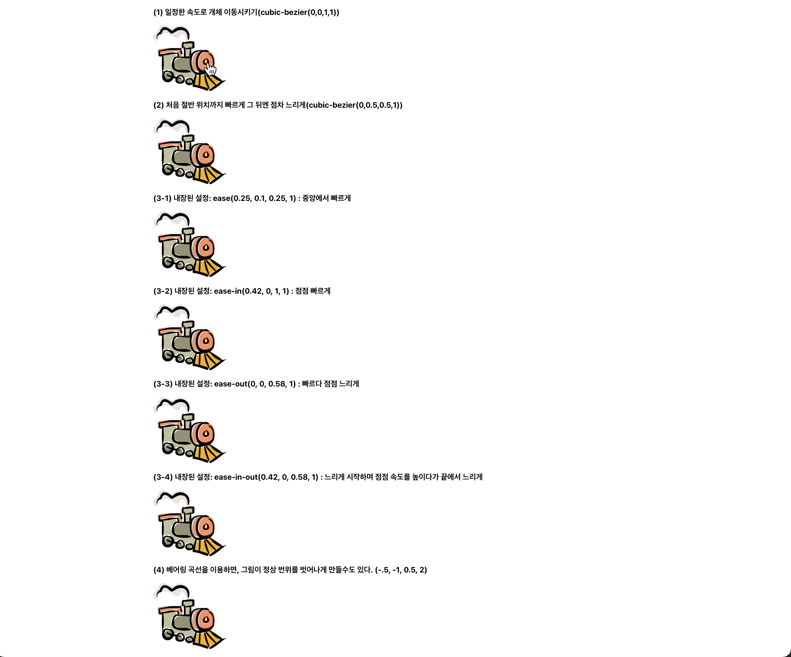
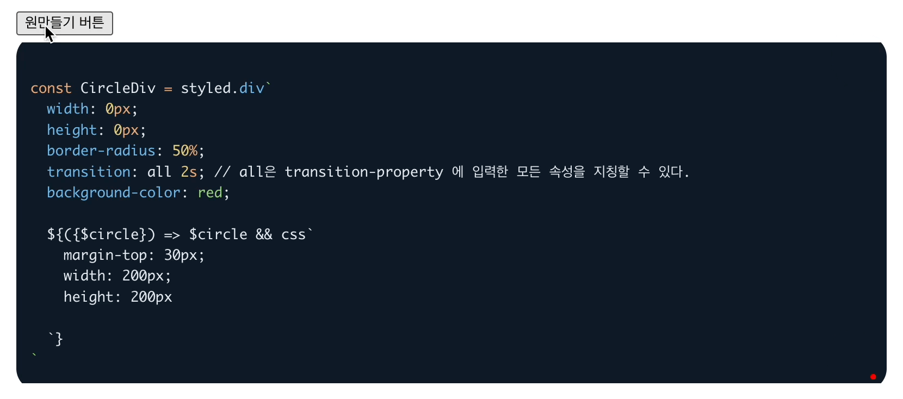

## 애니메이션
CSS 애니메이션을 사용하면 JS 자바스크립트 없이도 간단한 애니메이션을 만들 수 있다. 그러나 JS를 더하면 CSS 애니메이션을 동적으로 제어할 수 있고, 짧은 코드로 더 효과적인 동작을 구현할 수 있다는 장점이 있다. 

1. [트렌지션](https://ko.javascript.info/css-animations)에 대해서 

    CSS에 트렌지션이 등장한 배경은 단순하다. 프로퍼티를 통해서 동적인 효과를 넣어주자는 의도였다. 프로퍼티의 값이 변경되면, 트랜지션(전환) 효과는 브라우저가 알아서 처리한다. 

    - 트랜젝션에 사용되는 프로퍼티는 `4기지`이다. 
      - transition-property
      - transition-duration
      - transition-timing-function
      - transition-delay
      <br/><br/>

      그리고 공동적으로 가진 `transition`이라는 공통 프로퍼티를 사용하여 4개의 프로퍼티에 값을 한 번에 선언할 수 있다. 

      1. `transition-property` 애니메이션 효과를 적용할 프로퍼티 목록 : left, margin-left, height, color ...

          이때 주의할 점은 모든 프로퍼티에 애니메이션을 적용할 수 없다는 점이다. 자세한 설명은 [MDN](https://developer.mozilla.org/en-US/docs/Web/CSS/CSS_animated_properties)문서를 확인해보자. 

      2. `transition-duration` 애니메이션 효과시간을 설정

      3. `transition-delay` 애니메이션에 대한 지현시간을 설정할 수 있다. 

      지금까지의 코드를 리액트의 상황에서 가정해보자. 
      - (1) onClick에 따라서 `animate`의 진위값이 변경될 것이고 그 결과에 따라서 화면에 그려지는 내용이 달라진다. 
      - (2) animateStripe가 true가 되면, animation이 동작할 것인데,
      - (3) `transition`설정에 따라서, transform이, 9초간 진행되며, 일정한 속도(`transition-timing-function`)로 진행될 것이다. 
      <br/>

        ```jsx
        import React, { useState } from 'react';
        import styled, { keyframes } from 'styled-components';

        const App = () => {
          const [animateStripe, setAnimateStripe] = useState(false);
          const handleClick = () => {
            setAnimateStripe(true);
          };

          return (
            <Container>
              아래 숫자를 클릭하세요.
              <Stripe animate={animateStripe} onClick={handleClick}>
                0123456789
              </Stripe>
            </Container>
          );
        };

        export default App;

        const moveAnimation = keyframes`
          0% {transform: translate(0);}
          100% {transform: translate(-90%);}
        `

        const Container = styled.div`
          width: 0.5em;
          overflow: hidden;
          font: 32px monospace;
          cursor: pointer;
        `;

        const Stripe = styled.div`
          display: inline-block;
          transition-property: transform;
          transition-duration: 9s;
          transition-timing-function: linear;

          ${({$animate}) => $animate && css`
            animation: ${moveAnimation} 9s linear infinite;
          `}
        `;
        ```

      4. `transition-timing-function` 시간에 따라 

          조절점이 4개면서 아래 조건을 만족하는 베지어 곡선을 지정할 수 있다. 
          - 첫번째 조절점 : P1(0,0)
          - 마지막 조절점 : P3(1,1)
          - 중간 조절점들 x가 0과 1 사이에 있어야 하며, y엔 제약이 없다. 

            ```jsx
            cubic-bezier(0, 0, 1, 1) 
            // 가장 간단한 timing함수를 통해서 일정한 속도를 나타낼 수 있다. 
            transition: left 5s cubic-bezier(0,0.5,0.5,1); // 중간까지 빠르게 그후 느리게
            transition: left 5s ease; // 중앙에서 가장빠르고 양측은 느리게
            transition: left 5s ease-in; // 점점 빠르게 
            transition: left 5s ease-out; // 빠르게 시작해서 점점 느리게
            transition: left 5s ease-in-out; // 점점 빠르게 시작되지만, 종점을 향할수록 점점 느리게 
            transition: left 5s cubic-bezier(0.5, -1, 0.5, 2); // 정해진 공간 밖으로 이동시킬 수도 있다. 
            ```

            

      5. `transition` 만으로도 아래와 같은 재미있는 효과를 줄 수 있다. 하나는 일정한 속도로, 하나는 cubic-bezier을 통해 Jumping-out을 구현

                

        - 이번에는 처음에는 보이지 않지만, 클릭으로 생겨날 빨간 원을 생성해보자. 

                

          코드를 살펴보면 클릭 이벤트를 통해서 상태를 변경하고, true가 되면 애니메이션 효과가 동작되도록 설정하였다. 

          ```jsx
          const CircleDiv = styled.div`
            width: 0px;
            height: 0px;
            border-radius: 50%;
            transition: all 2s;
            // all 을 선언하여 transition-property 에 입력한 모든 속성을 지칭할 수 있다. 
            background-color: red;

            ${({$circle}) => $circle && css`
              margin-top: 30px;
              width: 200px;
              height: 200px   
            `}
          `
          ```


