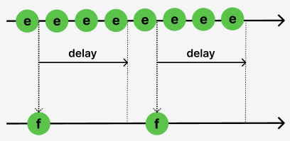
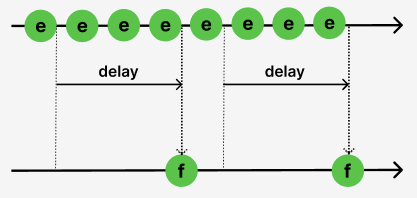
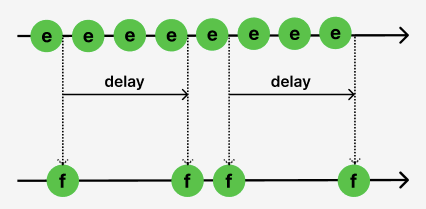
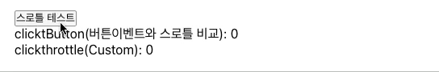

## 41.Debounce&Throttle
디바운스와 스로틀은 공부는 했지만, 이전 프로젝트에서 적용하지 못했던 부분이 있었다. 그 결과 UserTest에서 좋지 못한 평가를 받았다. 오늘은 해당 주제에 대해서 다뤄보자. 

### 1. 디바운스와 스로틀이 필요한 상황
<span style="color:orange">모던자바스크립트</span>에 따르면, 디바운스와 스로틀은 `Scroll`, `Resize`, `Input`, `Mousemove` 같은 이벤트와 관련있다. 이와 같은 이벤트들이 짧은 시간 간격으로 연속해서 발생을 일으키기 때문이다. 

연속적으로 발생되는 이벤트는 과도하게 호출되며 성능저하를 발생시킨다. <span style="color:orange">디바운스와 스로틀</span>은 짧은 시간 간격으로 연속해서 발생하는 이벤트를 그룹화해서 과도한 이벤트 헨들러의 호출을 방지하는 기법이다. 

<details id="htmlcode">
<summary>첫째, 코드살펴보기(모던자바스크립트)</summary>

<div style="height: 400px; overflow-y: scroll;">

```html
<!DOCTYPE html>
<html lang="ko">
<head>
  <meta charset="UTF-8">
  <meta name="viewport" content="width=device-width, initial-scale=1.0">
  <title>Document</title>
</head>
<body>
  <button>Click Me</button>
  <br/><br/>
  <table style="text-align: justify; border:1px solid black">
    <tr style="color:lightcoral; border-bottom:1px soild black">
      <th width="150px" style="border-bottom:1px solid black">이벤트종류</th>
      <th width="100px" style="border-bottom:1px solid black">이벤트횟수</th>
    </tr>
    <tr>
      <td>일반 클릭</td>
      <td><span class="normal-msg">0</span></td>
    </tr>
    <tr>
      <td>디바운스 이벤트</td>
      <td><span class="debounce-msg">0</span></td>
    </tr>
    <tr>
      <td>스로틀 이벤트</td>
      <td><span class="throttle-msg">0</span></td>
    </tr>
  </table>  
  <script>
    const $button = document.querySelector('button')
    const $normalMsg = document.querySelector('.normal-msg')
    const $debounceMsg = document.querySelector('.debounce-msg')
    const $throttleMsg = document.querySelector('.throttle-msg')

    const debounce = (callback, delay) => {
      let tiemId;
      return (...args) => {
        if(tiemId) clearTimeout(tiemId);
        tiemId = setTimeout(callback, delay, ...args)
      }
    }

    const throttle = (callback, delay) => {
      let tiemId;
      return (...args) => {
        if(tiemId) return;
        tiemId = setTimeout(()=>{
          callback(...args);
          tiemId = null
        },delay)
      }
    }

    $button.addEventListener('click', throttle(() => {
      $throttleMsg.textContent = +$throttleMsg.textContent +1;
    }, 1000));

    $button.addEventListener('click', () => {
      $normalMsg.textContent = +$normalMsg.textContent + 1;
    })

    $button.addEventListener('click', debounce(() => {
      $debounceMsg.textContent = +$debounceMsg.textContent +1;
    }, 1000));


  </script>
</body>
</html>
```

</div>
</details>
<div align="center"></div>

### 2. 디바운스
디바운스는 광클하는 사람들의 클릭 이벤트를 제어한다. 아무리 연속적인 광클을 해도 동작은 마지막 클릭이 종료된 다음 delay를 설정한 1초 뒤에 실행된다. 

조금 있어보이게 설명하면, 연속해서 이벤트가 발생된 시점에서 마지막 이벤트가 종료된 후 일정시간이 경과한 후에 한해서 동작이 이뤄지게 하는 것이 디바운스의 핵심이다. 

예를 들어, resize 이벤트 처리나, input 요소에 입력된 값으로 ajax 요청하는 입력 필드 자동완성 UI 구현, 버튼 중복 클릭 방지 처리 등에 유용하게 사용된다. 실무에서는 Lodash의 debounce 함수를 사용하는 것이 권장된다. 

```html
<!--DOCUMENT - HTML -->
<body>
  <input type="text">
  <div class="msg"></div>
  <script>
    const $input = document.querySelector('input');
    const $msg = document.querySelector('.msg')

    const debounce = (callback, delay) => {
      let tiemId;
      return (...args) => {
        if(tiemId) clearTimeout(tiemId)
        tiemId = setTimeout(callback, delay, ...args)
      };
    };

    $input.oninput = debounce(e => {
      $msg.textContent = e.target.value;
    }, 1000)
  </script>
  
</body>
```

1. input 이벤트가 발생될 때마다. 선언된 `debounce(callback, delay)`가 동작한다.
2. debounce 함수는 인수를 받아서 동작하는데, 먼저 tiemId의 여부를 관찰한다. 
3. tiemId 기존애 등록되어 있다면, clearTimeout()를 통해서 등록된 setTimeout() 제거한다. 
4. 추가로 입력되지 않는다면, `setTimeout(callback, delay, ...args)`이 실행되며, callback 함수의 로직이 동작하는 원리로 동작한다.

### 3. 리액트(tsx)와 디바운스 - 커스텀 Debounce, lodash를 통한 구현 

```tsx 
import React, { ChangeEvent, useState, useCallback } from 'react'
import _ from 'lodash' // yarn add @types/lodash

const Debounce: React.FC = () => {
  const [inputValue, setInputValue] = useState<string>("");
  const [printInput, setPrintInput] = useState<string>("");
  const [printInput2, setPrintInput2] = useState<string>("");

  const handleInputChange = (e: ChangeEvent<HTMLInputElement>) => {
    setInputValue(e.target.value);
    DebounceUseCallback(e.target.value)
    Debounce(e.target.value)
  };

  // eslint-disable-next-line
  const DebounceUseCallback = useCallback(
    _.debounce((text: string) => {
      setPrintInput(text);
    }, 2000),
    []
  );
  const Debounce = 
    _.debounce((text: string) => {
      setPrintInput2(text);
    }, 2000)

  const ButtonClickDebounce = (callback:() => void, delay: number) => {
    let timer: NodeJS.Timeout | null = null;

    return () => {
      timer && clearTimeout(timer);
      timer = setTimeout(callback, delay);
    };
  };
  const handleButtonClick = ButtonClickDebounce(() => {
    console.log("디바운스 테스트");
  }, 500);

  return (
    <div>
      <input type="text" value={inputValue} onChange={handleInputChange} />
      <div>Debounce(useCallback): {printInput}</div>
      <div>Debounce(useCallback No): {printInput2}</div>
      <button onClick={handleButtonClick}>디바운스 테스트</button>
    </div>
  );
};
```

<br/>
<div align="center"></div>

우여곡절이 많았다. JSX도 아니고, TSX구문으로 컴포넌트를 만들다 보니 고려해야할 사항이 너무 많았다. 그럼에도 제어를 했고.. 성공을 했다. `handleButtonClick`은 버튼이벤트가 발생되었을 때 동작하는 디바운스이고, `DebounceUseCallback`는 input 이밴트가 발생했을 때 동작하는 디바운스이다.  

<details>
<summary>(1) handleButtonClick 버튼이벤트</summary>

버튼의 경우, 이전 프로젝트 유저피드백시에 받았던 부분이었다. 그때에는 사실 구현하지 못하였다. 좋아요/스크립트/입력버튼 등에서 이러한 제어없이 그냥 동작하였다. 완성도를 높이는 것 중에 이러한 내용들도 들어갈 것이다. 

- handleButtonClick 실행 : ButtonClickDebounce(callback, delay)를 호출하며, 인자로 선언한 내용을 가져간다. 
  - 인자(1) : callback() : ButtonClickDebounce를 통하여 실행될 내부함수이다. 테스트를 위해 콘솔에 디바운스의 결과가 출력되도록 기록하였다.
  - 인자(2) : delay : ButtonClickDebounce에서 제어될 setTimeout 메서드의 시간이 기록된다. 
- ButtonClickDebounce(callback, delay) 실행 
  - timer : setTimeout 메서드가 등록될 식별자로, 선언하고 null을 할당한다. 
  - 반환 (1) : timer && clearTimeout(timer); 기존에 있던 timer가 존재하면, setTimeout의 등록과 실행을 제거한다. 
  - 반환 (2) : timer = setTimeout(callback, delay); 그 후에, timer에 setTimeout을 등록한다. 
  - 추가적인 버튼 입력이 없다면, 등록된 setTimeout에 따라 코드가 동작된다. 

</details>

<details>
<summary>(2) Debounce : useCallback이 없을 때 </summary>

위의 미이지에서 볼 수 있는 두번째 Debounce의 상황이다. useCallBack은 함수에 대한 메모이제이션이다. 메모이제이션에 대한 차이는 강력하다. 위의 코드를 보면 `handleInputChange 함수`에 따라서 사용자가 input에 값을 입력하면 `상태변경`이 발생된다. 

`상태변경`이 발생되었다는 것은 가상DOM이 동작하면서 이전 DOM과 이후 DOM의 비교를 탐색해 리랜더링을 발생시킨다. 이때 함수 또한 리랜더링의 대상이 된다는 것을 기억하자. 리랜더링 되면서 객체에 해당되는 함수는 참조값이 달라진다. 참조값이 달라졌다는 것은 함수가 리랜더링 될 때마다 새롭게 선언되고 호출을 준비하게 된다는 말이다. 

기억하자 `함수`는 리렌더링시 항상 새로운 참조값을 가지게 됨으로 리렌더링의 대상이 된다. 위의 상황을 보자 Debounce는 새로 생성되며 계속해서  setTimeout과 clearTimeout이 호출된다. 그러나 중요한 점은 `clearTimeout`의 동작이다. 새로생성된 Debounce에 의해 `clearTimeout`은 이전에 생성된 `setTimeout`을 취소할 수 없다. 뿐만 아니라 'timer'도 초기화 된다. `setTimeout`도 진행 중인 상황에서 리렌더링 되면 실행이 중단된다. 즉 리렌더링 시점에서 Debounce는 새로운 함수로 계속 실행된다는 것이다. 그 결과 끊어지는 듯한 실행을 이미지에서 확인할 수 있다. 
</details>

<details>
<summary>(3) DebounceUseCallback : useCallback이 있을 때 </summary>

그러나 DebounceUseCallback는 Debounce와 다르다. 가장 큰 점은 함수의 참조값이 변경되지 않는다는 점이다. 함수의 참조값이 변경되지 않는다는 이야기는 만약 `setTimeout`이 동작 중이라면, 중단없이 그 실행을 리랜더링과 관계없이 이어간다는 말이다. 그 결과 useCallback(`setTimeout`) 중인 상황에서 `clearTimeout`이 요청되면, 실행 중인 함수에 대한 초기화를 발생시킬 수 있으며, 그 결과 이미지에서 볼 수 있는 input이벤트가 종료된 시점에 한해서 결과가 실행된다. 

---
`질문` : 그렇다면 화면에 리랜더링이 발생되어 보여줘야 하는 상태와 해당 결과에 대한 값을 전달할 상태가 이중으로 작성되는 것이 효율적일가? 

---
</details>

<details>
<summary>(4) customDebounceUseCallback : useCallback + CustomDebounce </summary>

[해당 부분은 다른 링크에서 자세히 다뤘음으로 이곳을 참고](../typescript//customDebounce.md)바란다. 

```tsx
  const customDebounce = 
    (callback:(text:string)=>void, delay:number)  => {
      let timeId:NodeJS.Timeout | null = null;
      return (text:string) => {
        if(timeId) clearTimeout(timeId)
        timeId = setTimeout(() => callback(text), delay) 
      }
    }

    // eslint-disable-next-line
    const customDebounceUseCallback = useCallback(
      customDebounce((text) => {
        setPrintInput3(text)
      }, 
      2000)
      ,[]
    )

  customDebounceUseCallback("문자열")  
```

간단하게 설명하면, `customDebounceUseCallback()`호출은 `customDebounce()`호출하는데  이때 `useCallback` 을 통해서 함수자체를 메모이제이션 한다. 이를 통해서 `customDebounce()`로 인해서 반환되는 클로저는 생성 당시의 `let timeId`를 내부에서 기억하고 있으며, 그 결과로 반환되는 `return (text:string) => {...}`를 반영하여 `customDebounceUseCallback("문자열")`에서 받아온 인수 `"문자열"`을 `setPrintInput3(text)`에 반영하하여 ` pintInput3`를 업데이트 하고 해당 결과를 뷰파트에 그려놓게 되는 것이다. 클로즈의 핵심은 `let timeId`가 메모이제이션 되었기에, 원하는 개발의도에 따라 `setTimeout()` 등록되고 `clearTimeout()`이 초기화 된다는 것이다. 

</details>

### 4. throttle
스로틀은 짧은 시간 간격으로 이벤트가 연속해서 발생하더라도 일정 시간 간격으로 이벤트 핸들러가 최대 한 번만 호출되도록 설정하는 것이다. 핵심은 `일정 시간 간격`에 있다. `일정 시간 간격`을 그룹화하고, 해당 단위별로 이벤트 핸들러가 동작하도록 하는 설정이 스로틀이다. 

먼저 이미지를 통해 살펴보자. 

<div width="90%" align="center">
  
  
  
</img>
</div>

<br/>
각 이미지는 throttle의 시점을 표현한 이미지이다. 

- 첫째, 쓰로틀의 시점이 처음 - 처음 호출되는 즉시 실행되고, 일정 시간 동안의 추가 호출은 무시한다. 
- 둘째, 쓰로틀의 시점이 끝 - 마지막으로 호출될 때 이벤트가 발생하고, 설정한 시간 동안 추가 호출은 무시한다. 
- 셋째, 쓰로틀의 시점이 처음과 끝 - 처음 호출될 때 즉시 실행되고, 일정 시간 동안의 추가 호출은 무시하지만, 마지막 호출이 완료된 후 일정 시간이 지난 후에 동작되도록 할 때 사용된다. 

디바운스와 다른 점은 등록된 timeId에 대한 부분이다. 아래의 사례는 위의 쓰로틀의 시점이 처음에 설정될 이다. 처음 실행과 함께 함수가 실행되고 실행 중일 때 요청되는 추가적인 호출은 무시된다. 

- 디바운스는 : 반환시 등록된 timeId를 초기화 한다. ` if(tiemId) clearTimeout(tiemId);`
- 스로틀은 : 반환시 등록된 timeId가 있으면 추가 동작을 중단한다. `if(tiemId) return;` 전체 코드는 [상단에 기록한 토글](#htmlcode)을 열어보자. 스로틀에 대한 부분만 아래에서 확인해 보자. 

```javascript 
  const throttle = (callback, delay) => {
    let tiemId;
    return (...args) => {
      if(tiemId) return;
      tiemId = setTimeout(()=>{
        callback(...args);
        tiemId = null
      },delay)
    }
  }
```

이를 두번째 사례로 변경하면 그것이 바로 앞에서 언급한 `디바운스`의 사례가 된다. 이처럼 스로틀링은 디바운스의 개념을 포함한다. 스로틀이 더 큰 개념으로 `처음 호출 시점과 일정한 시간 간격을 다루는데 초점`된 설정의 하나로 `디바운스`가 취급될 수 있기 때문이다. 

이를 처음과 끝으로 변경하기 위해서는 아래와 같이 변수를 하나 더 설정하고, 해당 변수를 조건으로 분기하여 접근하면 가능하다. 


```javascript 
    const throttleWithLeadingAndTrailing = (callback, delay) => {
      let timerId;
      let leadingExecuted = false;
    
      return (...args) => {
        if (!leadingExecuted) {
          callback(...args);
          leadingExecuted = true;
          timerId = setTimeout(() => {
            leadingExecuted = false;
            if (timerId) {
              callback(...args);
              timerId = null;
            }
          }, delay);
        } else {
          clearTimeout(timerId);
          timerId = setTimeout(() => {
            callback(...args);
            timerId = null;
            leadingExecuted = false;
          }, delay);
        }
      };
    };

$button.addEventListener('click', throttle(() => {
  $throttleMsg.textContent = +$throttleMsg.textContent +1;
}, 1000));
```
- 시점과 끝을 관장하는 스로틀은 `leadingExecuted`의 진위값에 따라서 결졍된다. 
  - 최초의 실행에서 `callback(...args)`이 실행되며, 결과를 반영한다. 
  - 이후, `leadingExecuted`의 값을 true 로 변경하고, 디바운스를 위한 `setTimeout`을 등록한다. 
  - 이후, `leadingExecuted`이 true 이면 디바운스가 동작하는데, 이때 등록된 `setTimeout`을 해제하며, 최종에 한해서 동작하도록 설정할 수 있게 되는 것이다. 
  - 그런데 엄밀한 의미에서 본 코드는 상단에 있는 예제 이미지와 다르다. 이런 부분은 앞으로 더 고민해 보자. 

### 4. 리액트(tsx)와 스로틀 - 커스텀 throttle, lodash를 통한 구현 
1. 먼저 customThottle을 구현해보자. 쉬운 예제로 버튼을 구현해보자. 
    <div width="90%" align="center">
      </img>
    </div>

    클릭이벤트는 계속 올라가지만, 스로틀에 의해서 `clickthrottle`가 동작하는 것을 볼 수 있다. 코드를 살펴보자. 

    ```tsx
    const [clicktButton, setClicktButton] = useState<number>(0)
    const [clickthrottle, setclickthrottle] = useState<number>(0)
    const handleButtonThrottle = (callback:()=>void, delay:number) => {
      let timeId:NodeJS.Timeout | null = null;
      return () => {
        setClicktButton(clicktButton => clicktButton+1)
        if(timeId) return;
        timeId = setTimeout(()=>{
          callback();
          timeId = null
        },delay)
      }
    }  

    // eslint-disable-next-line
    const customThorrtleUseCallback = useCallback(
      handleButtonThrottle(()=> {
        console.log("스로틀 동작")
        setclickthrottle(clickthrottle => clickthrottle+1)
      }, 2000),[])

      return (
          <div>
            // ...
            <button onClick={customThorrtleUseCallback}>스로틀 테스트</button>
            <div>clicktButton(버튼이벤트와 스로틀 비교): {clicktButton}</div>
            <div>clickthrottle(Custom): {clickthrottle}</div>
          </div>
      );  
    ```
    - 리렌더링과 상태변화 
      - clicktButton에 대해서 여러가지를 실험하다가 단순히 원시형 자료로 상태를 관리하고자 했다.
      - 그러나 원시형에 대한, 변수는 그 내용이 변경되어서 리액트 가상DOM이 동작하지 않는 것 같다. 
      - 상태 변화를 가상DOM에게 알려주기 위해서는 상태를 useState로 관리해야 한다. 

    - 코드 동작과정 살펴보기
      - ` onClick={customThorrtleUseCallback}>`이벤트가 발생되면 해당 함수가 실행된다. 
      - 해당 함수는 함수의 참조값이 변경되는 것을 방지하고자 `useCallback`을 실행하였다. 
      - 또한 클로저로 `handleButtonThrottle`을 생성하고, `timeId` 값이 클로저 안에서 캡슐화 되도록 설정하였다. 
      - 이후 동작은 간단하다. `timeId`가 유요한 기간 동안은 `timeId`이 재할당되기 전에 함수가 끝나버린다. 
      - `timeId`이 존재하지 않을 때에만 다시 해당 `timeId`가 등록되고 실행된다. 
      - 디바운스가 초기화를 선언하는 부분이었다. 스로틀은 동작하는 기간 동안의 추가적인 요청을 무시하는 것이 핵심이다. 
