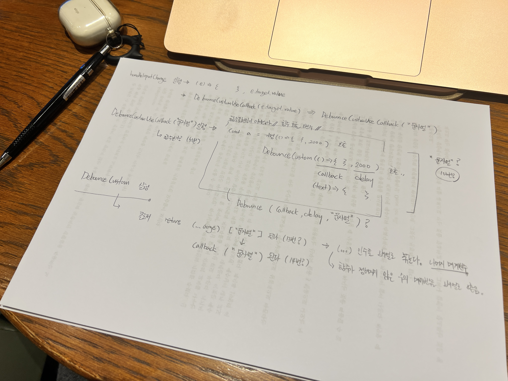

## Typescript - CustomDebounce

리액트 Typescript에서 CustomDebounce를 작성하고 있다. 물론 lodash의 debounce 메서드를 통해서 쉽게 구현할 수 있지만, 어렵게 구현할 줄도 알아야 하지 않을까? 

<div id="debounceHnadCoding" align="center"></div>

<details>
<summary>[토글] 코드 자체는 구현했다. 다음은 먼저 GPT의 도움과 각종 레퍼런스를 통해서 구현한 코드이다</summary>

```tsx
const Debounce: React.FC = () => {
  const [inputValue, setInputValue] = useState<string>("");
  const [printInput3, setPrintInput3] = useState<string>("");

  const handleInputChange = (e: ChangeEvent<HTMLInputElement>) => {
    setInputValue(e.target.value);
    customDebounceUseCallback(e.target.value)
  };

  const customDebounce = 
    (callback:(text:string)=>void, delay:number)  => {
      let timeId:NodeJS.Timeout | null = null;
      return (...args:[string]) => {
        if(timeId) clearTimeout(timeId)
        timeId = setTimeout(() => callback(...args), delay) 
      }
    }

    // eslint-disable-next-line
    const customDebounceUseCallback = useCallback(
      customDebounce((text) => {
        setPrintInput3(text)
      }, 
      2000)
      ,[]
    )

     return (
    <div>
      <input type="text" value={inputValue} onChange={handleInputChange} />
      <div>Debounce(Custom): {printInput3}</div>
    </div>
  );
```
</details><br/>

코드는 작성했지만 이해되지 않는 부분이 있었다. 처음 접근은 나머지 매개변수(...args)나 클로저에 대한 이해의 부족으로 여겼다. 그러나 문제는 허무하게 Type설정에 대한 부분이었다. 

```tsx
  const customDebounce = 
    (callback:(text:string)=>void, delay:number)  => {
      let timeId:NodeJS.Timeout | null = null;
      return (...args:[string]) => {
        if(timeId) clearTimeout(timeId)
        timeId = setTimeout(() => callback(...args), delay) 
      }
    }
```

`return (...args:[string])`에 갑자기 등장한 아이는 누구인가. 또한 timeId를 동록하는 곳에 등장하는 `timeId = setTimeout(() => callback(...args), delay)`에서 (...args)는 누구인가라는 것이다. 

이를 이해하기 위한 손코딩의 과정이 [위의 이미지](#debounceHnadCoding)이다. 그래도 도전은 응원한다. 다음 번에는 더 다양하게 생각하고 접근해 보자. 

코드를 이해하고자 했다. 

<details>
<summary>1. handleInputChange() 함수가 호출될 때</summary>

```tsx
customDebounceUseCallback(e.target.value)  // "문자열"
```

customDebounceUseCallback() 함수에 아마도 "문자열"이 인자로 담겨서 전달될 것이다. 
</details>

<details>
<summary>2. customDebounceUseCallback(e.target.value)  // "문자열" 할당은 언제? </summary>
  <div style="margin-left:20px;">
  <details>
  <summary>(1) customDebounceUseCallback함수의 실행 </summary>

      ```tsx
          // eslint-disable-next-line
          const customDebounceUseCallback = useCallback(
            customDebounce((text) => {
              setPrintInput3(text)
            }, 
            2000)
            ,[]
          )
      ```
  </details>
  <div>
</details>